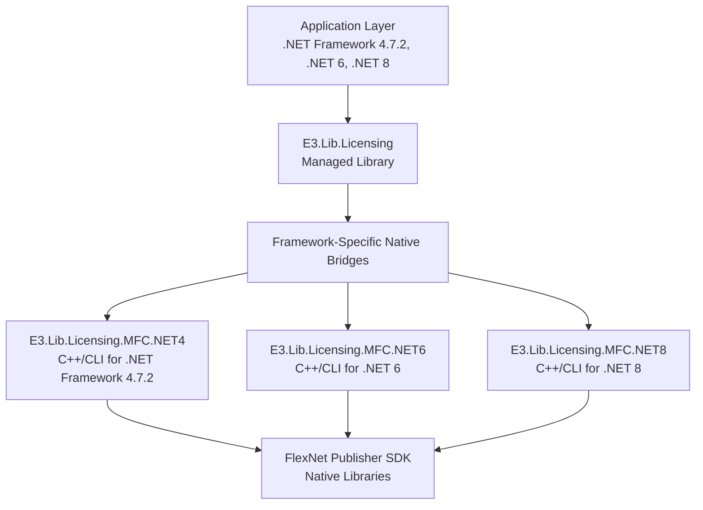

# Introduction

## Overview

E3.Lib.Licensing is a comprehensive .NET library that provides a high-level, type-safe abstraction for FlexNet licensing operations in E3Series applications. The library bridges native FlexNet functionality to .NET applications across multiple frameworks, offering a consistent and robust licensing solution for the entire E3Series ecosystem.

The library is designed to support:

- Type-safe feature management through generic implementations
- Multi-framework compatibility (.NET Framework 4.7.2, .NET 6, .NET 8)
- Comprehensive error handling and diagnostics
- Offline license borrowing capabilities
- Registry-based feature persistence
- Full license status monitoring and reporting
- Seamless integration with FlexNet Publisher licensing infrastructure

## Core Concepts and Terminology

### FlexNet Publisher

FlexNet Publisher is the underlying licensing technology that E3.Lib.Licensing abstracts. It provides:
- Network-based license distribution
- Feature-based licensing control
- License borrowing for offline use
- Comprehensive license monitoring and reporting

### LicenseManagerBase

The `LicenseManagerBase` is the abstract foundation of all licensing operations. It provides core functionality such as:

- License system initialization and termination
- Feature authentication and management
- Registry integration for persistent storage
- Connection management with FlexNet licensing servers
- Resource cleanup and disposal

```vb
' Example of LicenseManagerBase core functionality
Public MustInherit Class LicenseManagerBase
    Implements IDisposable
    
    ' Core initialization
    Public Function Init(Optional createRegKeys As Boolean = False) As Result
    
    ' Feature authentication
    Public Function AuthenticateFeatures(features As String()) As FeaturesResult
    
    ' Resource cleanup
    Public Sub TerminateLicense()
End Class
```

### Generic LicenseManager<TFeatures>

The generic `LicenseManager<TFeatures>` extends the base functionality to provide type-safe feature management:

- Strongly-typed feature handling using enums
- Automatic conversion between enum values and feature strings
- Type-safe method signatures for compile-time validation
- Simplified API for common licensing operations

```vb
' Example of strongly-typed feature management
Public Class MyAppLicenseManager
    Inherits LicenseManager(Of MyAppFeatures)
End Class

' Usage with type safety
Dim licenseManager As New MyAppLicenseManager()
licenseManager.Init()
licenseManager.AuthenticateFeatures(MyAppFeatures.Advanced, MyAppFeatures.Export)
```

### Feature Management

Features in E3.Lib.Licensing represent specific licensed capabilities:

- **Feature Names**: String identifiers that match FlexNet feature definitions
- **Feature Enums**: Strongly-typed enumerations for compile-time safety
- **Feature Authentication**: Process of requesting and obtaining licenses for specific features
- **Feature Persistence**: Registry-based storage of authenticated features across sessions

### Status and Monitoring

The library provides comprehensive status monitoring capabilities:

- **License Status**: Current state of individual feature licenses
- **Expiration Monitoring**: Tracking of license expiration dates
- **Server Connectivity**: Verification of license server availability
- **Borrowed License Tracking**: Status of offline borrowed licenses

### Borrow Management

License borrowing enables offline usage scenarios:

- **Borrowing**: Checking out licenses for specified durations
- **Returning**: Checking borrowed licenses back to the server
- **Duration Management**: Flexible time-based borrowing periods
- **Status Tracking**: Monitoring of borrowed license states

### Multi-Framework Architecture

E3.Lib.Licensing employs a sophisticated multi-framework strategy:



**Diagram Description:** This architecture diagram illustrates the layered approach of E3.Lib.Licensing, showing how applications across different .NET frameworks access a common managed library interface, which delegates to framework-specific native bridges that communicate with the FlexNet Publisher SDK.

## Licensing Workflow Fundamentals

### Basic Licensing Workflow

The fundamental licensing workflow follows these steps:

1. **Initialization**: Establish connection to licensing infrastructure
2. **Authentication**: Request licenses for specific features
3. **Usage**: Application functionality enabled by authenticated features
4. **Monitoring**: Ongoing status checking and expiration tracking
5. **Termination**: Clean resource cleanup and license release

### Error Handling Philosophy

E3.Lib.Licensing implements a result-based error handling approach:

- **Structured Results**: Operations return result objects rather than throwing exceptions
- **Detailed Information**: Results include success status, messages, and error codes
- **Categorized Errors**: Specific error types for different failure scenarios
- **Recovery Support**: Mechanisms for recovering from error states

```vb
' Example of result-based error handling
Dim result As FeaturesResult = licenseManager.AuthenticateFeatures(requiredFeatures)
If result.IsSuccess Then
    ' Proceed with licensed functionality
    Console.WriteLine($"Authenticated features: {String.Join(", ", result.Features)}")
Else
    ' Handle licensing error appropriately
    Console.WriteLine($"License error: {result.Message}")
    Console.WriteLine($"Error code: {result.ErrorCode}")
End If
```

### Registry Integration Patterns

The library uses Windows Registry for persistent feature storage:

- **Feature Registration**: Storing authenticated features between sessions
- **Configuration Persistence**: Maintaining license settings and preferences
- **Version Management**: Supporting version-specific registry keys
- **Cleanup Management**: Proper registry cleanup during uninstallation

## Key Benefits and Use Cases

### Type Safety and Compile-Time Validation

The generic architecture provides significant benefits:

- **Compile-Time Checking**: Feature references are validated at compile time
- **IntelliSense Support**: Full IDE support for feature enumeration
- **Refactoring Safety**: Renaming features updates all references
- **Documentation Integration**: Enum documentation appears in IDE tooltips

### Multi-Framework Consistency

The multi-framework approach enables:

- **Unified API**: Same licensing code works across .NET versions
- **Migration Support**: Easy framework upgrades without licensing changes
- **Development Flexibility**: Choose appropriate framework for each application
- **Maintenance Efficiency**: Single licensing codebase for all platforms

### Robust Error Handling

The result-based approach provides:

- **Predictable Behavior**: No unexpected exceptions during licensing operations
- **Detailed Diagnostics**: Comprehensive error information for troubleshooting
- **Graceful Degradation**: Applications can handle licensing failures appropriately
- **Recovery Mechanisms**: Built-in support for recovering from error states

### Offline Usage Support

The borrowing system enables:

- **Field Usage**: Applications work without continuous server connectivity
- **Travel Scenarios**: Users can borrow licenses for business trips
- **Disaster Recovery**: Continued operation during server outages
- **Flexible Duration**: Configurable borrowing periods based on needs

---

**Next:** [02 - Architecture Overview](./Documentation-02-Architecture-Overview.md)
