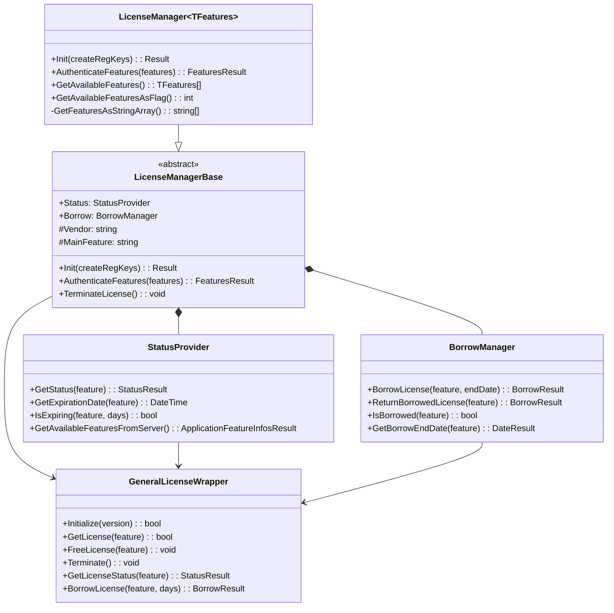
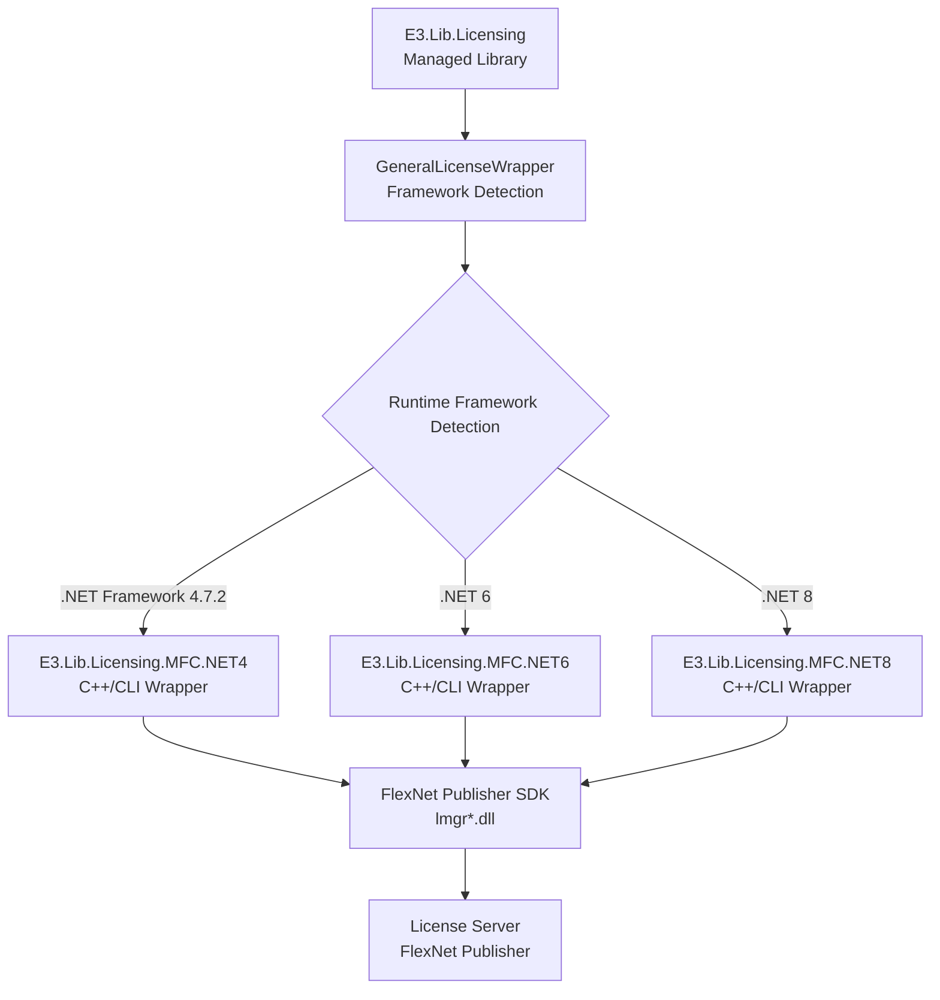
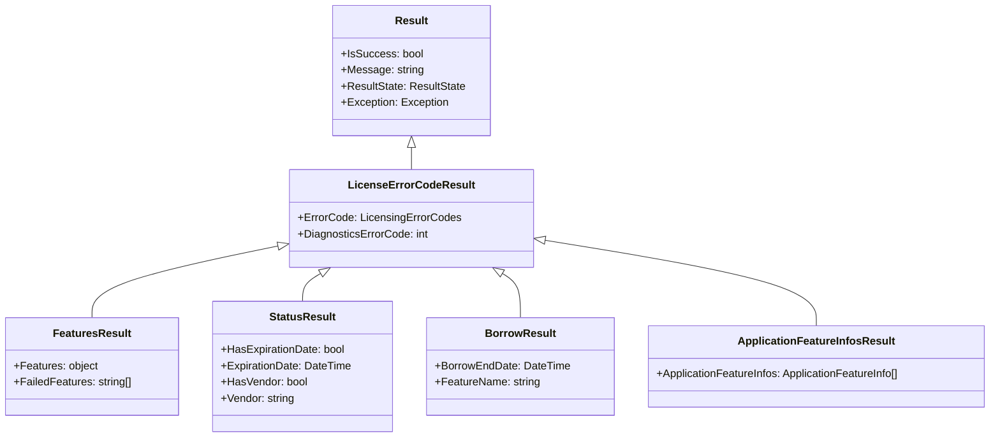

# Architecture Overview

This documentation provides a comprehensive architectural overview of the `E3.Lib.Licensing` library, a core component of the E3Series licensing infrastructure. The library implements a sophisticated abstraction layer over FlexNet Publisher, featuring extensive capabilities for multi-framework support, type-safe feature management, and robust error handling.

This overview covers both the high-level architectural concepts and detailed implementation patterns, providing developers with a complete understanding of the library's design principles and structure.

# Core Architectural Principles

The `E3.Lib.Licensing` library is built upon several central architectural principles that ensure robustness, maintainability, and cross-framework compatibility:

## Fundamental Design Principles

1. **FlexNet Publisher Abstraction**: Provides a high-level .NET abstraction over the native FlexNet licensing system
2. **Multi-Framework Compatibility**: Supports .NET Framework 4.7.2, .NET 6, and .NET 8 through a unified API
3. **Type-Safe Feature Management**: Enables compile-time validation of licensed features through generic implementations
4. **Result-Based Error Handling**: Uses structured result objects instead of exceptions for predictable error management
5. **Registry-Based Persistence**: Provides persistent storage of licensing information across application sessions
6. **Offline Licensing Support**: Enables borrowing licenses for offline usage scenarios

## System-Wide Design Principles

### 1. Layered Architecture
**Principle**: The system is organized in distinct layers, each with specific responsibilities and clear interfaces.

**Implementation**:
- **Application Layer**: Client applications using type-safe licensing APIs
- **Managed Library Layer**: E3.Lib.Licensing providing .NET abstraction
- **Native Bridge Layer**: Framework-specific C++/CLI wrappers
- **FlexNet Layer**: Native FlexNet Publisher SDK

**Benefits**:
- Clear separation of concerns between licensing logic and platform specifics
- Consistent API across different .NET framework versions
- Easier maintenance and testing of individual components
- Platform-specific optimizations without affecting higher layers

### 2. Type Safety Throughout
**Principle**: All licensing operations use strongly-typed interfaces to prevent runtime errors.

**Implementation**:
- Generic `LicenseManager<TFeatures>` with enum-based feature definitions
- Compile-time validation of feature references
- Automatic conversion between typed features and string representations
- Type-safe result objects with specific error information

**Benefits**:
- Compile-time detection of licensing configuration errors
- IntelliSense support for feature discovery and validation
- Refactoring safety when feature definitions change
- Self-documenting code through strongly-typed interfaces

### 3. Comprehensive Error Management
**Principle**: All operations return structured results that provide detailed information about success or failure.

**Implementation**:
- Result hierarchy with base `Result` class and specialized derivatives
- Detailed error codes and diagnostic information
- Contextual error messages for troubleshooting
- Recovery mechanisms through result analysis

**Benefits**:
- Predictable error handling without unexpected exceptions
- Rich diagnostic information for support and troubleshooting
- Consistent error handling patterns across all operations
- Graceful degradation when licensing issues occur

### 4. Multi-Framework Strategy
**Principle**: A single managed library provides identical functionality across multiple .NET framework versions.

**Implementation**:
- Shared managed codebase with conditional compilation for framework differences
- Framework-specific native bridges handling platform-specific requirements
- Runtime framework detection and appropriate wrapper selection
- Consistent API surface regardless of target framework

**Benefits**:
- Single licensing codebase for all E3Series applications
- Easy migration between .NET framework versions
- Framework-specific optimizations where needed
- Reduced maintenance overhead for licensing functionality

## Component Architecture

### Core Component Hierarchy



**Diagram Description:** This class diagram illustrates the core component hierarchy of E3.Lib.Licensing, showing how the generic LicenseManager inherits from LicenseManagerBase, which contains specialized providers for status monitoring and borrow management. All components interact with the GeneralLicenseWrapper for FlexNet communication.

### Multi-Framework Bridge Architecture



**Diagram Description:** This flowchart shows the multi-framework bridge architecture, illustrating how the managed library detects the runtime framework and delegates to the appropriate C++/CLI wrapper, which then communicates with the FlexNet Publisher SDK and ultimately the license server.

### Result System Architecture



**Diagram Description:** This class diagram shows the result system hierarchy, with the base Result class providing common success/failure information, LicenseErrorCodeResult adding licensing-specific error codes, and specialized result classes providing operation-specific data.

## Architectural Patterns in Use

### 1. Abstract Factory Pattern
**Usage**: Framework-specific wrapper creation based on runtime environment.

**Implementation**:
```vb
' Framework detection and wrapper creation
Public Class GeneralLicenseWrapper
    Private Function GetPlatformSpecificWrapper() As INativeLicenseWrapper
        Select Case Environment.Version.Major
            Case 4
                Return New NetFramework472Wrapper()
            Case 6
                Return New Net6Wrapper()
            Case 8
                Return New Net8Wrapper()
            Case Else
                Throw New NotSupportedException($"Framework version {Environment.Version} not supported")
        End Select
    End Function
End Class
```

### 2. Strategy Pattern
**Usage**: Different error handling strategies based on operation type and context.

**Implementation**:
```vb
' Different result strategies for different operations
Public Class ResultFactory
    Public Shared Function CreateFeatureResult(success As Boolean, features As Object) As FeaturesResult
        If success Then
            Return New FeaturesResult(ResultState.Success) With {.Features = features}
        Else
            Return New FeaturesResult(ResultState.Failed, "Feature authentication failed")
        End If
    End Function
End Class
```

### 3. Facade Pattern
**Usage**: `LicenseManagerBase` provides a simplified interface to complex FlexNet operations.

**Implementation**:
```vb
' Simplified facade over complex licensing operations
Public MustInherit Class LicenseManagerBase
    Public Function Init(Optional createRegKeys As Boolean = False) As Result
        ' Simplifies: registry setup, wrapper initialization, server connection
        Try
            SetupRegistry(createRegKeys)
            InitializeWrapper()
            ConnectToServer()
            Return New Result(ResultState.Success)
        Catch ex As Exception
            Return New Result(ex)
        End Try
    End Function
End Class
```

### 4. Template Method Pattern
**Usage**: `LicenseManagerBase` defines the algorithm structure while allowing derived classes to customize specific steps.

**Implementation**:
```vb
' Template method in base class
Public MustInherit Class LicenseManagerBase
    Public Function AuthenticateFeatures(features As String()) As FeaturesResult
        ' Template algorithm
        ValidateInput(features)
        Dim results = ProcessFeatureAuthentication(features)
        UpdateRegistry(results)
        Return CreateResult(results)
    End Function
    
    ' Abstract methods for customization
    Protected MustOverride Function ProcessFeatureAuthentication(features As String()) As AuthenticationResults
End Class
```

## Key Architectural Decisions

### 1. Result-Based Error Handling vs. Exceptions
**Decision**: Use structured result objects instead of exceptions for licensing operations.

**Rationale**:
- Licensing operations often have expected failure scenarios (server unavailable, feature expired)
- Result objects provide richer information than exception messages
- Enables graceful degradation and recovery strategies
- Avoids performance overhead of exception handling in normal operation

**Implementation Example**:
```vb
' Result-based approach
Public Function AuthenticateFeatures(features As TFeatures()) As FeaturesResult
    Try
        Dim authenticatedFeatures = ProcessAuthentication(features)
        Return New FeaturesResult(ResultState.Success) With {
            .Features = authenticatedFeatures
        }
    Catch ex As LicensingException
        Return New FeaturesResult(ResultState.Failed, ex.Message) With {
            .ErrorCode = ex.ErrorCode
        }
    End Try
End Function
```

### 2. Generic vs. String-Based Feature Management
**Decision**: Provide both generic type-safe and string-based interfaces.

**Rationale**:
- Type safety prevents runtime errors and improves development experience
- String interface enables dynamic feature configuration
- Generic interface provides compile-time validation and IntelliSense support
- Both approaches needed for different usage scenarios

**Implementation Example**:
```vb
' Type-safe generic interface
Public Function AuthenticateFeatures(ParamArray features As TFeatures()) As FeaturesResult
    Dim featureStrings = ConvertToStrings(features)
    Return MyBase.AuthenticateFeatures(featureStrings)
End Function

' String-based interface for dynamic scenarios
Public Function AuthenticateFeatures(features As String()) As FeaturesResult
    Return ProcessAuthentication(features)
End Function
```

### 3. Registry vs. Configuration File Storage
**Decision**: Use Windows Registry for persistent licensing information.

**Rationale**:
- Registry provides system-level persistence across user sessions
- Integrates with existing E3Series configuration patterns
- Supports per-machine and per-user licensing scenarios
- More secure than file-based storage for licensing information

**Implementation Approach**:
```vb
' Registry-based persistence
Private Sub UpdateAuthenticatedFeatures(features As String())
    Using key = Registry.LocalMachine.CreateSubKey($"SOFTWARE\Zuken\{ProductName}\Licensing")
        key.SetValue("AuthenticatedFeatures", String.Join(";", features))
        key.SetValue("LastAuthentication", DateTime.Now.ToString())
    End Using
End Sub
```

### 4. Synchronous vs. Asynchronous Operations
**Decision**: Provide primarily synchronous licensing operations with optional async support.

**Rationale**:
- Licensing operations are typically fast and performed during application startup
- Synchronous operations are simpler to use and debug
- Async support available for scenarios requiring non-blocking UI
- FlexNet SDK is primarily synchronous, making async wrapper complex

---

**Previous:** [01 - Introduction](./Documentation-01-Introduction.md) | **Next:** [03 - LicenseManagerBase Deep Dive](./Documentation-03-LicenseManagerBase-Deep-Dive.md)
