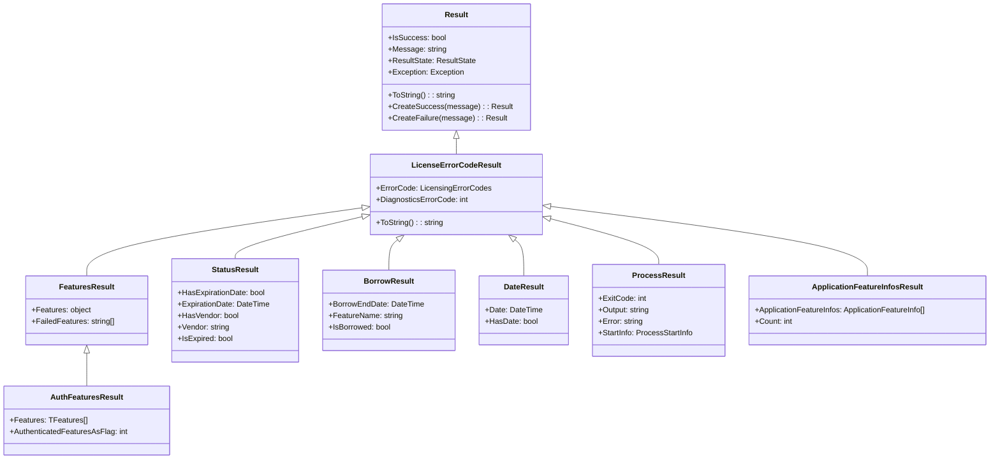

# Result System

This section explores the comprehensive result system in the E3.Lib.Licensing library, which provides structured error handling, status reporting, and detailed diagnostic information. We'll examine the result hierarchy, error code management, and best practices for result-based error handling.

## Result System Architecture

The result system in E3.Lib.Licensing follows a hierarchical structure that provides increasingly specific information for different types of operations. This approach ensures consistent error handling while providing rich diagnostic information.

### Result Hierarchy



**Diagram Description:** This class diagram illustrates the result system hierarchy, showing how specialized result classes inherit from the base Result class through LicenseErrorCodeResult, each adding operation-specific data while maintaining consistent error handling patterns.

## Base Result Class

The `Result` class provides the foundation for all result types in the system.

### Core Result Implementation

<details>
<summary>📝 (Code) <strong>Base Result Class Implementation</strong> - Foundation result class with state management and factory methods</summary>

```vb
Option Strict On
Option Explicit On
Option Infer Off

Public Class Result
    Implements IResult

    ' Core state properties
    Public Property IsSuccess As Boolean Implements IResult.IsSuccess
    Public Property Message As String Implements IResult.Message
    Public Property ResultState As ResultState Implements IResult.ResultState
    Public Property Exception As Exception Implements IResult.Exception

    ' Constructors for different scenarios
    Public Sub New()
        Me.New(ResultState.Success)
    End Sub

    Public Sub New(state As ResultState)
        Me.ResultState = state
        Me.IsSuccess = (state = ResultState.Success)
    End Sub

    Public Sub New(state As ResultState, message As String)
        Me.New(state)
        Me.Message = message
    End Sub

    Public Sub New(exception As Exception)
        Me.ResultState = ResultState.Failed
        Me.IsSuccess = False
        Me.Exception = exception
        If exception IsNot Nothing Then
            Me.Message = exception.Message
        End If
    End Sub

    Protected Sub New(other As IResult)
        If other IsNot Nothing Then
            Me.IsSuccess = other.IsSuccess
            Me.Message = other.Message
            Me.ResultState = other.ResultState
            Me.Exception = other.Exception
        End If
    End Sub

    ' Factory methods for common scenarios
    Public Shared Function CreateSuccess(Optional message As String = "Operation completed successfully") As Result
        Return New Result(ResultState.Success, message)
    End Function

    Public Shared Function CreateFailure(message As String) As Result
        Return New Result(ResultState.Failed, message)
    End Function

    Public Shared Function CreateFailure(exception As Exception) As Result
        Return New Result(exception)
    End Function

    ' String representation for debugging and logging
    Public Overrides Function ToString() As String
        Dim sb As StringBuilder = New StringBuilder()
        sb.AppendLine(String.Format(CultureInfo.InvariantCulture, "Result: {0}", If(IsSuccess, "Success", "Failed")))
        
        If Not String.IsNullOrEmpty(Message) Then
            sb.AppendLine(String.Format(CultureInfo.InvariantCulture, "Message: {0}", Message))
        End If

        If Exception IsNot Nothing Then
            sb.AppendLine(String.Format(CultureInfo.InvariantCulture, "Exception: {0}", Exception.Message))
        End If

        Return sb.ToString()
    End Function
End Class

' Enumeration for result states
Public Enum ResultState
    Success = 0
    Failed = 1
    PartialSuccess = 2
    Cancelled = 4
End Enum
            sb.AppendLine($"Message: {Message}")
        End If
        
        If Exception IsNot Nothing Then
            sb.AppendLine($"Exception: {Exception.GetType().Name} - {Exception.Message}")
        End If
        
        Return sb.ToString()
    End Function
End Class

' Enumeration for result states
Public Enum ResultState
    Success = 0
    Failed = 1
    Warning = 2
    Info = 3
    Cancelled = 4
End Enum
```
</details>

## License Error Code Result

The `LicenseErrorCodeResult` extends the base result to include licensing-specific error information.

### Error Code Management

<details>
<summary>📝 (Code) <strong>LicenseErrorCodeResult Implementation</strong> - Licensing-specific result with error codes and diagnostics</summary>

```vb
Option Strict On
Option Explicit On
Option Infer Off

Public Class LicenseErrorCodeResult
    Inherits Result
    Implements ILicenseErrorCodeResult

    ' Licensing-specific error information
    Private _errorCode As LicensingErrorCodes = LicensingErrorCodes.Undefined
    Public Property ErrorCode As LicensingErrorCodes Implements ILicenseErrorCodeResult.ErrorCode
        Get
            Return _errorCode
        End Get
        Set(value As LicensingErrorCodes)
            _errorCode = value
        End Set
    End Property

    Public Property DiagnosticsErrorCode As Integer

    ' Constructors for different error scenarios
    Public Sub New(result As ResultState, Optional errorCode As LicensingErrorCodes = LicensingErrorCodes.Undefined)
        MyBase.New(result)
        Me.ErrorCode = errorCode
    End Sub

    Public Sub New(exception As Exception, Optional errorCode As LicensingErrorCodes = LicensingErrorCodes.Undefined)
        MyBase.New(exception)
        Me.ErrorCode = errorCode
    End Sub

    Public Sub New(result As ResultState, message As String, Optional errorCode As LicensingErrorCodes = LicensingErrorCodes.Undefined)
        MyBase.New(result, message)
        Me.ErrorCode = errorCode
    End Sub

    Protected Sub New()
        MyBase.New()
    End Sub

    Protected Friend Sub New(other As IResult)
        MyBase.New(other)
        If TypeOf other Is ILicenseErrorCodeResult Then
            Me.ErrorCode = CType(other, ILicenseErrorCodeResult).ErrorCode
        End If
    End Sub

    ' Enhanced string representation with error codes
    Public Overrides Function ToString() As String
        Dim sb As New StringBuilder()
        sb.Append(MyBase.ToString())
        
        If ErrorCode <> LicensingErrorCodes.Undefined Then
            sb.AppendLine($"Error Code: {ErrorCode} ({CInt(ErrorCode)})")
        End If
        
        If DiagnosticsErrorCode <> 0 Then
            sb.AppendLine($"Diagnostics Code: {DiagnosticsErrorCode}")
        End If
        
        Return sb.ToString()
    End Function

    ' Factory methods for common licensing errors
    Public Shared Function CreateNotInitialized(Optional message As String = "License manager not initialized") As LicenseErrorCodeResult
        Return New LicenseErrorCodeResult(ResultState.Failed, message, LicensingErrorCodes.NOT_INITIALIZED)
    End Function

    Public Shared Function CreateAuthenticationFailed(Optional message As String = "Feature authentication failed") As LicenseErrorCodeResult
        Return New LicenseErrorCodeResult(ResultState.Failed, message, LicensingErrorCodes.AUTH_FAILED)
    End Function

    Public Shared Function CreateServerNotAccessible(Optional message As String = "License server not accessible") As LicenseErrorCodeResult
        Return New LicenseErrorCodeResult(ResultState.Failed, message, LicensingErrorCodes.SERVER_NOT_ACCESSIBLE)
    End Function
End Class
```
</details>

### Licensing Error Codes

The system uses a comprehensive enumeration of error codes for precise error classification:

<details>
<summary>📝 (Code) <strong>Licensing Error Codes</strong> - Complete enumeration of licensing error scenarios</summary>

```vb
Option Strict On
Option Explicit On
Option Infer Off

Public Enum LicensingErrorCodes
    ' General/undefined error
    Undefined = 0
    
    ' Borrowing-related errors
    NO_FEATURES_BORROWED = 1
    BORROW_FEATURES_FAILED = 2
    
    ' Authentication errors
    AUTH_FAILED = 3
    
    ' Server-related errors
    SERVER_REMOVE_FEATURE_FAILED = 4
    SERVER_NOT_ACCESSIBLE = 5
    
    ' License expiration errors
    DATE_EXPIRED = 6
    
    ' Service errors
    VENDOR_DEAMON_DOWN = 7
    
    ' Initialization errors
    NOT_INITIALIZED = 8
    
    ' Additional error codes for extended scenarios
    FEATURE_NOT_FOUND = 9
    INVALID_LICENSE_FILE = 10
    NETWORK_ERROR = 11
    PERMISSION_DENIED = 12
    LICENSE_LIMIT_EXCEEDED = 13
    INVALID_FEATURE_SPECIFICATION = 14
    CHECKOUT_FAILED = 15
    CHECKIN_FAILED = 16
End Enum
```
</details>

## Specialized Result Types

### FeaturesResult and AuthFeaturesResult

<details>
<summary>📝 (Code) <strong>Features Result Implementation</strong> - Results for feature authentication operations</summary>

```vb
Option Strict On
Option Explicit On
Option Infer Off

Public Class FeaturesResult
    Inherits LicenseErrorCodeResult

    ' Feature-specific result data
    Public Property Features As Object
    Public Property FailedFeatures As String()

    ' Constructors
    Public Sub New()
        MyBase.New()
    End Sub

    Public Sub New(result As ResultState)
        MyBase.New(result)
    End Sub

    Public Sub New(result As ResultState, message As String, Optional errorCode As LicensingErrorCodes = LicensingErrorCodes.Undefined)
        MyBase.New(result, message, errorCode)
    End Sub

    Public Sub New(exception As Exception, Optional errorCode As LicensingErrorCodes = LicensingErrorCodes.Undefined)
        MyBase.New(exception, errorCode)
    End Sub

    Public Sub New(other As IResult)
        MyBase.New(other)
    End Sub

    ' Enhanced string representation
    Public Overrides Function ToString() As String
        Dim sb As New StringBuilder()
        sb.Append(MyBase.ToString())
        
        If Features IsNot Nothing Then
            sb.AppendLine(String.Format(CultureInfo.InvariantCulture, "Authenticated Features: {0}", GetFeaturesString()))
        End If
        
        If FailedFeatures IsNot Nothing AndAlso FailedFeatures.Length > 0 Then
            sb.AppendLine(String.Format(CultureInfo.InvariantCulture, "Failed Features: {0}", String.Join(", ", FailedFeatures)))
        End If
        
        Return sb.ToString()
    End Function

    Private Function GetFeaturesString() As String
        Try
            If TypeOf Features Is String() Then
                Return String.Join(", ", DirectCast(Features, String()))
            ElseIf TypeOf Features Is Array Then
                Dim array = DirectCast(Features, Array)
                Return String.Join(", ", array.Cast(Of Object)().Select(Function(f) f.ToString()))
            Else
                Return Features.ToString()
            End If
        Catch
            Return "Unable to display features"
        End Try
    End Function
End Class

' Generic strongly-typed version
Public Class AuthFeaturesResult(Of TFeatures As Structure)
    Inherits FeaturesResult

    ' Strongly-typed feature data
    Public Shadows Property Features As TFeatures()
    Public Property AuthenticatedFeaturesAsFlag As Integer

    ' Constructors
    Public Sub New()
        MyBase.New()
    End Sub

    Public Sub New(result As ResultState)
        MyBase.New(result)
    End Sub

    Public Sub New(result As ResultState, message As String, Optional errorCode As LicensingErrorCodes = LicensingErrorCodes.Undefined)
        MyBase.New(result, message, errorCode)
    End Sub

    Public Sub New(exception As Exception, Optional errorCode As LicensingErrorCodes = LicensingErrorCodes.Undefined)
        MyBase.New(exception, errorCode)
    End Sub

    ' Conversion from base FeaturesResult
    Public Sub New(baseResult As FeaturesResult)
        MyBase.New(baseResult)
        ' Convert base Features to typed Features if possible
        ConvertBaseFeatures(baseResult)
    End Sub

    Private Sub ConvertBaseFeatures(baseResult As FeaturesResult)
        Try
            If baseResult.Features IsNot Nothing Then
                If TypeOf baseResult.Features Is TFeatures() Then
                    Me.Features = DirectCast(baseResult.Features, TFeatures())
                ElseIf TypeOf baseResult.Features Is String() Then
                    Me.Features = ConvertStringArrayToFeatures(DirectCast(baseResult.Features, String()))
                End If
            End If
        Catch ex As Exception
            ' Log conversion error but don't fail the result
            Logger.LogError($"Error converting base features to typed features: {ex.Message}")
        End Try
    End Sub

    Private Function ConvertStringArrayToFeatures(stringFeatures As String()) As TFeatures()
        Dim features As New List(Of TFeatures)
        
        For Each featureString In stringFeatures
            Dim feature As TFeatures
            If [Enum].TryParse(featureString, True, feature) Then
                features.Add(feature)
            End If
        Next
        
        Return features.ToArray()
    End Function
End Class
```
</details>

### StatusResult

<details>
<summary>📝 (Code) <strong>StatusResult Implementation</strong> - License status information with expiration tracking</summary>

```vb
Option Strict On
Option Explicit On
Option Infer Off

Public Class StatusResult
    Inherits LicenseErrorCodeResult

    ' Status-specific properties
    Public Property HasExpirationDate As Boolean
    Public Property ExpirationDate As DateTime
    Public Property HasVendor As Boolean
    Public Property Vendor As String

    ' Derived properties
    Public ReadOnly Property IsExpired As Boolean
        Get
            Return HasExpirationDate AndAlso ExpirationDate < DateTime.Now
        End Get
    End Property

    Public ReadOnly Property DaysUntilExpiration As Integer
        Get
            If HasExpirationDate Then
                Return Math.Max(0, CInt((ExpirationDate - DateTime.Now).TotalDays))
            End If
            Return Integer.MaxValue
        End Get
    End Property

    ' Constructors
    Public Sub New()
        MyBase.New()
    End Sub

    Public Sub New(result As ResultState)
        MyBase.New(result)
    End Sub

    Public Sub New(result As ResultState, message As String, Optional errorCode As LicensingErrorCodes = LicensingErrorCodes.Undefined)
        MyBase.New(result, message, errorCode)
    End Sub

    Public Sub New(exception As Exception, Optional errorCode As LicensingErrorCodes = LicensingErrorCodes.Undefined)
        MyBase.New(exception, errorCode)
    End Sub

    ' Enhanced string representation
    Public Overrides Function ToString() As String
        Dim sb As New StringBuilder()
        sb.Append(MyBase.ToString())
        
        If HasVendor AndAlso Not String.IsNullOrEmpty(Vendor) Then
            sb.AppendLine($"Vendor: {Vendor}")
        End If
        
        If HasExpirationDate Then
            sb.AppendLine($"Expiration Date: {ExpirationDate:yyyy-MM-dd HH:mm:ss}")
            sb.AppendLine($"Is Expired: {IsExpired}")
            If Not IsExpired Then
                sb.AppendLine($"Days Until Expiration: {DaysUntilExpiration}")
            End If
        Else
            sb.AppendLine("Expiration Date: Not specified (permanent license)")
        End If
        
        Return sb.ToString()
    End Function

    ' Helper methods for status checking
    Public Function IsExpiring(withinDays As Integer) As Boolean
        Return HasExpirationDate AndAlso DaysUntilExpiration <= withinDays
    End Function

    Public Function GetExpirationWarningMessage(warningDays As Integer) As String
        If IsExpired Then
            Return "License has expired"
        ElseIf IsExpiring(warningDays) Then
            Return $"License expires in {DaysUntilExpiration} day(s)"
        Else
            Return "License is valid"
        End If
    End Function
End Class
```
</details>

### BorrowResult

<details>
<summary>📝 (Code) <strong>BorrowResult Implementation</strong> - Borrowing operation results with date tracking</summary>

```vb
Option Strict On
Option Explicit On
Option Infer Off

Public Class BorrowResult
    Inherits LicenseErrorCodeResult

    ' Borrow-specific properties
    Public Property BorrowEndDate As DateTime
    Public Property FeatureName As String

    ' Derived properties
    Public ReadOnly Property IsBorrowed As Boolean
        Get
            Return IsSuccess AndAlso BorrowEndDate > DateTime.Now
        End Get
    End Property

    Public ReadOnly Property DaysRemaining As Integer
        Get
            If IsBorrowed Then
                Return Math.Max(0, CInt((BorrowEndDate - DateTime.Now).TotalDays))
            End If
            Return 0
        End Get
    End Property

    Public ReadOnly Property HoursRemaining As Integer
        Get
            If IsBorrowed Then
                Return Math.Max(0, CInt((BorrowEndDate - DateTime.Now).TotalHours))
            End If
            Return 0
        End Get
    End Property

    ' Constructors
    Public Sub New()
        MyBase.New()
    End Sub

    Public Sub New(result As ResultState)
        MyBase.New(result)
    End Sub

    Public Sub New(result As ResultState, message As String, Optional errorCode As LicensingErrorCodes = LicensingErrorCodes.Undefined)
        MyBase.New(result, message, errorCode)
    End Sub

    Public Sub New(exception As Exception, Optional errorCode As LicensingErrorCodes = LicensingErrorCodes.Undefined)
        MyBase.New(exception, errorCode)
    End Sub    ' Factory methods for common borrow scenarios
    Public Shared Function CreateBorrowSuccess(featureName As String, endDate As DateTime) As BorrowResult
        Return New BorrowResult(ResultState.Success, String.Format(CultureInfo.InvariantCulture, "Successfully borrowed {0} until {1:yyyy-MM-dd HH:mm}", featureName, endDate)) With {
            .FeatureName = featureName,
            .BorrowEndDate = endDate
        }
    End Function

    Public Shared Function CreateReturnSuccess(featureName As String) As BorrowResult
        Return New BorrowResult(ResultState.Success, String.Format(CultureInfo.InvariantCulture, "Successfully returned borrowed license for {0}", featureName)) With {
            .FeatureName = featureName,
            .BorrowEndDate = DateTime.MinValue
        }
    End Function

    ' Enhanced string representation
    Public Overrides Function ToString() As String
        Dim sb As New StringBuilder()
        sb.Append(MyBase.ToString())
        
        If Not String.IsNullOrEmpty(FeatureName) Then
            sb.AppendLine(String.Format(CultureInfo.InvariantCulture, "Feature: {0}", FeatureName))
        End If
        
        If BorrowEndDate > DateTime.MinValue Then
            sb.AppendLine(String.Format(CultureInfo.InvariantCulture, "Borrow End Date: {0:yyyy-MM-dd HH:mm:ss}", BorrowEndDate))
            sb.AppendLine(String.Format(CultureInfo.InvariantCulture, "Is Currently Borrowed: {0}", IsBorrowed))
            
            If IsBorrowed Then
                sb.AppendLine(String.Format(CultureInfo.InvariantCulture, "Days Remaining: {0}", DaysRemaining))
                sb.AppendLine(String.Format(CultureInfo.InvariantCulture, "Hours Remaining: {0}", HoursRemaining))
            End If
        End If
        
        Return sb.ToString()
    End Function
End Class
```
</details>

## Result Usage Patterns

### Standard Error Handling Pattern

<details>
<summary>📝 (Code) <strong>Standard Result Handling</strong> - Common patterns for processing results</summary>

```vb
Option Strict On
Option Explicit On
Option Infer Off

' Standard result processing pattern
Public Sub ProcessLicenseOperation()
    ' Initialize license manager
    Dim licenseManager As New MyAppLicenseManager()
    
    ' Handle initialization result
    Dim initResult As Result = licenseManager.Init(createRegKeys:=True)
    If Not ProcessResult(initResult, "License Initialization") Then
        Return
    End If
    
    ' Handle authentication result
    Dim authResult As AuthFeaturesResult(Of MyAppFeatures) = licenseManager.AuthenticateFeatures(MyAppFeatures.Base, MyAppFeatures.Advanced)
    If Not ProcessAuthenticationResult(authResult) Then
        Return
    End If
    
    ' Handle status check result
    Dim statusResult As StatusResult = licenseManager.Status.GetStatus("MyApp_Advanced")
    ProcessStatusResult(statusResult)
End Sub

' Generic result processor
Private Function ProcessResult(result As Result, operationName As String) As Boolean
    If result.IsSuccess Then
        Logger.LogInfo(String.Format(CultureInfo.InvariantCulture, "{0} succeeded: {1}", operationName, result.Message))
        Return True
    Else
        Logger.LogError(String.Format(CultureInfo.InvariantCulture, "{0} failed: {1}", operationName, result.Message))
        
        ' Handle specific error types
        If TypeOf result Is LicenseErrorCodeResult Then
            Dim licenseResult As LicenseErrorCodeResult = DirectCast(result, LicenseErrorCodeResult)
            ProcessLicenseError(licenseResult, operationName)
        End If
        
        ' Show user-friendly error message
        ShowErrorMessage(operationName, result.Message)
        Return False
    End If
End Function

' Authentication result processor with feature details
Private Function ProcessAuthenticationResult(result As AuthFeaturesResult(Of MyAppFeatures)) As Boolean
    If result.IsSuccess Then
        Logger.LogInfo(String.Format(CultureInfo.InvariantCulture, "Authentication succeeded. Features: {0}", String.Join(", ", result.Features)))
        
        ' Enable UI based on authenticated features
        EnableFeaturesInUI(result.Features)
          ' Check for partial failures
        If result.FailedFeatures IsNot Nothing AndAlso result.FailedFeatures.Length > 0 Then
            Logger.LogWarning(String.Format(CultureInfo.InvariantCulture, "Some features failed to authenticate: {0}", String.Join(", ", result.FailedFeatures)))
            ShowWarningMessage(String.Format(CultureInfo.InvariantCulture, "Some advanced features are not available: {0}", String.Join(", ", result.FailedFeatures)))
        End If
        
        Return True
    Else
        Logger.LogError(String.Format(CultureInfo.InvariantCulture, "Authentication failed: {0}", result.Message))
        ProcessLicenseError(result, "Feature Authentication")
        
        ' Provide recovery options
        OfferRecoveryOptions(result)
        Return False
    End If
End Function

' License error processor with specific handling
Private Sub ProcessLicenseError(result As LicenseErrorCodeResult, operationName As String)
    Select Case result.ErrorCode
        Case LicensingErrorCodes.NOT_INITIALIZED
            Logger.LogError("License system not initialized")
            ShowErrorMessage("Licensing Error", "Please restart the application to reinitialize licensing.")
            
        Case LicensingErrorCodes.SERVER_NOT_ACCESSIBLE
            Logger.LogError("License server not accessible")
            ShowErrorMessage("Network Error", "Cannot connect to license server. Please check your network connection.")
            
        Case LicensingErrorCodes.AUTH_FAILED
            Logger.LogError("Feature authentication failed")
            ShowErrorMessage("License Error", "The requested features are not available in your license.")
            
        Case LicensingErrorCodes.DATE_EXPIRED
            Logger.LogError("License has expired")
            ShowErrorMessage("License Expired", "Your license has expired. Please contact support.")
              Case Else
            Logger.LogError(String.Format(CultureInfo.InvariantCulture, "Unknown licensing error: {0}", result.ErrorCode))
            ShowErrorMessage("Licensing Error", String.Format(CultureInfo.InvariantCulture, "An unexpected licensing error occurred: {0}", result.Message))
    End Select
End Sub

' Status result processor with expiration handling
Private Sub ProcessStatusResult(result As StatusResult)
    If result.IsSuccess Then
        Logger.LogInfo(String.Format(CultureInfo.InvariantCulture, "Status check succeeded: {0}", result))
        
        ' Check for expiration warnings
        If result.IsExpiring(30) Then
            Dim warningMessage As String = result.GetExpirationWarningMessage(30)
            Logger.LogWarning(warningMessage)
            ShowWarningMessage(warningMessage)
        End If
    Else
        Logger.LogError(String.Format(CultureInfo.InvariantCulture, "Status check failed: {0}", result.Message))
        ProcessLicenseError(result, "Status Check")
    End If
End Sub
```
</details>

### Advanced Result Processing

<details>
<summary>📝 (Code) <strong>Advanced Result Processing</strong> - Complex scenarios and bulk operations</summary>

```vb
Option Strict On
Option Explicit On
Option Infer Off

' Bulk operation result processing
Public Sub ProcessBulkResults(results As IEnumerable(Of Result))
    Dim successCount As Integer = 0
    Dim failureCount As Integer = 0
    Dim warnings As New List(Of String)
    Dim errors As New List(Of String)
    
    For Each result As Result In results
        If result.IsSuccess Then
            successCount += 1
        Else
            failureCount += 1
            errors.Add(result.Message)
        End If
        
        ' Check for warnings in successful results
        If result.ResultState = ResultState.Warning Then
            warnings.Add(result.Message)
        End If
    Next
    
    ' Generate summary report
    Logger.LogInfo(String.Format(CultureInfo.InvariantCulture, "Bulk operation completed: {0} succeeded, {1} failed", successCount, failureCount))
    
    If warnings.Count > 0 Then
        Logger.LogWarning(String.Format(CultureInfo.InvariantCulture, "Warnings: {0}", String.Join("; ", warnings)))
    End If
    
    If errors.Count > 0 Then
        Logger.LogError(String.Format(CultureInfo.InvariantCulture, "Errors: {0}", String.Join("; ", errors)))
    End If
End Sub

' Result aggregation and analysis
Public Function AnalyzeLicensingHealth() As LicenseHealthReport
    Dim report As New LicenseHealthReport()
    
    ' Check initialization status
    Dim initResult As Result = _licenseManager.GetInitializationStatus()
    report.IsInitialized = initResult.IsSuccess
    
    ' Check feature availability
    Dim features As MyAppFeatures() = CType([Enum].GetValues(GetType(MyAppFeatures)), MyAppFeatures())
    For Each feature As MyAppFeatures In features
        Dim statusResult As StatusResult = _licenseManager.Status.GetStatus(feature.ToString())
        
        If statusResult.IsSuccess Then
            If statusResult.IsExpiring(30) Then
                report.ExpiringFeatures.Add(feature.ToString())
            ElseIf statusResult.IsExpired Then
                report.ExpiredFeatures.Add(feature.ToString())
            Else
                report.ValidFeatures.Add(feature.ToString())
            End If
        Else
            report.UnavailableFeatures.Add(feature.ToString())
        End If
    Next
    
    ' Check borrowed licenses
    For Each feature As MyAppFeatures In features
        Dim borrowResult As BorrowResult = _licenseManager.Borrow.IsBorrowed(feature.ToString())
        If borrowResult.IsSuccess AndAlso borrowResult.IsBorrowed Then
            report.BorrowedFeatures.Add(feature.ToString())
        End If
    Next
    
    return report
End Function

' License health report class
Public Class LicenseHealthReport
    Public Property IsInitialized As Boolean
    Public Property ValidFeatures As New List(Of String)
    Public Property ExpiringFeatures As New List(Of String)
    Public Property ExpiredFeatures As New List(Of String)
    Public Property UnavailableFeatures As New List(Of String)
    Public Property BorrowedFeatures As New List(Of String)
    
    Public ReadOnly Property OverallHealth As String
        Get
            If ExpiredFeatures.Count > 0 OrElse UnavailableFeatures.Count > 0 Then
                Return "Critical"
            ElseIf ExpiringFeatures.Count > 0 Then
                Return "Warning"
            ElseIf ValidFeatures.Count > 0 Then
                Return "Good"
            Else
                Return "Unknown"            End If
        End Get
    End Property
End Class
```
</details>

---

**Previous:** [04 - Generic LicenseManager](./Documentation-04-Generic-LicenseManager.md) | **Next:** [06 - Status Management](./Documentation-06-Status-Management.md)
