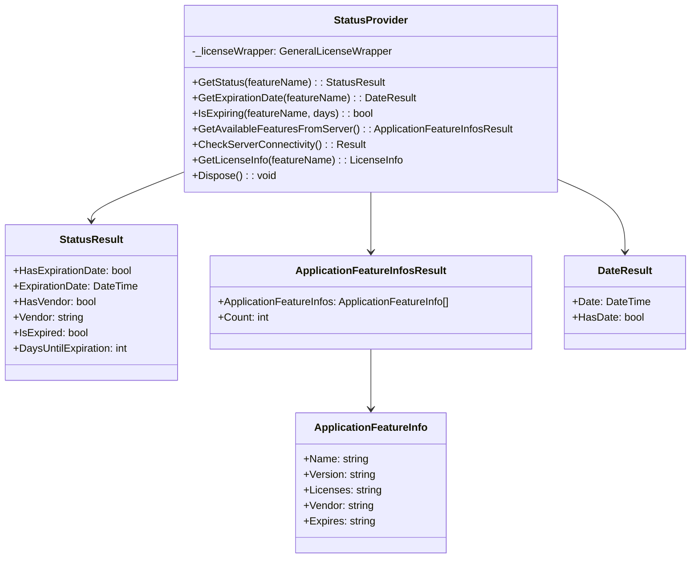

# Status Management

This section explores the status management capabilities of the E3.Lib.Licensing library, which provides comprehensive license monitoring, expiration tracking, and server connectivity verification. We'll examine the StatusProvider class, status reporting mechanisms, and proactive monitoring strategies.

## StatusProvider Architecture

The `StatusProvider` class serves as the central component for license status monitoring and provides detailed information about license states, expiration dates, and server connectivity.

### StatusProvider Class Structure



**Diagram Description:** This class diagram shows the StatusProvider class structure and its relationships with various result types, illustrating how status information flows from the license wrapper through the provider to structured result objects.

## License Status Monitoring

### GetStatus Method Implementation

<details>
<summary>📝 (Code) <strong>GetStatus Implementation</strong> - Comprehensive license status retrieval with error handling</summary>

```vb
Option Strict On
Option Explicit On
Option Infer Off

Public Function GetStatus(featureName As String) As StatusResult
    ' Validate input parameters
    If String.IsNullOrWhiteSpace(featureName) Then
        Return New StatusResult(ResultState.Failed, 
            "Feature name cannot be null or empty", 
            LicensingErrorCodes.INVALID_FEATURE_SPECIFICATION)
    End If

    Try
        ' Query the license wrapper for detailed status information
        Dim licenseInfo As Object = _licenseWrapper.GetLicenseInfo(featureName)
        
        If licenseInfo Is Nothing Then
            Return New StatusResult(ResultState.Failed, 
                String.Format(CultureInfo.InvariantCulture, "Unable to retrieve status for feature '{0}'", featureName), 
                LicensingErrorCodes.FEATURE_NOT_FOUND)
        End If

        ' Create successful status result
        Dim result As New StatusResult(ResultState.Success, String.Format(CultureInfo.InvariantCulture, "Status retrieved for feature '{0}'", featureName))
        
        ' Parse expiration information
        If Not String.IsNullOrEmpty(licenseInfo.ExpirationDate) Then
            Dim expirationDate As DateTime
            If DateTime.TryParse(licenseInfo.ExpirationDate, expirationDate) Then
                result.HasExpirationDate = True
                result.ExpirationDate = expirationDate
            End If
        End If
        
        ' Parse vendor information
        If Not String.IsNullOrEmpty(licenseInfo.Vendor) Then
            result.HasVendor = True
            result.Vendor = licenseInfo.Vendor
        End If        ' Additional validation for expired licenses
        If result.IsExpired Then
            result.ResultState = ResultState.Warning
            result.Message = String.Format(CultureInfo.InvariantCulture, "Feature '{0}' license has expired on {1:yyyy-MM-dd}", featureName, result.ExpirationDate)
            result.ErrorCode = LicensingErrorCodes.DATE_EXPIRED
        End If

        Return result

    Catch ex As LicensingException
        Logger.LogError(String.Format(CultureInfo.InvariantCulture, "Licensing error getting status for '{0}': {1}", featureName, ex.Message))
        Return New StatusResult(ex, LicensingErrorCodes.AUTH_FAILED)
        
    Catch ex As NetworkException
        Logger.LogError(String.Format(CultureInfo.InvariantCulture, "Network error getting status for '{0}': {1}", featureName, ex.Message))
        Return New StatusResult(ex, LicensingErrorCodes.SERVER_NOT_ACCESSIBLE)
        
    Catch ex As Exception
        Logger.LogError(String.Format(CultureInfo.InvariantCulture, "Unexpected error getting status for '{0}': {1}", featureName, ex.Message))
        Return New StatusResult(ex, LicensingErrorCodes.Undefined)
    End Try
End Function
```
</details>

### Status Information Structure

<details>
<summary>📝 (Code) <strong>LicenseInfo Class</strong> - Internal structure for license information</summary>

```vb
Option Strict On
Option Explicit On
Option Infer Off

' Internal class for license information (used by StatusProvider)
Friend Class LicenseInfo
    Public Property FeatureName As String
    Public Property Version As String
    Public Property ExpirationDate As String
    Public Property Vendor As String
    Public Property LicenseCount As String
    Public Property CheckoutTime As String
    Public Property ServerName As String
    Public Property PortNumber As String
    
    Public Sub New()
    End Sub
    
    Public Sub New(featureName As String)
        Me.FeatureName = featureName
    End Sub
    
    ' Parse from FlexNet status string
    Public Shared Function ParseFromStatusString(statusString As String) As LicenseInfo
        Dim info As New LicenseInfo()
        
        Try
            ' Parse status string format from FlexNet
            ' Example: "feature_name version expires=dd-mmm-yyyy vendor=vendor_name"
            Dim parts = statusString.Split(" "c)
            
            For i As Integer = 0 To parts.Length - 1
                Dim part = parts(i).Trim()
                
                If i = 0 Then
                    info.FeatureName = part
                ElseIf i = 1 Then
                    info.Version = part
                ElseIf part.StartsWith("expires=") Then
                    info.ExpirationDate = part.Substring("expires=".Length)
                ElseIf part.StartsWith("vendor=") Then
                    info.Vendor = part.Substring("vendor=".Length)
                ElseIf part.StartsWith("count=") Then
                    info.LicenseCount = part.Substring("count=".Length)
                ElseIf part.StartsWith("server=") Then
                    info.ServerName = part.Substring("server=".Length)
                ElseIf part.StartsWith("port=") Then
                    info.PortNumber = part.Substring("port=".Length)
                End If
            Next
            
        Catch ex As Exception
            Logger.LogError($"Error parsing license info from status string: {ex.Message}")
        End Try
        
        Return info
    End Function
    
    Public Overrides Function ToString() As String
        Dim sb As New StringBuilder()
        sb.AppendLine($"Feature: {FeatureName}")
        
        If Not String.IsNullOrEmpty(Version) Then
            sb.AppendLine($"Version: {Version}")
        End If
        
        If Not String.IsNullOrEmpty(ExpirationDate) Then
            sb.AppendLine($"Expires: {ExpirationDate}")
        End If
        
        If Not String.IsNullOrEmpty(Vendor) Then
            sb.AppendLine($"Vendor: {Vendor}")
        End If
        
        Return sb.ToString()
    End Function
End Class
```
</details>

## Expiration Tracking and Monitoring

### Expiration Date Management

<details>
<summary>📝 (Code) <strong>Expiration Tracking Implementation</strong> - Methods for monitoring license expiration</summary>

```vb
Option Strict On
Option Explicit On
Option Infer Off

' Get expiration date for a specific feature
Public Function GetExpirationDate(featureName As String) As DateResult
    Try
        ' Get status first to retrieve expiration information
        Dim statusResult As StatusResult = GetStatus(featureName)
        
        If Not statusResult.IsSuccess Then
            Return New DateResult(statusResult.ResultState, statusResult.Message, statusResult.ErrorCode)
        End If
        
        ' Create date result based on status information
        Dim result As New DateResult(ResultState.Success, String.Format(CultureInfo.InvariantCulture, "Expiration date retrieved for '{0}'", featureName))
        
        If statusResult.HasExpirationDate Then
            result.Date = statusResult.ExpirationDate
            result.HasDate = True
        Else
            result.HasDate = False
            result.Message = String.Format(CultureInfo.InvariantCulture, "Feature '{0}' has no expiration date (permanent license)", featureName)
        End If
        
        Return result
        
    Catch ex As Exception
        Logger.LogError(String.Format(CultureInfo.InvariantCulture, "Error getting expiration date for '{0}': {1}", featureName, ex.Message))
        Return New DateResult(ex, LicensingErrorCodes.Undefined)
    End Try
End Function

' Check if a feature is expiring within specified days
Public Function IsExpiring(featureName As String, withinDays As Integer) As Boolean
    Try
        Dim statusResult = GetStatus(featureName)
        
        If statusResult.IsSuccess AndAlso statusResult.HasExpirationDate Then
            Return statusResult.IsExpiring(withinDays)
        End If
        
        Return False
        
    Catch ex As Exception
        Logger.LogError($"Error checking expiration for '{featureName}': {ex.Message}")
        Return False
    End Try
End Function

' Get expiration warning message
Public Function GetExpirationWarning(featureName As String, warningDays As Integer) As String
    Try
        Dim statusResult = GetStatus(featureName)
        
        If statusResult.IsSuccess Then
            Return statusResult.GetExpirationWarningMessage(warningDays)
        Else
            Return $"Unable to check expiration for {featureName}: {statusResult.Message}"
        End If
        
    Catch ex As Exception
        Logger.LogError($"Error getting expiration warning for '{featureName}': {ex.Message}")
        Return $"Error checking expiration for {featureName}"
    End Try
End Function

' Monitor multiple features for expiration
Public Function MonitorFeatureExpirations(featureNames As String(), warningDays As Integer) As List(Of ExpirationWarning)
    Dim warnings As New List(Of ExpirationWarning)
    
    For Each featureName In featureNames
        Try
            Dim statusResult = GetStatus(featureName)
            
            If statusResult.IsSuccess Then
                If statusResult.IsExpired Then
                    warnings.Add(New ExpirationWarning With {
                        .FeatureName = featureName,
                        .ExpirationDate = statusResult.ExpirationDate,
                        .IsExpired = True,
                        .DaysRemaining = 0,
                        .Message = $"Feature '{featureName}' has expired"
                    })
                ElseIf statusResult.IsExpiring(warningDays) Then
                    warnings.Add(New ExpirationWarning With {
                        .FeatureName = featureName,
                        .ExpirationDate = statusResult.ExpirationDate,
                        .IsExpired = False,
                        .DaysRemaining = statusResult.DaysUntilExpiration,
                        .Message = $"Feature '{featureName}' expires in {statusResult.DaysUntilExpiration} day(s)"
                    })
                End If
            End If
            
        Catch ex As Exception
            Logger.LogError($"Error monitoring expiration for '{featureName}': {ex.Message}")
        End Try
    Next
    
    Return warnings
End Function

' Helper class for expiration warnings
Public Class ExpirationWarning
    Public Property FeatureName As String
    Public Property ExpirationDate As DateTime
    Public Property IsExpired As Boolean
    Public Property DaysRemaining As Integer
    Public Property Message As String
    
    Public ReadOnly Property Severity As WarningLevel
        Get
            If IsExpired Then
                Return WarningLevel.Critical
            ElseIf DaysRemaining <= 7 Then
                Return WarningLevel.High
            ElseIf DaysRemaining <= 30 Then
                Return WarningLevel.Medium
            Else
                Return WarningLevel.Low
            End If
        End Get
    End Property
End Class

Public Enum WarningLevel
    Low = 0
    Medium = 1
    High = 2
    Critical = 3
End Enum
```
</details>

## Server Feature Discovery

### Available Features Retrieval

<details>
<summary>📝 (Code) <strong>Server Feature Discovery</strong> - Retrieving available features from license server</summary>

```vb
Option Strict On
Option Explicit On
Option Infer Off

' Get all available features from the license server
Public Function GetAvailableFeaturesFromServer() As ApplicationFeatureInfosResult
    Try
        ' Query the license server for all available features
        Dim serverFeatures As Object = _licenseWrapper.QueryServerFeatures()
        
        If serverFeatures Is Nothing OrElse CInt(serverFeatures.Count) = 0 Then
            Return New ApplicationFeatureInfosResult(ResultState.Warning, 
                "No features found on license server", 
                LicensingErrorCodes.FEATURE_NOT_FOUND)
        End If
        
        ' Convert server response to ApplicationFeatureInfo objects
        Dim featureInfos As New List(Of ApplicationFeatureInfo)
        
        For Each serverFeature As Object In serverFeatures
            Try
                Dim featureInfo As ApplicationFeatureInfo = ConvertToApplicationFeatureInfo(serverFeature)
                If featureInfo IsNot Nothing Then
                    featureInfos.Add(featureInfo)
                End If
            Catch ex As Exception
                Logger.LogWarning(String.Format(CultureInfo.InvariantCulture, "Error converting server feature '{0}': {1}", serverFeature, ex.Message))
            End Try
        Next
        
        ' Create successful result
        Dim result As New ApplicationFeatureInfosResult(ResultState.Success, 
            $"Retrieved {featureInfos.Count} features from server")
        result.ApplicationFeatureInfos = featureInfos.ToArray()
        
        Return result
        
    Catch ex As NetworkException
        Logger.LogError($"Network error querying server features: {ex.Message}")
        Return New ApplicationFeatureInfosResult(ex, LicensingErrorCodes.SERVER_NOT_ACCESSIBLE)
        
    Catch ex As LicensingException
        Logger.LogError($"Licensing error querying server features: {ex.Message}")
        Return New ApplicationFeatureInfosResult(ex, LicensingErrorCodes.VENDOR_DEAMON_DOWN)
        
    Catch ex As Exception
        Logger.LogError($"Unexpected error querying server features: {ex.Message}")
        Return New ApplicationFeatureInfosResult(ex, LicensingErrorCodes.Undefined)
    End Try
End Function

' Convert server feature data to ApplicationFeatureInfo
Private Function ConvertToApplicationFeatureInfo(serverFeature As Object) As ApplicationFeatureInfo
    Try
        ' Parse server feature string (format may vary by FlexNet version)
        Dim featureString = serverFeature.ToString()
        
        ' Example format: "feature_name version=1.0 licenses=10 vendor=Zuken expires=31-dec-2024"
        Dim parts = featureString.Split(" "c)
        
        If parts.Length = 0 Then
            Return Nothing
        End If
        
        Dim name = parts(0)
        Dim version = ""
        Dim licenses = ""
        Dim vendor = ""
        Dim expires = ""
        
        ' Parse additional parameters
        For i As Integer = 1 To parts.Length - 1
            Dim part = parts(i)
            
            If part.StartsWith("version=") Then
                version = part.Substring("version=".Length)
            ElseIf part.StartsWith("licenses=") Then
                licenses = part.Substring("licenses=".Length)
            ElseIf part.StartsWith("vendor=") Then
                vendor = part.Substring("vendor=".Length)
            ElseIf part.StartsWith("expires=") Then
                expires = part.Substring("expires=".Length)
            End If
        Next
        
        Return New ApplicationFeatureInfo(name, version, licenses, vendor, expires)
        
    Catch ex As Exception
        Logger.LogError($"Error converting server feature to ApplicationFeatureInfo: {ex.Message}")
        Return Nothing
    End Try
End Function

' Filter available features by criteria
Public Function FilterAvailableFeatures(criteria As FeatureFilterCriteria) As ApplicationFeatureInfosResult
    Try
        ' Get all features from server
        Dim allFeaturesResult = GetAvailableFeaturesFromServer()
        
        If Not allFeaturesResult.IsSuccess Then
            Return allFeaturesResult
        End If
        
        ' Apply filters
        Dim filteredFeatures = allFeaturesResult.ApplicationFeatureInfos.AsEnumerable()
        
        If Not String.IsNullOrEmpty(criteria.VendorFilter) Then
            filteredFeatures = filteredFeatures.Where(Function(f) 
                String.Equals(f.Vendor, criteria.VendorFilter, StringComparison.OrdinalIgnoreCase))
        End If
        
        If Not String.IsNullOrEmpty(criteria.NamePattern) Then
            filteredFeatures = filteredFeatures.Where(Function(f) 
                f.Name.Contains(criteria.NamePattern))
        End If
        
        If criteria.ExcludeExpired Then
            filteredFeatures = filteredFeatures.Where(Function(f) 
                Not IsFeatureExpired(f.Expires))
        End If
        
        If criteria.MinimumLicenseCount > 0 Then
            filteredFeatures = filteredFeatures.Where(Function(f) 
                GetLicenseCount(f.Licenses) >= criteria.MinimumLicenseCount)
        End If
        
        ' Create filtered result
        Dim result As New ApplicationFeatureInfosResult(ResultState.Success, 
            $"Filtered to {filteredFeatures.Count()} features")
        result.ApplicationFeatureInfos = filteredFeatures.ToArray()
        
        Return result
        
    Catch ex As Exception
        Logger.LogError($"Error filtering available features: {ex.Message}")
        Return New ApplicationFeatureInfosResult(ex, LicensingErrorCodes.Undefined)
    End Try
End Function

' Helper class for feature filtering
Public Class FeatureFilterCriteria
    Public Property VendorFilter As String
    Public Property NamePattern As String
    Public Property ExcludeExpired As Boolean
    Public Property MinimumLicenseCount As Integer
End Class

' Helper methods for filtering
Private Function IsFeatureExpired(expiresString As String) As Boolean
    Try
        If String.IsNullOrEmpty(expiresString) OrElse expiresString.ToLower() = "permanent" Then
            Return False
        End If
        
        Dim expirationDate As DateTime
        If DateTime.TryParse(expiresString, expirationDate) Then
            Return expirationDate < DateTime.Now
        End If
        
        Return False
    Catch
        Return False
    End Try
End Function

Private Function GetLicenseCount(licensesString As String) As Integer
    Try
        Dim count As Integer
        If Integer.TryParse(licensesString, count) Then
            Return count
        End If
        Return 0
    Catch
        Return 0
    End Try
End Function
```
</details>

## Server Connectivity Verification

### Connectivity Testing

<details>
<summary>📝 (Code) <strong>Server Connectivity Testing</strong> - Methods for verifying license server accessibility</summary>

```vb
Option Strict On
Option Explicit On
Option Infer Off

' Check if license server is accessible
Public Function CheckServerConnectivity() As Result
    Try
        Logger.LogInfo("Checking license server connectivity...")
        
        ' Attempt to connect to license server
        Dim connected As Boolean = _licenseWrapper.TestServerConnection()
        
        If connected Then
            Logger.LogInfo("License server connectivity verified")
            Return Result.CreateSuccess("License server is accessible")
        Else
            Logger.LogWarning("License server is not accessible")
            Return New LicenseErrorCodeResult(ResultState.Failed, 
                "License server is not accessible", 
                LicensingErrorCodes.SERVER_NOT_ACCESSIBLE)
        End If
        
    Catch ex As NetworkException
        Logger.LogError(String.Format(CultureInfo.InvariantCulture, "Network error testing server connectivity: {0}", ex.Message))
        Return New LicenseErrorCodeResult(ex, LicensingErrorCodes.SERVER_NOT_ACCESSIBLE)
        
    Catch ex As Exception
        Logger.LogError(String.Format(CultureInfo.InvariantCulture, "Unexpected error testing server connectivity: {0}", ex.Message))
        Return New LicenseErrorCodeResult(ex, LicensingErrorCodes.Undefined)
    End Try
End Function

' Get detailed server information
Public Function GetServerInfo() As ServerInfoResult
    Try
        ' Query server for detailed information
        Dim serverInfo = _licenseWrapper.GetServerInfo()
        
        If serverInfo Is Nothing Then
            Return New ServerInfoResult(ResultState.Failed, 
                "Unable to retrieve server information", 
                LicensingErrorCodes.SERVER_NOT_ACCESSIBLE)
        End If
        
        ' Create successful result with server details
        Dim result As New ServerInfoResult(ResultState.Success, "Server information retrieved")
        result.ServerName = serverInfo.Name
        result.ServerVersion = serverInfo.Version
        result.ServerPort = serverInfo.Port
        result.TotalFeatures = serverInfo.FeatureCount
        result.ActiveConnections = serverInfo.ConnectionCount
        result.ServerUptime = serverInfo.Uptime
        
        Return result
        
    Catch ex As Exception
        Logger.LogError($"Error getting server information: {ex.Message}")
        Return New ServerInfoResult(ex, LicensingErrorCodes.SERVER_NOT_ACCESSIBLE)
    End Try
End Function

' Monitor server status continuously
Public Function StartServerMonitoring(intervalMinutes As Integer) As Result
    Try
        If _serverMonitorTimer IsNot Nothing Then
            Return Result.CreateFailure("Server monitoring is already running")
        End If
        
        _serverMonitorTimer = New Timer(
            AddressOf MonitorServerCallback, 
            Nothing, 
            TimeSpan.Zero, 
            TimeSpan.FromMinutes(intervalMinutes)
        )
        
        Logger.LogInfo($"Started server monitoring with {intervalMinutes} minute interval")
        Return Result.CreateSuccess("Server monitoring started")
        
    Catch ex As Exception
        Logger.LogError($"Error starting server monitoring: {ex.Message}")
        Return Result.CreateFailure($"Failed to start server monitoring: {ex.Message}")
    End Try
End Function

Public Sub StopServerMonitoring()
    Try
        _serverMonitorTimer?.Dispose()
        _serverMonitorTimer = Nothing
        Logger.LogInfo("Stopped server monitoring")
    Catch ex As Exception
        Logger.LogError($"Error stopping server monitoring: {ex.Message}")
    End Try
End Sub

Private Sub MonitorServerCallback(state As Object)
    Try
        Dim connectivityResult = CheckServerConnectivity()
        
        If Not connectivityResult.IsSuccess Then
            ' Raise event for server disconnection
            RaiseEvent ServerConnectivityChanged(Me, New ServerConnectivityEventArgs With {
                .IsConnected = False,
                .ErrorMessage = connectivityResult.Message,
                .Timestamp = DateTime.Now
            })
        Else
            ' Raise event for server connection
            RaiseEvent ServerConnectivityChanged(Me, New ServerConnectivityEventArgs With {
                .IsConnected = True,
                .Timestamp = DateTime.Now
            })
        End If
        
    Catch ex As Exception
        Logger.LogError($"Error in server monitoring callback: {ex.Message}")
    End Try
End Sub

' Events for server status changes
Public Event ServerConnectivityChanged As EventHandler(Of ServerConnectivityEventArgs)

Public Class ServerConnectivityEventArgs
    Inherits EventArgs
    
    Public Property IsConnected As Boolean
    Public Property ErrorMessage As String
    Public Property Timestamp As DateTime
End Class

' Server information result class
Public Class ServerInfoResult
    Inherits LicenseErrorCodeResult
    
    Public Property ServerName As String
    Public Property ServerVersion As String
    Public Property ServerPort As String
    Public Property TotalFeatures As Integer
    Public Property ActiveConnections As Integer
    Public Property ServerUptime As TimeSpan
    
    Public Sub New()
        MyBase.New()
    End Sub
    
    Public Sub New(state As ResultState)
        MyBase.New(state)
    End Sub
    
    Public Sub New(state As ResultState, message As String, Optional errorCode As LicensingErrorCodes = LicensingErrorCodes.Undefined)
        MyBase.New(state, message, errorCode)
    End Sub
    
    Public Sub New(exception As Exception, Optional errorCode As LicensingErrorCodes = LicensingErrorCodes.Undefined)
        MyBase.New(exception, errorCode)
    End Sub
    
    Public Overrides Function ToString() As String
        Dim sb As New StringBuilder()
        sb.Append(MyBase.ToString())
        
        If Not String.IsNullOrEmpty(ServerName) Then
            sb.AppendLine($"Server Name: {ServerName}")
        End If
        
        If Not String.IsNullOrEmpty(ServerVersion) Then
            sb.AppendLine($"Server Version: {ServerVersion}")
        End If
        
        If Not String.IsNullOrEmpty(ServerPort) Then
            sb.AppendLine($"Server Port: {ServerPort}")
        End If
        
        If TotalFeatures > 0 Then
            sb.AppendLine($"Total Features: {TotalFeatures}")
        End If
        
        If ActiveConnections > 0 Then
            sb.AppendLine($"Active Connections: {ActiveConnections}")
        End If
        
        If ServerUptime > TimeSpan.Zero Then
            sb.AppendLine($"Server Uptime: {ServerUptime}")
        End If
        
        Return sb.ToString()
    End Function
End Class
```
</details>

---

**Previous:** [05 - Result System](./Documentation-05-Result-System.md) | **Next:** [07 - Borrow Management](./Documentation-07-Borrow-Management.md)
