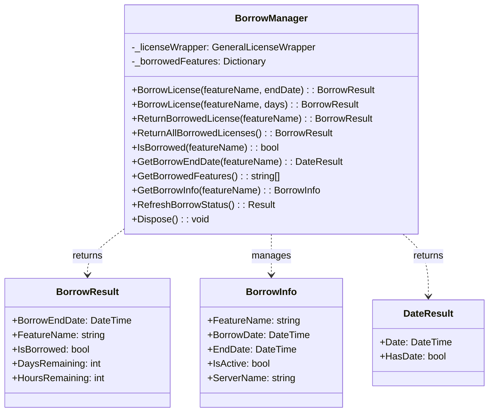

# Borrow Management

This section explores the borrow management capabilities of the E3.Lib.Licensing library, which enable offline license usage through FlexNet's license borrowing features. We'll examine the BorrowManager class, borrowing operations, duration management, and best practices for offline scenarios.

## BorrowManager Architecture

The `BorrowManager` class provides comprehensive license borrowing functionality, allowing users to check out licenses for offline use during specified time periods.

### BorrowManager Class Structure



**Diagram Description:** This class diagram illustrates the BorrowManager structure, showing its core borrowing operations, status tracking capabilities, and relationships with result types for comprehensive offline license management.

## License Borrowing Operations

### BorrowLicense Method Implementation

<details>
<summary>📝 (Code) <strong>BorrowLicense Implementation</strong> - Core borrowing functionality with duration management and validation</summary>

```vb
Option Strict On
Option Explicit On
Option Infer Off

' Borrow a license for a specific feature until a specified end date
Public Function BorrowLicense(featureName As String, endDate As DateTime) As BorrowResult
    ' Validate input parameters
    If String.IsNullOrWhiteSpace(featureName) Then
        Return New BorrowResult(ResultState.Failed, 
            "Feature name cannot be null or empty", 
            LicensingErrorCodes.INVALID_FEATURE_SPECIFICATION)
    End If

    If endDate <= DateTime.Now Then
        Return New BorrowResult(ResultState.Failed, 
            "Borrow end date must be in the future", 
            LicensingErrorCodes.INVALID_FEATURE_SPECIFICATION)
    End If

    Try
        Logger.LogInfo(String.Format(CultureInfo.InvariantCulture, "Attempting to borrow license for '{0}' until {1:yyyy-MM-dd HH:mm}", featureName, endDate))

        ' Check if feature is already borrowed
        If IsBorrowed(featureName) Then
            Return New BorrowResult(ResultState.Failed, 
                String.Format(CultureInfo.InvariantCulture, "Feature '{0}' is already borrowed", featureName), 
                LicensingErrorCodes.BORROW_FEATURES_FAILED)
        End If

        ' Calculate duration in days for FlexNet
        Dim duration As Integer = CInt(Math.Ceiling((endDate - DateTime.Now).TotalDays))
        
        If duration > MaxBorrowDays Then
            Return New BorrowResult(ResultState.Failed, 
                String.Format(CultureInfo.InvariantCulture, "Borrow duration of {0} days exceeds maximum allowed ({1} days)", duration, MaxBorrowDays), 
                LicensingErrorCodes.BORROW_FEATURES_FAILED)
        End If

        ' Attempt to borrow the license through FlexNet
        Dim borrowSuccess As Boolean = _licenseWrapper.BorrowLicense(featureName, duration)
          If borrowSuccess Then
            ' Create borrow information record
            Dim borrowInfo As New BorrowInfo With {
                .FeatureName = featureName,
                .BorrowDate = DateTime.Now,
                .EndDate = endDate,
                .IsActive = True,
                .ServerName = GetServerNameForFeature(featureName)
            }
            
            ' Store borrow information
            _borrowedFeatures(featureName) = borrowInfo
            
            ' Update registry with borrow information
            UpdateBorrowRegistry(borrowInfo)
            
            Logger.LogInfo(String.Format(CultureInfo.InvariantCulture, "Successfully borrowed license for '{0}' until {1:yyyy-MM-dd HH:mm}", featureName, endDate))
            
            ' Create successful result
            Return BorrowResult.CreateBorrowSuccess(featureName, endDate)
        Else
            Logger.LogWarning(String.Format(CultureInfo.InvariantCulture, "Failed to borrow license for '{0}'", featureName))
            Return New BorrowResult(ResultState.Failed, 
                String.Format(CultureInfo.InvariantCulture, "Failed to borrow license for feature '{0}'", featureName), 
                LicensingErrorCodes.BORROW_FEATURES_FAILED)
        End If

    Catch ex As LicensingException
        Logger.LogError(String.Format(CultureInfo.InvariantCulture, "Licensing error borrowing '{0}': {1}", featureName, ex.Message))
        Return New BorrowResult(ex, LicensingErrorCodes.BORROW_FEATURES_FAILED)
        
    Catch ex As NetworkException
        Logger.LogError(String.Format(CultureInfo.InvariantCulture, "Network error borrowing '{0}': {1}", featureName, ex.Message))
        Return New BorrowResult(ex, LicensingErrorCodes.SERVER_NOT_ACCESSIBLE)
        
    Catch ex As Exception
        Logger.LogError(String.Format(CultureInfo.InvariantCulture, "Unexpected error borrowing '{0}': {1}", featureName, ex.Message))
        Return New BorrowResult(ex, LicensingErrorCodes.Undefined)
    End Try
End Function

' Overloaded method to borrow for a specific number of days
Public Function BorrowLicense(featureName As String, days As Integer) As BorrowResult
    ' Validate days parameter
    If days <= 0 Then
        Return New BorrowResult(ResultState.Failed, 
            "Borrow duration must be greater than zero days", 
            LicensingErrorCodes.INVALID_FEATURE_SPECIFICATION)
    End If
    
    If days > MaxBorrowDays Then
        Return New BorrowResult(ResultState.Failed, 
            $"Borrow duration of {days} days exceeds maximum allowed ({MaxBorrowDays} days)", 
            LicensingErrorCodes.BORROW_FEATURES_FAILED)
    End If
    
    ' Calculate end date and call main method
    Dim endDate = DateTime.Now.AddDays(days)
    Return BorrowLicense(featureName, endDate)
End Function

' Constants for borrow management
Private Const MaxBorrowDays As Integer = 365 ' Maximum borrowing period
Private Const DefaultBorrowDays As Integer = 30 ' Default borrowing period
```
</details>

### License Return Operations

<details>
<summary>📝 (Code) <strong>License Return Implementation</strong> - Methods for returning borrowed licenses</summary>

```vb
Option Strict On
Option Explicit On
Option Infer Off

' Return a specific borrowed license
Public Function ReturnBorrowedLicense(featureName As String) As BorrowResult
    ' Validate input parameters
    If String.IsNullOrWhiteSpace(featureName) Then
        Return New BorrowResult(ResultState.Failed, 
            "Feature name cannot be null or empty", 
            LicensingErrorCodes.INVALID_FEATURE_SPECIFICATION)
    End If

    Try
        Logger.LogInfo(String.Format(CultureInfo.InvariantCulture, "Attempting to return borrowed license for '{0}'", featureName))

        ' Check if feature is actually borrowed
        If Not IsBorrowed(featureName) Then
            Return New BorrowResult(ResultState.Warning, 
                String.Format(CultureInfo.InvariantCulture, "Feature '{0}' is not currently borrowed", featureName))
        End If

        ' Attempt to return the license through FlexNet
        Dim returnSuccess As Boolean = _licenseWrapper.ReturnBorrowedLicense(featureName)
        
        If returnSuccess Then
            ' Remove from local tracking
            If _borrowedFeatures.ContainsKey(featureName) Then
                Dim borrowInfo As BorrowInfo = _borrowedFeatures(featureName)
                borrowInfo.IsActive = False
                _borrowedFeatures.Remove(featureName)
                
                ' Update registry
                RemoveBorrowFromRegistry(featureName)
            End If
            
            Logger.LogInfo(String.Format(CultureInfo.InvariantCulture, "Successfully returned borrowed license for '{0}'", featureName))
            
            ' Create successful result
            Return BorrowResult.CreateReturnSuccess(featureName)
        Else
            Logger.LogWarning($"Failed to return borrowed license for '{featureName}'")
            Return New BorrowResult(ResultState.Failed, 
                $"Failed to return borrowed license for feature '{featureName}'", 
                LicensingErrorCodes.SERVER_REMOVE_FEATURE_FAILED)
        End If

    Catch ex As LicensingException
        Logger.LogError($"Licensing error returning '{featureName}': {ex.Message}")
        Return New BorrowResult(ex, LicensingErrorCodes.SERVER_REMOVE_FEATURE_FAILED)
        
    Catch ex As NetworkException
        Logger.LogError($"Network error returning '{featureName}': {ex.Message}")
        Return New BorrowResult(ex, LicensingErrorCodes.SERVER_NOT_ACCESSIBLE)
        
    Catch ex As Exception
        Logger.LogError($"Unexpected error returning '{featureName}': {ex.Message}")
        Return New BorrowResult(ex, LicensingErrorCodes.Undefined)
    End Try
End Function

' Return all borrowed licenses
Public Function ReturnAllBorrowedLicenses() As BorrowResult
    Try
        Logger.LogInfo("Attempting to return all borrowed licenses")
        
        Dim borrowedFeaturesList = GetBorrowedFeatures()
        
        If borrowedFeaturesList.Length = 0 Then
            Return New BorrowResult(ResultState.Warning, "No borrowed licenses to return")
        End If
        
        Dim successCount = 0
        Dim failureCount = 0
        Dim failedFeatures As New List(Of String)
        
        ' Return each borrowed feature
        For Each featureName In borrowedFeaturesList
            Dim returnResult = ReturnBorrowedLicense(featureName)
            
            If returnResult.IsSuccess Then
                successCount += 1
            Else
                failureCount += 1
                failedFeatures.Add(featureName)
            End If
        Next
        
        ' Create summary result
        If failureCount = 0 Then
            Logger.LogInfo($"Successfully returned all {successCount} borrowed licenses")
            Return New BorrowResult(ResultState.Success, 
                $"Successfully returned all {successCount} borrowed licenses")
        Else
            Logger.LogWarning($"Returned {successCount} licenses, failed to return {failureCount} licenses")
            Return New BorrowResult(ResultState.Warning, 
                $"Returned {successCount} licenses, failed to return {failureCount} licenses: {String.Join(", ", failedFeatures)}", 
                LicensingErrorCodes.SERVER_REMOVE_FEATURE_FAILED)
        End If

    Catch ex As Exception
        Logger.LogError($"Error returning all borrowed licenses: {ex.Message}")
        Return New BorrowResult(ex, LicensingErrorCodes.Undefined)
    End Try
End Function

' Force return all borrowed features from all servers (emergency cleanup)
Public Function ReturnAllFeaturesFromAllServers() As BorrowResult
    Try
        Logger.LogInfo("Attempting emergency return of all borrowed features from all servers")
        
        ' Use FlexNet's global return functionality
        Dim returnSuccess = _licenseWrapper.ReturnAllBorrowedFeatures()
        
        If returnSuccess Then
            ' Clear all local tracking
            _borrowedFeatures.Clear()
            ClearBorrowRegistry()
            
            Logger.LogInfo("Successfully returned all borrowed features from all servers")
            Return New BorrowResult(ResultState.Success, 
                "Successfully returned all borrowed features from all servers")
        Else
            Logger.LogWarning("Failed to return all borrowed features from all servers")
            Return New BorrowResult(ResultState.Failed, 
                "Failed to return all borrowed features from all servers", 
                LicensingErrorCodes.SERVER_REMOVE_FEATURE_FAILED)
        End If

    Catch ex As Exception
        Logger.LogError($"Error in emergency return of all borrowed features: {ex.Message}")
        Return New BorrowResult(ex, LicensingErrorCodes.Undefined)
    End Try
End Function
```
</details>

## Borrow Status and Information

### Status Query Methods

<details>
<summary>📝 (Code) <strong>Borrow Status Queries</strong> - Methods for checking borrowing status and information</summary>

```vb
Option Strict On
Option Explicit On
Option Infer Off

' Check if a specific feature is currently borrowed
Public Function IsBorrowed(featureName As String) As Boolean
    Try
        If String.IsNullOrWhiteSpace(featureName) Then
            Return False
        End If
        
        ' Check local tracking first
        If _borrowedFeatures.ContainsKey(featureName) Then
            Dim borrowInfo As BorrowInfo = _borrowedFeatures(featureName)
            
            ' Verify the borrow is still active (not expired)
            If borrowInfo.IsActive AndAlso borrowInfo.EndDate > DateTime.Now Then
                Return True
            Else
                ' Remove expired borrow from tracking
                _borrowedFeatures.Remove(featureName)
                RemoveBorrowFromRegistry(featureName)
                Return False
            End If
        End If
        
        ' Query FlexNet directly if not in local tracking
        Dim isActuallyBorrowed As Boolean = _licenseWrapper.IsFeatureBorrowed(featureName)
        
        If isActuallyBorrowed Then
            ' Feature is borrowed but not in our tracking - refresh status
            RefreshBorrowStatus()
        End If
        
        Return isActuallyBorrowed
        
    Catch ex As Exception
        Logger.LogError($"Error checking borrow status for '{featureName}': {ex.Message}")
        Return False
    End Try
End Function

' Get the end date for a borrowed license
Public Function GetBorrowEndDate(featureName As String) As DateResult
    Try
        If String.IsNullOrWhiteSpace(featureName) Then
            Return New DateResult(ResultState.Failed, 
                "Feature name cannot be null or empty", 
                LicensingErrorCodes.INVALID_FEATURE_SPECIFICATION)
        End If
        
        ' Check if feature is borrowed
        If Not IsBorrowed(featureName) Then
            Return New DateResult(ResultState.Failed, 
                $"Feature '{featureName}' is not currently borrowed", 
                LicensingErrorCodes.NO_FEATURES_BORROWED)
        End If
        
        ' Get end date from local tracking
        If _borrowedFeatures.ContainsKey(featureName) Then
            Dim borrowInfo = _borrowedFeatures(featureName)
            
            Dim result As New DateResult(ResultState.Success, $"Borrow end date retrieved for '{featureName}'")
            result.Date = borrowInfo.EndDate
            result.HasDate = True
            
            Return result
        End If
        
        ' If not in local tracking, query FlexNet
        Dim endDate = _licenseWrapper.GetBorrowEndDate(featureName)
        If endDate > DateTime.MinValue Then
            Dim result As New DateResult(ResultState.Success, $"Borrow end date retrieved for '{featureName}'")
            result.Date = endDate
            result.HasDate = True
            
            Return result
        Else
            Return New DateResult(ResultState.Failed, 
                $"Unable to retrieve borrow end date for '{featureName}'", 
                LicensingErrorCodes.NO_FEATURES_BORROWED)
        End If
        
    Catch ex As Exception
        Logger.LogError($"Error getting borrow end date for '{featureName}': {ex.Message}")
        Return New DateResult(ex, LicensingErrorCodes.Undefined)
    End Try
End Function

' Get list of all currently borrowed features
Public Function GetBorrowedFeatures() As String()
    Try
        ' Start with features from local tracking
        Dim borrowedFeatures As New List(Of String)
        
        ' Validate each locally tracked feature
        For Each kvp In _borrowedFeatures.ToArray()
            If kvp.Value.IsActive AndAlso kvp.Value.EndDate > DateTime.Now Then
                borrowedFeatures.Add(kvp.Key)
            Else
                ' Remove expired features
                _borrowedFeatures.Remove(kvp.Key)
                RemoveBorrowFromRegistry(kvp.Key)
            End If
        Next
        
        ' Query FlexNet for any additional borrowed features
        Try
            Dim serverBorrowedFeatures = _licenseWrapper.GetBorrowedFeatures()
            If serverBorrowedFeatures IsNot Nothing Then
                For Each serverFeature In serverBorrowedFeatures
                    If Not borrowedFeatures.Contains(serverFeature) Then
                        borrowedFeatures.Add(serverFeature)
                    End If
                Next
            End If
        Catch ex As Exception
            Logger.LogWarning($"Error querying server for borrowed features: {ex.Message}")
        End Try
        
        Return borrowedFeatures.ToArray()
        
    Catch ex As Exception
        Logger.LogError($"Error getting borrowed features list: {ex.Message}")
        Return New String() {}
    End Try
End Function

' Get detailed information about a borrowed feature
Public Function GetBorrowInfo(featureName As String) As BorrowInfo
    Try
        If String.IsNullOrWhiteSpace(featureName) Then
            Return Nothing
        End If
        
        ' Return local tracking information if available
        If _borrowedFeatures.ContainsKey(featureName) Then
            Return _borrowedFeatures(featureName)
        End If
        
        ' Query FlexNet if not in local tracking
        If IsBorrowed(featureName) Then
            ' Create basic borrow info from FlexNet query
            Dim endDate = _licenseWrapper.GetBorrowEndDate(featureName)
            
            If endDate > DateTime.MinValue Then
                Return New BorrowInfo With {
                    .FeatureName = featureName,
                    .BorrowDate = DateTime.MinValue, ' Unknown
                    .EndDate = endDate,
                    .IsActive = True,
                    .ServerName = GetServerNameForFeature(featureName)
                }
            End If
        End If
        
        Return Nothing
        
    Catch ex As Exception
        Logger.LogError($"Error getting borrow info for '{featureName}': {ex.Message}")
        Return Nothing
    End Try
End Function

' Refresh borrow status from FlexNet server
Public Function RefreshBorrowStatus() As Result
    Try
        Logger.LogInfo("Refreshing borrow status from server")
        
        ' Get current borrowed features from FlexNet
        Dim serverBorrowedFeatures = _licenseWrapper.GetBorrowedFeatures()
        
        If serverBorrowedFeatures Is Nothing Then
            Logger.LogWarning("Unable to retrieve borrowed features from server")
            Return New Result(ResultState.Warning, "Unable to retrieve borrowed features from server")
        End If
        
        ' Update local tracking based on server information
        Dim updatedCount = 0
        Dim addedCount = 0
        
        ' Add any server-tracked features not in local tracking
        For Each serverFeature In serverBorrowedFeatures
            If Not _borrowedFeatures.ContainsKey(serverFeature) Then
                Dim endDate = _licenseWrapper.GetBorrowEndDate(serverFeature)
                
                If endDate > DateTime.Now Then
                    Dim borrowInfo As New BorrowInfo With {
                        .FeatureName = serverFeature,
                        .BorrowDate = DateTime.MinValue, ' Unknown
                        .EndDate = endDate,
                        .IsActive = True,
                        .ServerName = GetServerNameForFeature(serverFeature)
                    }
                    
                    _borrowedFeatures(serverFeature) = borrowInfo
                    UpdateBorrowRegistry(borrowInfo)
                    addedCount += 1
                End If
            Else
                updatedCount += 1
            End If
        Next
        
        ' Remove any locally tracked features not on server
        Dim removedCount = 0
        For Each localFeature In _borrowedFeatures.Keys.ToArray()
            If Not serverBorrowedFeatures.Contains(localFeature) Then
                _borrowedFeatures.Remove(localFeature)
                RemoveBorrowFromRegistry(localFeature)
                removedCount += 1
            End If
        Next
        
        Logger.LogInfo($"Borrow status refresh completed: {addedCount} added, {updatedCount} updated, {removedCount} removed")
        
        Return Result.CreateSuccess($"Borrow status refreshed: {addedCount} added, {updatedCount} updated, {removedCount} removed")
          Catch ex As Exception
        Logger.LogError(String.Format(CultureInfo.InvariantCulture, "Error refreshing borrow status: {0}", ex.Message))
        Return Result.CreateFailure(String.Format(CultureInfo.InvariantCulture, "Error refreshing borrow status: {0}", ex.Message))
    End Try
End Function
```
</details>

### BorrowInfo Class

<details>
<summary>📝 (Code) <strong>BorrowInfo Class</strong> - Data structure for tracking borrowed license information</summary>

```vb
Option Strict On
Option Explicit On
Option Infer Off

' Information about a borrowed license
Public Class BorrowInfo
    Public Property FeatureName As String
    Public Property BorrowDate As DateTime
    Public Property EndDate As DateTime
    Public Property IsActive As Boolean
    Public Property ServerName As String
    
    ' Calculated properties
    Public ReadOnly Property RemainingTime As TimeSpan
        Get
            If IsActive AndAlso EndDate > DateTime.Now Then
                Return EndDate - DateTime.Now
            End If
            Return TimeSpan.Zero
        End Get
    End Property
    
    Public ReadOnly Property DaysRemaining As Integer
        Get
            Return Math.Max(0, CInt(RemainingTime.TotalDays))
        End Get
    End Property
    
    Public ReadOnly Property HoursRemaining As Integer
        Get
            Return Math.Max(0, CInt(RemainingTime.TotalHours))
        End Get
    End Property
    
    Public ReadOnly Property IsExpired As Boolean
        Get
            Return EndDate <= DateTime.Now
        End Get
    End Property
    
    Public ReadOnly Property IsExpiring As Boolean
        Get
            Return IsActive AndAlso DaysRemaining <= 7
        End Get
    End Property
    
    ' Constructor
    Public Sub New()
    End Sub
    
    Public Sub New(featureName As String, endDate As DateTime)
        Me.FeatureName = featureName
        Me.BorrowDate = DateTime.Now
        Me.EndDate = endDate
        Me.IsActive = True
    End Sub
    
    ' String representation
    Public Overrides Function ToString() As String
        Dim sb As New StringBuilder()
        sb.AppendLine($"Feature: {FeatureName}")
        sb.AppendLine($"Borrowed: {BorrowDate:yyyy-MM-dd HH:mm}")
        sb.AppendLine($"Expires: {EndDate:yyyy-MM-dd HH:mm}")
        sb.AppendLine($"Active: {IsActive}")
        sb.AppendLine($"Days Remaining: {DaysRemaining}")
        
        If Not String.IsNullOrEmpty(ServerName) Then
            sb.AppendLine($"Server: {ServerName}")
        End If
        
        Return sb.ToString()
    End Function
    
    ' Create from registry string
    Public Shared Function FromRegistryString(registryValue As String) As BorrowInfo
        Try
            ' Expected format: "FeatureName|BorrowDate|EndDate|IsActive|ServerName"
            Dim parts = registryValue.Split("|"c)
            
            If parts.Length >= 4 Then
                Dim info As New BorrowInfo()
                info.FeatureName = parts(0)
                
                If DateTime.TryParse(parts(1), info.BorrowDate) AndAlso
                   DateTime.TryParse(parts(2), info.EndDate) AndAlso
                   Boolean.TryParse(parts(3), info.IsActive) Then
                    
                    If parts.Length > 4 Then
                        info.ServerName = parts(4)
                    End If
                    
                    Return info
                End If
            End If
            
        Catch ex As Exception
            Logger.LogError($"Error parsing borrow info from registry: {ex.Message}")
        End Try
        
        Return Nothing
    End Function
      ' Convert to registry string
    Public Function ToRegistryString() As String
        Return String.Format(CultureInfo.InvariantCulture, "{0}|{1:yyyy-MM-dd HH:mm:ss}|{2:yyyy-MM-dd HH:mm:ss}|{3}|{4}", FeatureName, BorrowDate, EndDate, IsActive, ServerName)
    End Function
End Class
```
</details>

## Registry Integration for Persistence

### Borrow Information Persistence

<details>
<summary>📝 (Code) <strong>Registry Integration</strong> - Persistent storage of borrow information</summary>

```vb
Option Strict On
Option Explicit On
Option Infer Off

' Update registry with borrow information
Private Sub UpdateBorrowRegistry(borrowInfo As BorrowInfo)
    Try
        Dim registryPath As String = String.Format(CultureInfo.InvariantCulture, "SOFTWARE\Zuken\{0}\Licensing\BorrowedFeatures", GetProductName())
        
        Using key As RegistryKey = Registry.LocalMachine.CreateSubKey(registryPath, True)
            If key IsNot Nothing Then
                key.SetValue(borrowInfo.FeatureName, borrowInfo.ToRegistryString())
                Logger.LogDebug(String.Format(CultureInfo.InvariantCulture, "Updated registry for borrowed feature: {0}", borrowInfo.FeatureName))
            End If
        End Using
        
    Catch ex As UnauthorizedAccessException
        Logger.LogError(String.Format(CultureInfo.InvariantCulture, "Insufficient permissions to update borrow registry: {0}", ex.Message))
    Catch ex As Exception
        Logger.LogError(String.Format(CultureInfo.InvariantCulture, "Error updating borrow registry: {0}", ex.Message))
    End Try
End Sub

' Remove borrow information from registry
Private Sub RemoveBorrowFromRegistry(featureName As String)
    Try
        Dim registryPath = $"SOFTWARE\Zuken\{GetProductName()}\Licensing\BorrowedFeatures"
        
        Using key = Registry.LocalMachine.OpenSubKey(registryPath, True)
            If key IsNot Nothing AndAlso key.GetValue(featureName) IsNot Nothing Then
                key.DeleteValue(featureName)
                Logger.LogDebug($"Removed registry entry for borrowed feature: {featureName}")
            End If
        End Using
        
    Catch ex As Exception
        Logger.LogError($"Error removing borrow registry entry: {ex.Message}")
    End Try
End Sub

' Clear all borrow information from registry
Private Sub ClearBorrowRegistry()
    Try
        Dim registryPath = $"SOFTWARE\Zuken\{GetProductName()}\Licensing\BorrowedFeatures"
        
        Using key = Registry.LocalMachine.OpenSubKey(registryPath, True)
            If key IsNot Nothing Then
                For Each valueName In key.GetValueNames()
                    Try
                        key.DeleteValue(valueName)
                    Catch ex As Exception
                        Logger.LogWarning($"Error deleting registry value '{valueName}': {ex.Message}")
                    End Try
                Next
                
                Logger.LogInfo("Cleared all borrow registry entries")
            End If
        End Using
        
    Catch ex As Exception
        Logger.LogError($"Error clearing borrow registry: {ex.Message}")
    End Try
End Sub

' Load borrow information from registry at startup
Private Sub LoadBorrowFromRegistry()
    Try
        Dim registryPath = $"SOFTWARE\Zuken\{GetProductName()}\Licensing\BorrowedFeatures"
        
        Using key = Registry.LocalMachine.OpenSubKey(registryPath, False)
            If key IsNot Nothing Then
                For Each valueName In key.GetValueNames()
                    Try
                        Dim registryValue = key.GetValue(valueName)?.ToString()
                        
                        If Not String.IsNullOrEmpty(registryValue) Then
                            Dim borrowInfo = BorrowInfo.FromRegistryString(registryValue)
                            
                            If borrowInfo IsNot Nothing AndAlso borrowInfo.IsActive AndAlso Not borrowInfo.IsExpired Then
                                _borrowedFeatures(borrowInfo.FeatureName) = borrowInfo
                                Logger.LogDebug($"Loaded borrowed feature from registry: {borrowInfo.FeatureName}")
                            End If
                        End If
                        
                    Catch ex As Exception
                        Logger.LogWarning($"Error loading registry value '{valueName}': {ex.Message}")
                    End Try
                Next
                
                Logger.LogInfo($"Loaded {_borrowedFeatures.Count} borrowed features from registry")
            End If
        End Using
        
    Catch ex As Exception
        Logger.LogError($"Error loading borrow information from registry: {ex.Message}")
    End Try
End Sub

' Helper method to get server name for a feature
Private Function GetServerNameForFeature(featureName As String) As String
    Try
        Return _licenseWrapper.GetServerNameForFeature(featureName)
    Catch ex As Exception
        Logger.LogDebug($"Error getting server name for feature '{featureName}': {ex.Message}")
        Return "Unknown"
    End Try
End Function

' Helper method to get product name
Private Function GetProductName() As String
    Try
        Return System.Reflection.Assembly.GetExecutingAssembly().GetName().Name
    Catch
        Return "E3Licensing"
    End Try
End Function
```
</details>

---

**Previous:** [06 - Status Management](./Documentation-06-Status-Management.md) | **Next:** [08 - FlexNet Integration](./Documentation-08-FlexNet-Integration.md)
