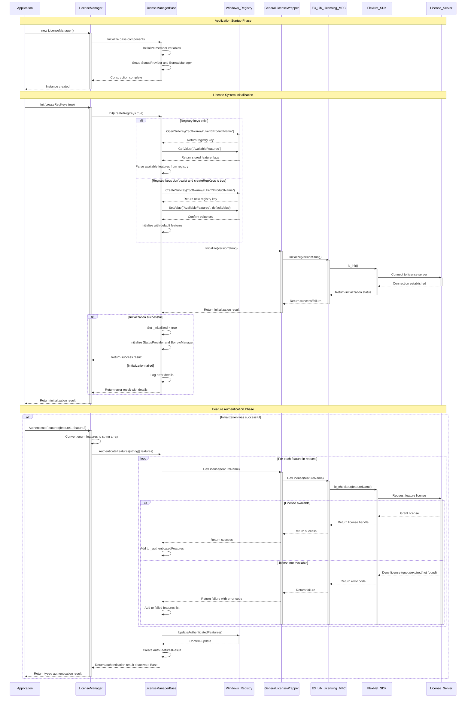
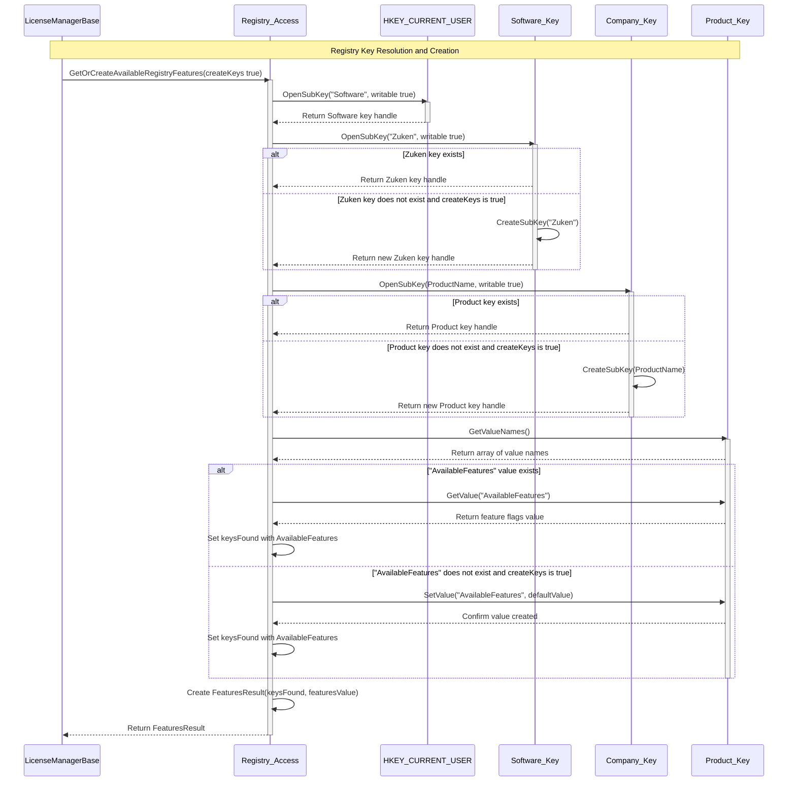
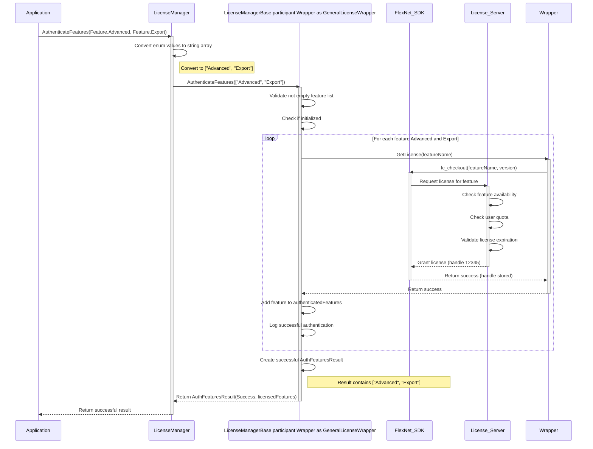
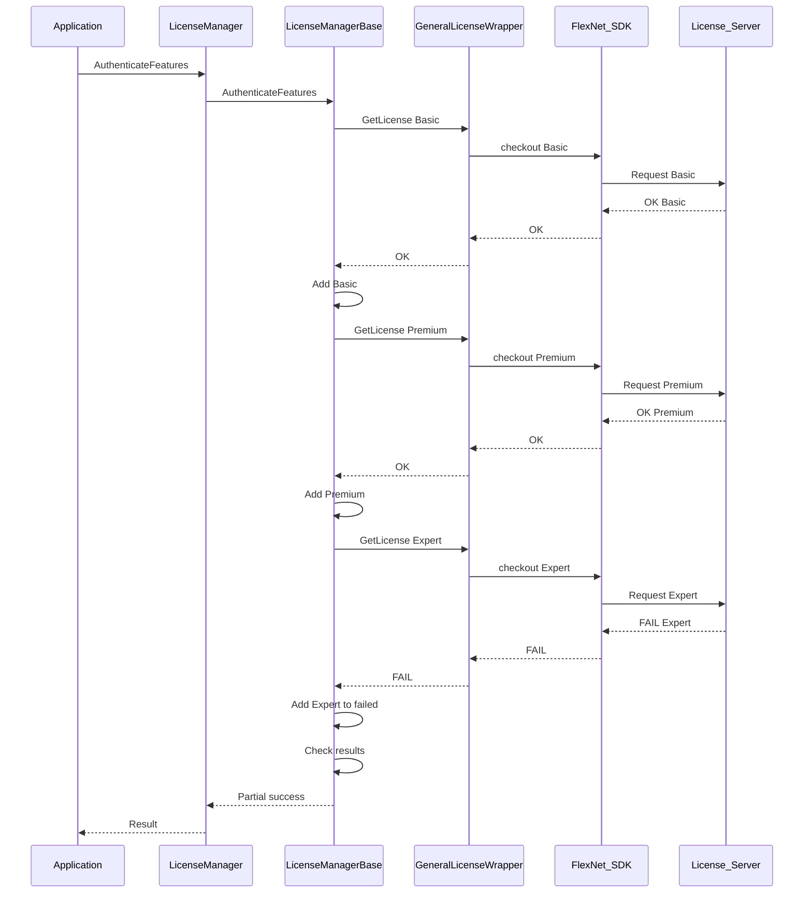
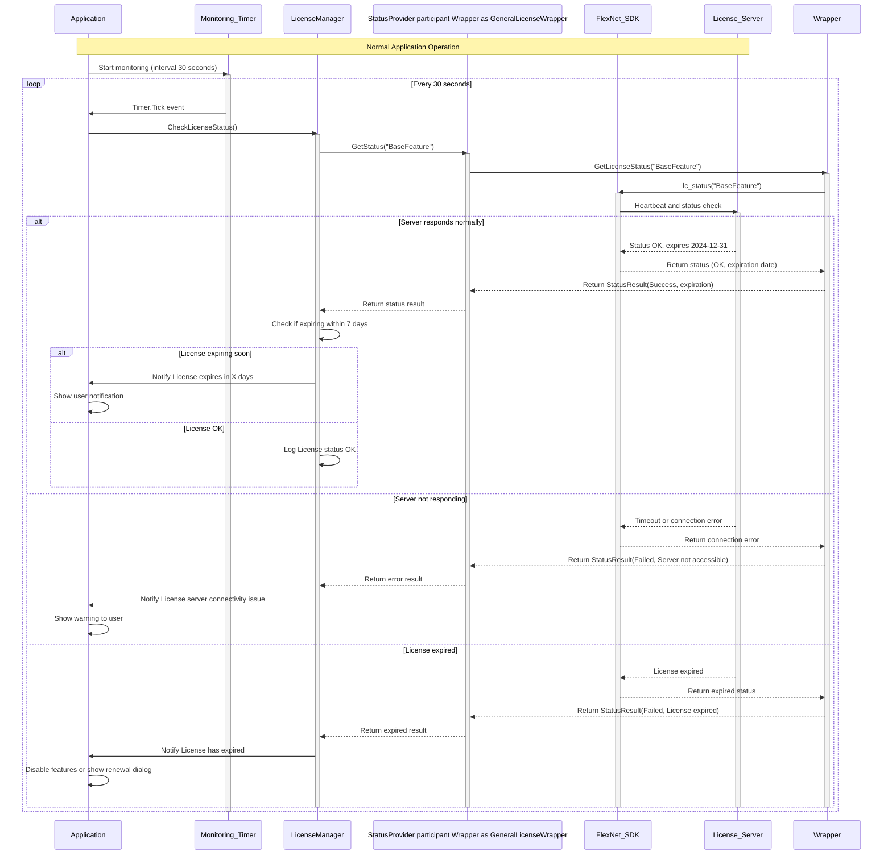
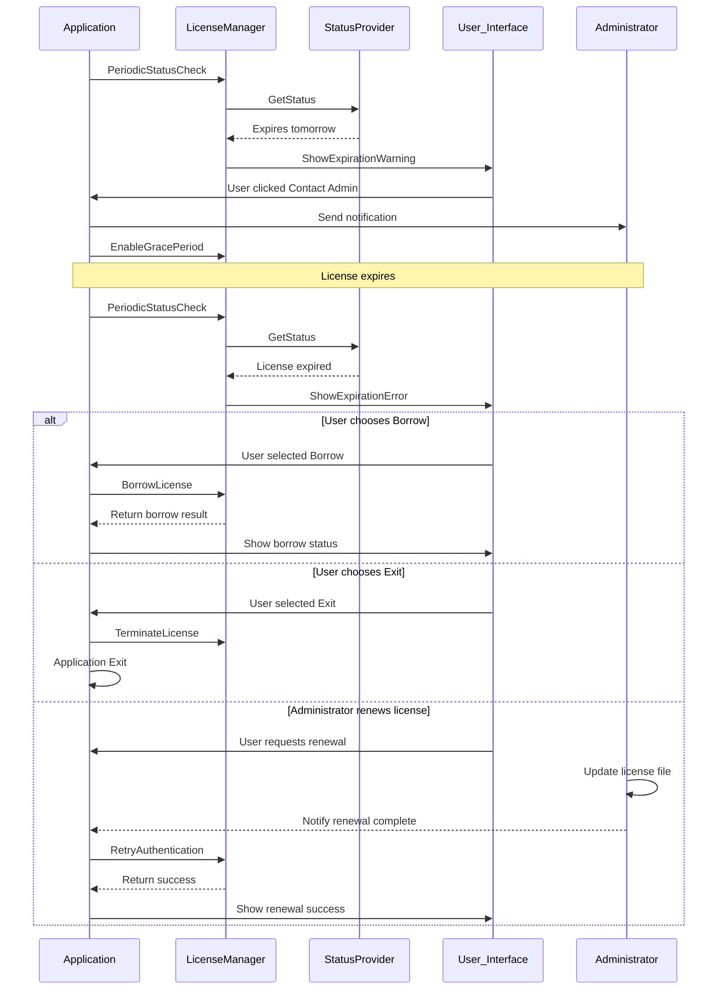
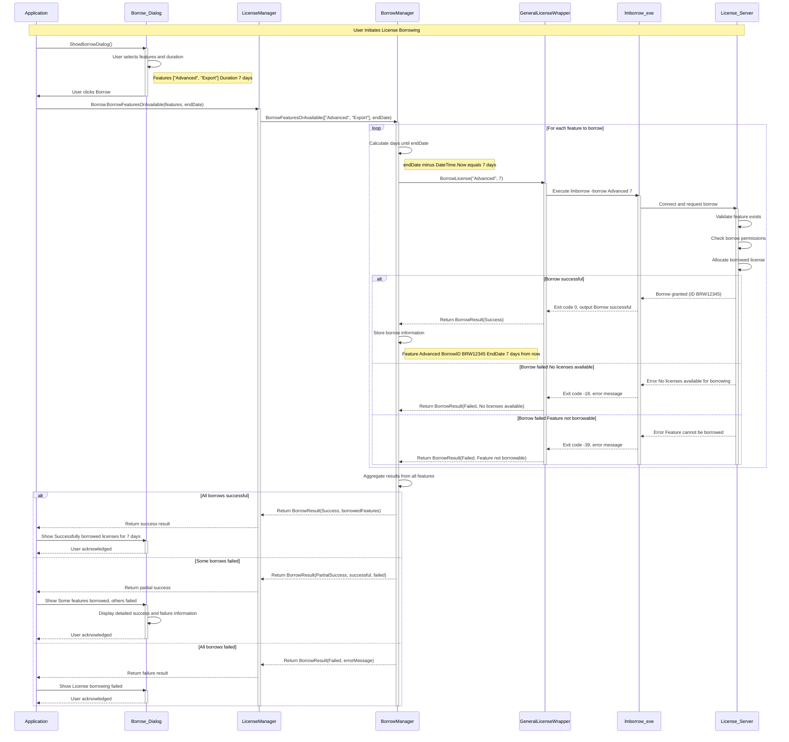
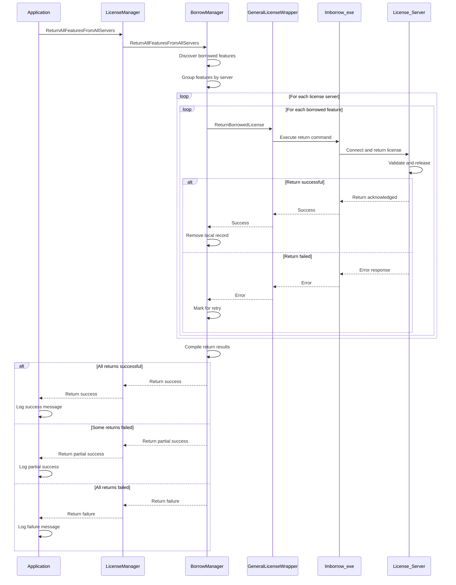
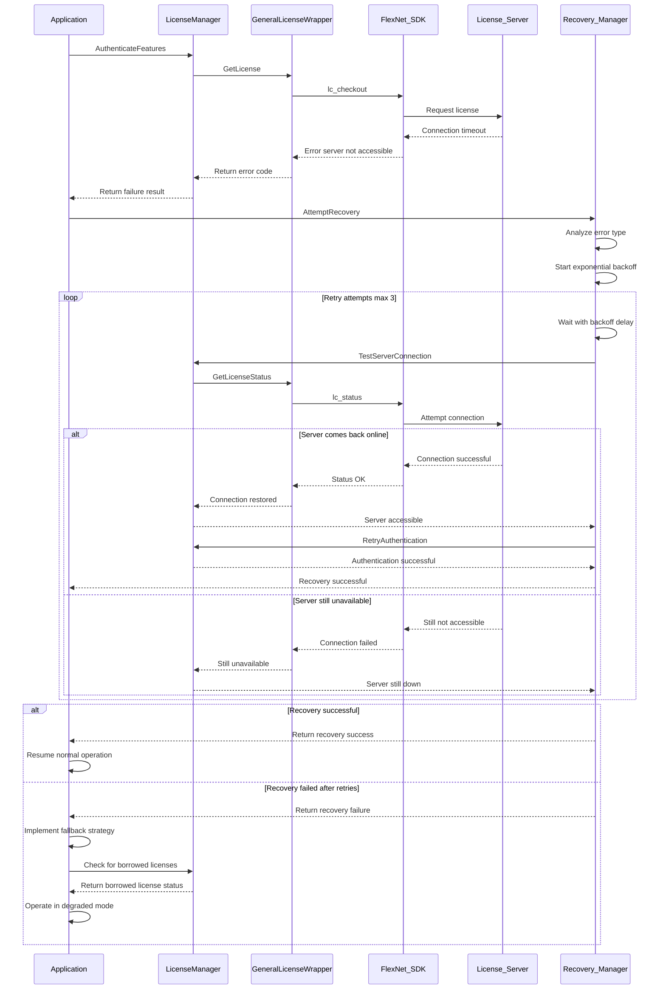
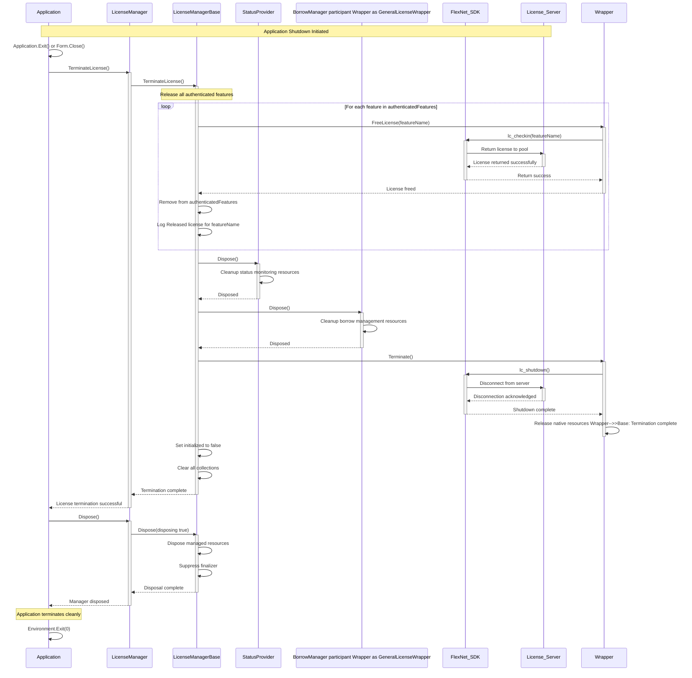

# Sequence Diagrams

<!-- Last updated: 2025-06-15 - Documentation verification and Next Steps validation completed -->

This section provides detailed sequence diagrams illustrating the key operational flows and interaction patterns within the E3.Lib.Licensing library. These diagrams help visualize the communication between components and understand the temporal aspects of licensing operations.

### Overview

The sequence diagrams cover:
- **Initialization and Setup**: System startup and configuration flows
- **Feature Authentication**: License checking and feature validation
- **Status Monitoring**: Periodic health checks and expiration monitoring
- **Borrow Management**: Offline license management workflows
- **Error Handling**: Failure scenarios and recovery patterns
- **Termination and Cleanup**: Proper resource disposal flows

## Initialization Sequence Diagrams

### Complete Initialization Flow

This diagram shows the comprehensive initialization process from application startup through feature authentication:



**Key Steps:**
1. **Application Startup**: Application creates LicenseManager instance and calls initialization
2. **Base Initialization**: LicenseManager delegates to LicenseManagerBase for core setup
3. **Registry Configuration**: System reads existing registry keys or creates new ones if requested
4. **Feature Discovery**: Loads available features from registry or initializes defaults
5. **Wrapper Initialization**: Initializes GeneralLicenseWrapper with version information
6. **FlexNet Connection**: Wrapper connects to FlexNet SDK and establishes server communication
7. **Feature Authentication**: System authenticates requested features with license server
8. **Registry Update**: Updates registry with successfully authenticated features
9. **Result Creation**: Creates and returns typed authentication result to application

<details>
<summary>📝 (Code) <strong>Complete Initialization Implementation</strong> - Full initialization process from startup to feature authentication</summary>

```vb
Option Strict On
Option Explicit On
Option Infer Off

Public Function Init(Optional createRegKeys As Boolean = False) As Result
    Try
        ' Application creates LicenseManager and calls initialization
        If Me._initialized Then
            Return New Result(ResultState.Success, "Already initialized")
        End If

        ' Initialize available features from registry
        Me.InitAvailableFeatures(createRegKeys)
        
        ' Setup product configuration
        If String.IsNullOrEmpty(Me._productName) Then
            Me._productName = Me.GetProductNameFromAssembly()
        End If

        ' Initialize GeneralLicenseWrapper with version info
        Dim wrapperResult As Boolean = Me._licenseWrapper.Initialize(Me.GetVersionString())
        If Not wrapperResult Then
            Return New LicenseErrorCodeResult(ResultState.Failed, 
                "Failed to initialize licensing system")
        End If

        ' Connect to FlexNet SDK and establish server communication
        Me._status = New StatusProvider(Me._licenseWrapper)
        Me._borrow = New BorrowManager(Me._licenseWrapper)
        
        ' Extract FlexNet tools for advanced operations
        Me.ExtractFlexNetTools()

        Me._initialized = True
        
        ' Authenticate requested features with license server
        Dim requestedFeatures As String() = Me.GetDefaultFeatures()
        Dim authResult As FeaturesResult = Me.AuthenticateFeatures(requestedFeatures)
        
        ' Update registry with successfully authenticated features
        If authResult.State = ResultState.Success Then
            Dim featuresList As List(Of String) = authResult.Features.ToList()
            Me.UpdateRegistryFeatures(featuresList)
        End If

        Return New Result(ResultState.Success, "Initialization completed")
    Catch ex As Exception
        Return New Result(ex)
    End Try
End Function
```
</details>

### Registry Integration Sequence

This diagram illustrates how the licensing system interacts with Windows Registry for configuration and feature storage:



**Key Steps:**
1. **Registry Access**: LicenseManagerBase initiates registry access for feature configuration
2. **Software Key**: Opens or creates the Software registry key under HKEY_CURRENT_USER
3. **Company Key**: Opens or creates the Zuken company key under Software
4. **Product Key**: Opens or creates the product-specific key under Zuken
5. **Feature Values**: Checks for existing AvailableFeatures value or creates default if requested
6. **Configuration Storage**: Stores or retrieves licensing configuration from registry
7. **Result Creation**: Creates FeaturesResult with discovered configuration and returns to caller

<details>
<summary>📝 (Code) <strong>Registry Integration Implementation</strong> - Windows Registry interaction for feature configuration storage</summary>

```vb
Option Strict On
Option Explicit On
Option Infer Off

Private Sub InitAvailableFeatures(Optional createRegKeys As Boolean = False)
    Try
        ' Registry access for feature configuration
        Dim registryPath As String = String.Format("SOFTWARE\Zuken\{0}\Licensing", Me.ProductName)
        
        ' Open Software registry key under HKEY_CURRENT_USER
        Using key As RegistryKey = Registry.CurrentUser.OpenSubKey(registryPath, False)
            If key IsNot Nothing Then
                ' Check for existing AvailableFeatures value
                Dim storedFeatures As String() = TryCast(key.GetValue("AvailableFeatures"), String())
                If storedFeatures IsNot Nothing AndAlso storedFeatures.Length > 0 Then
                    Dim featuresList As New List(Of String)(storedFeatures)
                    Me._availableFeatures = New ReadOnlyCollection(Of String)(featuresList)
                    Return
                End If
            End If
        End Using

        ' Create registry keys if requested and they don't exist
        If createRegKeys Then
            ' Create company key under Software
            Using companyKey As RegistryKey = Registry.CurrentUser.CreateSubKey("SOFTWARE\Zuken", True)
                ' Create product-specific key under Zuken
                Using productKey As RegistryKey = companyKey.CreateSubKey(Me.ProductName, True)
                    Using licensingKey As RegistryKey = productKey.CreateSubKey("Licensing", True)
                        ' Store licensing configuration from registry
                        Dim allFeatures As String() = Me.GetAllFeatureNames()
                        licensingKey.SetValue("AvailableFeatures", allFeatures, RegistryValueKind.MultiString)
                        licensingKey.SetValue("Created", DateTime.Now.ToString(CultureInfo.InvariantCulture))
                    End Using
                End Using
            End Using
        End If

        ' Create FeaturesResult with discovered configuration
        Dim defaultFeatures As String() = Me.GetAllFeatureNames()
        Dim defaultFeaturesList As New List(Of String)(defaultFeatures)
        Me._availableFeatures = New ReadOnlyCollection(Of String)(defaultFeaturesList)
        
    Catch ex As Exception
        Logger.LogError(String.Format("Registry integration error: {0}", ex.Message))
        Dim fallbackFeatures As String() = Me.GetAllFeatureNames()
        Dim fallbackFeaturesList As New List(Of String)(fallbackFeatures)
        Me._availableFeatures = New ReadOnlyCollection(Of String)(fallbackFeaturesList)
    End Try
End Sub
```
</details>

## Feature Authentication Sequences

### Successful Authentication Flow

This diagram demonstrates the successful authentication process for multiple features:



**Key Steps:**
1. **Feature Request**: Application requests authentication for multiple features
2. **Type Conversion**: LicenseManager converts strongly-typed enums to string array
3. **Validation**: Base class validates feature list and initialization status
4. **Individual Authentication**: System requests each feature license from FlexNet
5. **Server Processing**: License server checks availability, quota, and expiration for each feature
6. **License Grant**: Server grants licenses and returns handles for successful features
7. **Result Tracking**: Base class tracks successfully authenticated features
8. **Result Creation**: Creates AuthFeaturesResult with licensed features list
9. **Response**: Returns typed success result to application

<details>
<summary>📝 (Code) <strong>Successful Authentication Implementation</strong> - Complete feature authentication process with success handling</summary>

```vb
Option Strict On
Option Explicit On
Option Infer Off

Public Function AuthenticateFeatures(features As String()) As FeaturesResult
    Try
        ' Feature request from application
        If Not Me._initialized Then
            Return New FeaturesResult(ResultState.Failed, "Not initialized")
        End If

        ' Type conversion - strongly-typed enums to string array
        Dim validFeatures As String() = features.Where(Function(f As String) Not String.IsNullOrWhiteSpace(f)).ToArray()
        
        ' Validation of feature list and initialization status
        If validFeatures.Length = 0 Then
            Return New FeaturesResult(ResultState.Failed, "No valid features")
        End If

        Dim authenticatedFeatures As New List(Of String)

        ' Individual authentication - request each feature license from FlexNet
        For Each feature As String In validFeatures
            ' License server checks availability, quota, and expiration
            Dim success As Boolean = Me._licenseWrapper.GetLicense(feature)
            
            If success Then
                ' License grant - server grants licenses and returns handles
                authenticatedFeatures.Add(feature)
                Me._authenticatedFeatures.Add(feature)
                Logger.LogInfo(String.Format("Successfully authenticated feature: {0}", feature))
            End If
        Next

        ' Result tracking - base class tracks successfully authenticated features
        If authenticatedFeatures.Count > 0 Then
            Me.UpdateRegistryFeatures(authenticatedFeatures)
        End If

        ' Result creation - create AuthFeaturesResult with licensed features
        Return New FeaturesResult(ResultState.Success) With {
            .Features = authenticatedFeatures.ToArray(),
            .Message = String.Format("Successfully authenticated {0} features", authenticatedFeatures.Count)
        }

    Catch ex As Exception
        Return New FeaturesResult(ex)
    End Try
End Function
```
</details>

### Authentication with Partial Failure

This diagram shows the authentication process when some features succeed and others fail:



**Key Steps:**
1. **Mixed Authentication**: Application requests multiple features with varying availability
2. **Feature Processing**: System processes each feature individually (Basic, Premium, Expert)
3. **Success Cases**: Basic and Premium features authenticate successfully
4. **Failure Case**: Expert feature fails due to various reasons (quota, not found, expired)
5. **Error Handling**: System captures error codes and adds failed features to separate list
6. **Result Assessment**: Determines overall result based on main feature success/failure
7. **Partial Success**: Returns success with warnings if main features succeeded but optional ones failed
8. **Detailed Response**: Provides both successful and failed features in the result

<details>
<summary>📝 (Code) <strong>Partial Failure Authentication Implementation</strong> - Handling mixed success/failure scenarios with detailed error reporting</summary>

```vb
Option Strict On
Option Explicit On
Option Infer Off

Public Function AuthenticateFeatures(features As String()) As FeaturesResult
    Try
        ' Mixed authentication request for multiple features
        Dim authenticatedFeatures As New List(Of String)
        Dim failedFeatures As New List(Of String)

        ' Feature processing - process each feature individually
        For Each feature As String In features
            Try
                ' Success cases - Basic and Premium authenticate successfully
                Dim success As Boolean = Me._licenseWrapper.GetLicense(feature)
                
                If success Then
                    authenticatedFeatures.Add(feature)
                    Me._authenticatedFeatures.Add(feature)
                    Logger.LogInfo(String.Format("Authenticated feature: {0}", feature))
                Else
                    ' Failure case - Expert fails due to various reasons
                    Dim errorCode As Integer = Me._licenseWrapper.GetLastErrorCode()
                    failedFeatures.Add(feature)
                    
                    ' Error handling - capture error codes for failed features
                    Select Case errorCode
                        Case -103 ' No licenses available (quota exceeded)
                            Logger.LogWarning(String.Format("Feature {0}: All licenses in use", feature))
                        Case -5 ' Feature not found in license file
                            Logger.LogWarning(String.Format("Feature {0}: Not found in license", feature))
                        Case -6 ' License expired
                            Logger.LogWarning(String.Format("Feature {0}: License expired", feature))
                        Case Else
                            Logger.LogWarning(String.Format("Feature {0}: Error code {1}", feature, errorCode.ToString(CultureInfo.InvariantCulture)))
                    End Select
                End If

            Catch ex As Exception
                failedFeatures.Add(feature)
                Logger.LogError(String.Format("Exception authenticating {0}: {1}", feature, ex.Message))
            End Try
        Next

        ' Result assessment - determine overall result based on main feature success
        Dim hasMainFeature As Boolean = authenticatedFeatures.Contains(Me.MainFeature)
        
        ' Update registry with successful authentications
        If authenticatedFeatures.Count > 0 Then
            Me.UpdateRegistryFeatures(authenticatedFeatures)
        End If

        ' Partial success or detailed response
        If authenticatedFeatures.Count > 0 Then
            Dim resultState As ResultState = If(failedFeatures.Count > 0, ResultState.PartialSuccess, ResultState.Success)
            Return New FeaturesResult(resultState) With {
                .Features = authenticatedFeatures.ToArray(),
                .FailedFeatures = failedFeatures.ToArray(),
                .Message = String.Format("Authenticated {0}/{1} features", 
                                       authenticatedFeatures.Count.ToString(CultureInfo.InvariantCulture), 
                                       features.Length.ToString(CultureInfo.InvariantCulture))
            }
        Else
            Return New FeaturesResult(ResultState.Failed, "No features authenticated") With {
                .FailedFeatures = failedFeatures.ToArray()
            }
        End If

    Catch ex As Exception
        Return New FeaturesResult(ex)
    End Try
End Function
```
</details>

## Status Monitoring Sequences

### Periodic License Status Check

This diagram illustrates the continuous monitoring process that checks license status at regular intervals:



**Key Steps:**
1. **Monitoring Setup**: Application starts periodic timer for license status monitoring
2. **Regular Checks**: Timer triggers status checks at configured intervals (e.g., 30 seconds)
3. **Status Query**: License manager requests status for critical features
4. **Server Communication**: Status provider communicates with license server via FlexNet
5. **Health Assessment**: Server responds with license status and expiration information
6. **Expiration Warning**: System checks for upcoming expirations and notifies user
7. **Error Handling**: Handles server connectivity issues and license expiration scenarios
8. **User Notification**: Displays appropriate warnings or errors to user interface
9. **Continuous Operation**: Process repeats for ongoing license health monitoring

<details>
<summary>📝 (Code) <strong>Periodic Status Check Implementation</strong> - Continuous license monitoring with expiration warnings and error handling</summary>

```vb
Option Strict On
Option Explicit On
Option Infer Off

Public Class LicenseStatusMonitor
    Private _statusTimer As Timer
    Private _licenseManager As LicenseManager
    Private _monitoringInterval As TimeSpan = TimeSpan.FromSeconds(30)

    Public Sub StartMonitoring()
        Try
            ' Monitoring setup - start periodic timer for license status monitoring
            Me._statusTimer = New Timer(Me._monitoringInterval.TotalMilliseconds)
            AddHandler Me._statusTimer.Elapsed, AddressOf Me.OnStatusCheck
            Me._statusTimer.Start()
            
            Logger.LogInfo("License status monitoring started")
        Catch ex As Exception
            Logger.LogError(String.Format(CultureInfo.InvariantCulture, "Failed to start monitoring: {0}", ex.Message))
        End Try
    End Sub

    Private Sub OnStatusCheck(sender As Object, e As ElapsedEventArgs)
        Try
            ' Regular checks - timer triggers status checks at configured intervals
            For Each feature As String In Me._licenseManager.AuthenticatedFeatures
                ' Status query - license manager requests status for critical features
                Dim statusResult As StatusResult = Me._licenseManager.Status.GetStatus(feature)
                
                If statusResult.IsSuccess Then
                    ' Server communication via FlexNet successful
                    ' Health assessment - server responds with status and expiration info
                    Dim expirationDate As DateTime = statusResult.ExpirationDate
                    Dim daysUntilExpiration As Integer = CInt((expirationDate - DateTime.Now).Days)
                    
                    ' Expiration warning - check for upcoming expirations
                    If daysUntilExpiration <= 7 AndAlso daysUntilExpiration > 0 Then
                        ' User notification - display warning to user interface
                        Me.ShowExpirationWarning(feature, expirationDate, daysUntilExpiration)
                    ElseIf daysUntilExpiration <= 0 Then
                        ' License expired
                        Me.ShowExpirationError(feature, expirationDate)
                    End If
                Else
                    ' Error handling - server connectivity issues
                    Me.HandleStatusError(feature, statusResult.ErrorCode)
                End If
            Next

        Catch ex As Exception
            ' Error handling for monitoring failures
            Logger.LogError(String.Format(CultureInfo.InvariantCulture, "Status monitoring error: {0}", ex.Message))
        End Try
    End Sub

    Private Sub ShowExpirationWarning(feature As String, expirationDate As DateTime, daysRemaining As Integer)
        ' User notification for upcoming expiration
        Dim message As String = String.Format(CultureInfo.InvariantCulture, "License for {0} expires in {1} days ({2:yyyy-MM-dd})", feature, daysRemaining.ToString(CultureInfo.InvariantCulture), expirationDate)
        Logger.LogWarning(message)
        RaiseEvent LicenseExpirationWarning(feature, expirationDate, daysRemaining)
    End Sub

    Private Sub HandleStatusError(feature As String, errorCode As Integer)
        ' Error handling for license expiration scenarios
        Select Case errorCode
            Case -15 ' License expired
                Logger.LogError(String.Format(CultureInfo.InvariantCulture, "License for {0} has expired", feature))
                RaiseEvent LicenseExpired(feature)
            Case -5 ' Server not accessible
                Logger.LogWarning(String.Format(CultureInfo.InvariantCulture, "Cannot connect to license server for {0}", feature))
                RaiseEvent ServerConnectionLost(feature)
            Case Else
                Logger.LogWarning(String.Format(CultureInfo.InvariantCulture, "Status check failed for {0}: Error {1}", feature, errorCode.ToString(CultureInfo.InvariantCulture)))
        End Select
    End Sub

    ' Continuous operation events
    Public Event LicenseExpirationWarning(feature As String, expirationDate As DateTime, daysRemaining As Integer)
    Public Event LicenseExpired(feature As String)
    Public Event ServerConnectionLost(feature As String)
End Class
```
</details>

### License Expiration Handling

This diagram demonstrates how the system handles license expiration scenarios and user interactions:



**Key Steps:**
1. **Expiration Detection**: System detects license approaching expiration during status check
2. **User Warning**: Displays expiration warning dialog with timeline and options
3. **Administrator Contact**: User can request administrator assistance for license renewal
4. **Grace Period**: System enables grace period mode for temporary continued operation
5. **License Expiry**: When license actually expires, system detects and responds accordingly
6. **User Options**: Presents options for borrowing, renewal, or application exit
7. **Borrow Attempt**: User may attempt to borrow expired license (may fail)
8. **Recovery Actions**: Administrator can renew license or user must exit application
9. **Successful Renewal**: System re-authenticates features when license is renewed

<details>
<summary>📝 (Code) <strong>License Expiration Handling Implementation</strong> - Complete expiration detection, user interaction, and recovery process</summary>

```vb
Option Strict On
Option Explicit On
Option Infer Off

Public Class LicenseExpirationHandler
    Private _licenseManager As LicenseManager
    Private _userInterface As IUserInterface

    Public Sub HandleExpirationScenario(feature As String)
        Try
            ' Expiration detection during periodic status check
            Dim statusResult As StatusResult = _licenseManager.Status.GetStatus(feature)
            
            If statusResult.IsExpiring(7) Then ' 7-day warning threshold
                ' User warning - display expiration warning dialog
                Dim warningResult As WarningResult = _userInterface.ShowExpirationWarning(
                    feature, statusResult.ExpirationDate)
                
                ' Administrator contact option
                If warningResult.ContactAdministrator Then
                    SendAdministratorNotification(feature, statusResult.ExpirationDate)
                End If
                
                ' Grace period - enable temporary continued operation
                _licenseManager.EnableGracePeriod(feature)
            End If

            ' License expiry - when license actually expires
            If statusResult.IsExpired Then
                HandleExpiredLicense(feature)
            End If

        Catch ex As Exception
            Logger.LogError(String.Format(CultureInfo.InvariantCulture, "Error handling expiration for {0}: {1}", feature, ex.Message))
        End Try
    End Sub

    Private Sub HandleExpiredLicense(feature As String)
        ' System detects and responds to license expiry
        Dim expirationDialog As ExpirationDialog = _userInterface.ShowExpirationError(feature)
        
        ' User options - present borrowing, renewal, or exit options
        Select Case expirationDialog.UserChoice
            Case ExpirationChoice.BorrowLicense
                ' Borrow attempt - may fail for expired licenses
                AttemptLicenseBorrow(feature)
                
            Case ExpirationChoice.ExitApplication
                ' User chooses to exit application
                _licenseManager.TerminateLicense()
                Application.Exit()
                
            Case ExpirationChoice.RequestRenewal
                ' Recovery actions - administrator renewal process
                HandleRenewalRequest(feature)
        End Select
    End Sub

    Private Sub AttemptLicenseBorrow(feature As String)
        Try
            ' User may attempt to borrow expired license
            Dim borrowEndDate As DateTime = DateTime.Now.AddDays(30)
            Dim borrowResult As BorrowResult = _licenseManager.Borrow.BorrowLicense(feature, borrowEndDate)
            
            If borrowResult.IsSuccess Then
                _userInterface.ShowMessage(String.Format(CultureInfo.InvariantCulture, "Successfully borrowed {0} until {1:yyyy-MM-dd}", feature, borrowEndDate))
            Else
                ' Borrow attempt may fail for expired licenses
                _userInterface.ShowError(String.Format(CultureInfo.InvariantCulture, "Cannot borrow expired license for {0}. Please contact administrator.", feature))
            End If
            
        Catch ex As Exception
            Logger.LogError(String.Format(CultureInfo.InvariantCulture, "Borrow attempt failed for {0}: {1}", feature, ex.Message))
            _userInterface.ShowError("License borrowing failed. Please contact administrator.")
        End Try
    End Sub

    Private Sub HandleRenewalRequest(feature As String)
        Try
            ' Administrator renewal process
            _userInterface.ShowMessage("Renewal request sent to administrator. Please wait...")
            
            ' Wait for administrator to update license file on server
            Dim renewalTimeout As DateTime = DateTime.Now.AddMinutes(5)
            While DateTime.Now < renewalTimeout
                Threading.Thread.Sleep(10000) ' Check every 10 seconds
                
                ' Successful renewal - re-authenticate features
                Dim retryResult As AuthenticationResult = _licenseManager.RetryAuthentication()
                If retryResult.IsSuccess Then
                    _userInterface.ShowMessage(String.Format(CultureInfo.InvariantCulture, "License for {0} renewed successfully!", feature))
                    Return
                End If
            End While
            
            ' Timeout - renewal not completed
            _userInterface.ShowError("License renewal timeout. Please contact administrator.")
            
        Catch ex As Exception
            Logger.LogError(String.Format(CultureInfo.InvariantCulture, "Renewal handling failed for {0}: {1}", feature, ex.Message))
        End Try
    End Sub

    Private Sub SendAdministratorNotification(feature As String, expirationDate As DateTime)
        ' Administrator contact for license renewal assistance
        Try
            Dim emailBody As String = String.Format(CultureInfo.InvariantCulture, "License expiration warning:{0}Feature: {1}{0}Expires: {2:yyyy-MM-dd HH:mm:ss}{0}User: {3}{0}Machine: {4}", 
                vbCrLf, feature, expirationDate, Environment.UserName, Environment.MachineName)
            
            SendEmail("license-admin@company.com", "License Expiration Warning", emailBody)
            Logger.LogInfo(String.Format(CultureInfo.InvariantCulture, "Administrator notification sent for {0} expiration", feature))
            
        Catch ex As Exception
            Logger.LogError(String.Format(CultureInfo.InvariantCulture, "Failed to send administrator notification: {0}", ex.Message))
        End Try
    End Sub
End Class
```
</details>

## Borrow Management Sequences

### License Borrowing Flow

This diagram shows the complete process of borrowing licenses for offline use:



**Key Steps:**
1. **Borrow Initiation**: User opens borrow dialog and selects features and duration
2. **Feature Selection**: User specifies which features to borrow and for how long
3. **Borrow Request**: Application calls BorrowManager with selected features and end date
4. **Duration Calculation**: System calculates number of days from current date to end date
5. **Server Communication**: BorrowManager uses lmborrow.exe to communicate with license server
6. **License Allocation**: Server validates permissions and allocates borrowed licenses
7. **Local Storage**: System stores borrow information locally for offline access
8. **Result Processing**: Aggregates results from all borrow attempts (success/failure)
9. **User Feedback**: Displays success, partial success, or failure message to user

<details>
<summary>📝 (Code) <strong>License Borrowing Implementation</strong> - Complete offline license borrowing process with validation and local storage</summary>

```vb
Option Strict On
Option Explicit On
Option Infer Off

Public Class BorrowManager
    Private _licenseWrapper As GeneralLicenseWrapper
    Private _localBorrowStorage As String

    Public Function BorrowLicense(feature As String, endDate As DateTime) As BorrowResult
        Try
            ' Borrow initiation - user opens dialog and selects features
            If String.IsNullOrEmpty(feature) Then
                Return New BorrowResult(ResultState.Failed, "Feature name required")
            End If

            ' Feature selection - user specifies duration
            If endDate <= DateTime.Now Then
                Return New BorrowResult(ResultState.Failed, "End date must be in the future")
            End If

            ' Duration calculation - calculate days from current date
            Dim borrowDays As Integer = CInt((endDate - DateTime.Now).TotalDays)
            If borrowDays > 30 Then ' Maximum borrow period
                Return New BorrowResult(ResultState.Failed, "Maximum borrow period is 30 days")
            End If

            ' Server communication using lmborrow.exe
            Dim lmborrowResult As LmBorrowResult = ExecuteLmBorrow(feature, borrowDays)
            
            If lmborrowResult.Success Then
                ' License allocation - server validates and allocates borrowed license
                Dim borrowInfo As BorrowInfo = New BorrowInfo With {
                    .Feature = feature,
                    .BorrowDate = DateTime.Now,
                    .EndDate = endDate,
                    .ServerId = lmborrowResult.ServerId,
                    .BorrowId = lmborrowResult.BorrowId
                }

                ' Local storage - store borrow information for offline access
                StoreBorrowInfoLocally(borrowInfo)
                UpdateRegistryBorrowInfo(borrowInfo)

                ' Result processing - successful borrow
                Logger.LogInfo(String.Format(CultureInfo.InvariantCulture, "Successfully borrowed {0} until {1:yyyy-MM-dd}", feature, endDate))
                
                ' User feedback - display success message
                Return New BorrowResult(ResultState.Success) With {
                    .BorrowedFeature = feature,
                    .EndDate = endDate,
                    .Message = String.Format(CultureInfo.InvariantCulture, "License borrowed successfully until {0:yyyy-MM-dd}", endDate)
                }
            Else
                ' Result processing - borrow failed
                Logger.LogWarning(String.Format(CultureInfo.InvariantCulture, "Failed to borrow {0}: {1}", feature, lmborrowResult.ErrorMessage))
                
                ' User feedback - display failure message
                Return New BorrowResult(ResultState.Failed, lmborrowResult.ErrorMessage)
            End If

        Catch ex As Exception
            Logger.LogError(String.Format(CultureInfo.InvariantCulture, "Borrow operation failed for {0}: {1}", feature, ex.Message))
            Return New BorrowResult(ex)
        End Try
    End Function

    Private Function ExecuteLmBorrow(feature As String, days As Integer) As LmBorrowResult
        Try
            ' Server communication via lmborrow.exe
            Dim lmborrowPath As String = Path.Combine(_flexNetToolsPath, "lmborrow.exe")
            Dim arguments As String = String.Format(CultureInfo.InvariantCulture, "-checkout {0} -date {1}", feature, days.ToString(CultureInfo.InvariantCulture))
            
            Using process As Process = New Process()
                process.StartInfo.FileName = lmborrowPath
                process.StartInfo.Arguments = arguments
                process.StartInfo.UseShellExecute = False
                process.StartInfo.RedirectStandardOutput = True
                process.StartInfo.RedirectStandardError = True
                process.StartInfo.CreateNoWindow = True
                
                process.Start()
                Dim output As String = process.StandardOutput.ReadToEnd()
                Dim errorOutput As String = process.StandardError.ReadToEnd()
                process.WaitForExit()
                
                ' Process lmborrow output
                If process.ExitCode = 0 Then
                    Return ParseLmBorrowOutput(output)
                Else
                    Return New LmBorrowResult With {
                        .Success = False,
                        .ErrorMessage = If(String.IsNullOrEmpty(errorOutput), output, errorOutput)
                    }
                End If
            End Using
            
        Catch ex As Exception
            Return New LmBorrowResult With {
                .Success = False,
                .ErrorMessage = ex.Message
            }
        End Try
    End Function

    Private Sub StoreBorrowInfoLocally(borrowInfo As BorrowInfo)
        Try
            ' Local storage for offline access
            Dim borrowFile As String = Path.Combine(_localBorrowStorage, String.Format(CultureInfo.InvariantCulture, "{0}.borrow", borrowInfo.Feature))
            Dim json As String = JsonConvert.SerializeObject(borrowInfo, Formatting.Indented)
            File.WriteAllText(borrowFile, json)
            
            Logger.LogInfo(String.Format(CultureInfo.InvariantCulture, "Stored borrow info locally: {0}", borrowFile))
            
        Catch ex As Exception
            Logger.LogError(String.Format(CultureInfo.InvariantCulture, "Failed to store borrow info locally: {0}", ex.Message))
        End Try
    End Sub

    Public Function GetBorrowedFeatures() As List(Of BorrowInfo)
        ' Aggregates results from all borrow attempts
        Dim borrowedFeatures As List(Of BorrowInfo) = New List(Of BorrowInfo)
        
        Try
            If Directory.Exists(_localBorrowStorage) Then
                For Each borrowFile As String In Directory.GetFiles(_localBorrowStorage, "*.borrow")
                    Try
                        Dim json As String = File.ReadAllText(borrowFile)
                        Dim borrowInfo As BorrowInfo = JsonConvert.DeserializeObject(Of BorrowInfo)(json)
                        borrowedFeatures.Add(borrowInfo)
                    Catch ex As Exception
                        Logger.LogWarning(String.Format(CultureInfo.InvariantCulture, "Failed to read borrow file {0}: {1}", borrowFile, ex.Message))
                    End Try
                Next
            End If
            
        Catch ex As Exception
            Logger.LogError(String.Format(CultureInfo.InvariantCulture, "Error reading borrowed features: {0}", ex.Message))
        End Try
        
        Return borrowedFeatures
    End Function
End Class
```
</details>

### License Return Flow

This diagram shows the process of returning borrowed licenses back to the license server:



**Key Steps:**
1. **Return Initiation**: Application requests return of all borrowed licenses from all servers
2. **Discovery**: BorrowManager discovers borrowed features from local storage and registry
3. **Server Grouping**: Groups features by license server for efficient processing
4. **Individual Returns**: Processes each borrowed feature return using lmborrow.exe
5. **Server Validation**: License server validates borrow records and releases allocations
6. **Local Cleanup**: Removes borrow records from local storage and updates registry
7. **Error Handling**: Handles various failure scenarios (already returned, communication errors)
8. **Result Compilation**: Aggregates results from all return attempts
9. **Status Reporting**: Reports success, partial success, or failure with appropriate logging

<details>
<summary>📝 (Code) <strong>License Return Implementation</strong> - Complete borrowed license return process with error handling and cleanup</summary>

```vb
Option Strict On
Option Explicit On
Option Infer Off

Public Function ReturnAllFeaturesFromAllServers() As LicenseErrorCodeResult
    Try
        ' Return initiation - application requests return of all borrowed licenses
        Logger.LogInfo("Starting return of all borrowed licenses from all servers")
        
        ' Discovery - discover borrowed features from local storage and registry
        Dim borrowedFeatures As List(Of BorrowInfo) = GetBorrowedFeatures()
        If borrowedFeatures.Count = 0 Then
            Return New LicenseErrorCodeResult(ResultState.Success, "No borrowed licenses to return")
        End If

        ' Server grouping - group features by license server for efficient processing
        Dim serverGroups As List(Of IGrouping(Of String, BorrowInfo)) = borrowedFeatures.GroupBy(Function(b) b.ServerId).ToList()
        
        Dim allReturnsSuccessful As Boolean = True
        Dim partialFailures As List(Of String) = New List(Of String)
        Dim allFailures As List(Of String) = New List(Of String)

        ' Process each license server group
        For Each serverGroup In serverGroups
            Dim serverId As String = serverGroup.Key
            Logger.LogInfo(String.Format(CultureInfo.InvariantCulture, "Processing returns for server: {0}", serverId))

            ' Individual returns - process each borrowed feature using lmborrow.exe
            For Each borrowInfo As BorrowInfo In serverGroup
                Try
                    ' Server validation and license return
                    Dim returnResult As LmBorrowReturnResult = ExecuteLmBorrowReturn(borrowInfo)
                    
                    If returnResult.Success Then
                        ' License server validates borrow records and releases allocations
                        Logger.LogInfo(String.Format(CultureInfo.InvariantCulture, "Successfully returned {0} to {1}", borrowInfo.Feature, serverId))
                        
                        ' Local cleanup - remove borrow records from local storage
                        RemoveBorrowInfoLocally(borrowInfo)
                        UpdateRegistryAfterReturn(borrowInfo)
                        
                    Else
                        ' Error handling - various failure scenarios
                        allReturnsSuccessful = False
                        
                        Select Case returnResult.ErrorCode
                            Case -25 ' Already returned
                                Logger.LogWarning(String.Format(CultureInfo.InvariantCulture, "License {0} already returned", borrowInfo.Feature))
                                RemoveBorrowInfoLocally(borrowInfo) ' Clean up stale record
                                partialFailures.Add(String.Format(CultureInfo.InvariantCulture, "{0} (already returned)", borrowInfo.Feature))
                                
                            Case -5 ' Server communication error
                                Logger.LogError(String.Format(CultureInfo.InvariantCulture, "Communication error returning {0}", borrowInfo.Feature))
                                allFailures.Add(String.Format(CultureInfo.InvariantCulture, "{0} (communication error)", borrowInfo.Feature))
                                
                            Case Else
                                Logger.LogError(String.Format(CultureInfo.InvariantCulture, "Failed to return {0}: {1}", borrowInfo.Feature, returnResult.ErrorMessage))
                                allFailures.Add(String.Format(CultureInfo.InvariantCulture, "{0} ({1})", borrowInfo.Feature, returnResult.ErrorMessage))
                        End Select
                    End If

                Catch ex As Exception
                    allReturnsSuccessful = False
                    allFailures.Add(String.Format(CultureInfo.InvariantCulture, "{0} (exception: {1})", borrowInfo.Feature, ex.Message))
                    Logger.LogError(String.Format(CultureInfo.InvariantCulture, "Exception returning {0}: {1}", borrowInfo.Feature, ex.Message))
                End Try
            Next
        Next

        ' Result compilation - aggregate results from all return attempts
        Return CompileReturnResults(allReturnsSuccessful, partialFailures, allFailures)

    Catch ex As Exception
        Logger.LogError(String.Format(CultureInfo.InvariantCulture, "Error during license return process: {0}", ex.Message))
        Return New LicenseErrorCodeResult(ex, LicensingErrorCodes.BORROW_RETURN_FAILED)
    End Try
End Function

Private Function ExecuteLmBorrowReturn(borrowInfo As BorrowInfo) As LmBorrowReturnResult
    Try
        ' Individual returns using lmborrow.exe for server communication
        Dim lmborrowPath As String = Path.Combine(_flexNetToolsPath, "lmborrow.exe")
        Dim arguments As String = String.Format(CultureInfo.InvariantCulture, "-return {0} -id {1}", borrowInfo.Feature, borrowInfo.BorrowId)
        
        Using process As Process = New Process()
            process.StartInfo.FileName = lmborrowPath
            process.StartInfo.Arguments = arguments
            process.StartInfo.UseShellExecute = False
            process.StartInfo.RedirectStandardOutput = True
            process.StartInfo.RedirectStandardError = True
            process.StartInfo.CreateNoWindow = True
            
            process.Start()
            Dim output As String = process.StandardOutput.ReadToEnd()
            Dim errorOutput As String = process.StandardError.ReadToEnd()
            process.WaitForExit()
            
            ' Server validation and response processing
            If process.ExitCode = 0 Then
                Return New LmBorrowReturnResult With {
                    .Success = True,
                    .Message = "License returned successfully"
                }
            Else
                Return New LmBorrowReturnResult With {
                    .Success = False,
                    .ErrorCode = process.ExitCode,
                    .ErrorMessage = If(String.IsNullOrEmpty(errorOutput), output, errorOutput)
                }
            End If
        End Using
        
    Catch ex As Exception
        Return New LmBorrowReturnResult With {
            .Success = False,
            .ErrorCode = -1,
            .ErrorMessage = ex.Message
        }
    End Try
End Function

Private Sub RemoveBorrowInfoLocally(borrowInfo As BorrowInfo)
    Try
        ' Local cleanup - remove borrow records from local storage
        Dim borrowFile As String = Path.Combine(_localBorrowStorage, String.Format(CultureInfo.InvariantCulture, "{0}.borrow", borrowInfo.Feature))
        If File.Exists(borrowFile) Then
            File.Delete(borrowFile)
            Logger.LogInfo(String.Format(CultureInfo.InvariantCulture, "Removed local borrow file: {0}", borrowFile))
        End If
        
    Catch ex As Exception
        Logger.LogError(String.Format(CultureInfo.InvariantCulture, "Failed to remove local borrow file: {0}", ex.Message))
    End Try
End Sub

Private Function CompileReturnResults(allSuccessful As Boolean, 
                                     partialFailures As List(Of String), 
                                     allFailures As List(Of String)) As LicenseErrorCodeResult
    ' Result compilation and status reporting
    If allSuccessful Then
        ' All returns successful
        Logger.LogInfo("All borrowed licenses returned successfully")
        Return New LicenseErrorCodeResult(ResultState.Success, 
            "All borrowed licenses returned successfully")
            
    ElseIf allFailures.Count = 0 Then
        ' Some returns failed (partial success)
        Dim message As String = String.Format(CultureInfo.InvariantCulture, "Some license returns had issues: {0}", String.Join(", ", partialFailures))
        Logger.LogWarning(message)
        Return New LicenseErrorCodeResult(ResultState.PartialSuccess, message)
        
    Else
        ' All returns failed
        Dim message As String = String.Format(CultureInfo.InvariantCulture, "License return failed: {0}", String.Join(", ", allFailures))
        Logger.LogError(message)
        Return New LicenseErrorCodeResult(ResultState.Failed, message, 
            LicensingErrorCodes.BORROW_RETURN_FAILED)
    End If
End Function
```
</details>

## Error Handling Sequences

### Server Connection Failure and Recovery

This diagram shows how the system handles server connectivity issues and attempts recovery:



**Key Steps:**
1. **Initial Failure**: Application attempts feature authentication but server is unavailable
2. **Error Detection**: System detects server connection failure and converts to appropriate error code
3. **Recovery Initiation**: Application starts recovery process with exponential backoff strategy
4. **Retry Attempts**: System makes multiple connection attempts with increasing delays
5. **Connection Testing**: Tests server connectivity and licensing system functionality
6. **Successful Recovery**: If server comes back online, re-attempts authentication
7. **Fallback Strategy**: If recovery fails, checks for borrowed licenses for offline operation
8. **Degraded Mode**: If no offline options available, disables features and notifies user
9. **Status Monitoring**: Continues monitoring for server recovery opportunities

<details>
<summary>📝 (Code) <strong>Server Connection Recovery Implementation</strong> - Complete failure detection, retry logic, and fallback strategies</summary>

```vb
Option Strict On
Option Explicit On
Option Infer Off

Public Class ServerConnectionRecovery
    Private _licenseManager As LicenseManager
    Private _maxRetryAttempts As Integer = 3
    Private _baseRetryDelay As TimeSpan = TimeSpan.FromSeconds(1)

    Public Function AttemptRecovery(failureResult As FeaturesResult) As RecoveryResult
        Try
            ' Initial failure - application attempts authentication but server unavailable
            If failureResult.ErrorCode <> LicensingErrorCodes.SERVER_NOT_ACCESSIBLE Then
                Return New RecoveryResult(ResultState.Failed, "Recovery not applicable for this error type")
            End If

            ' Error detection - system detects server connection failure
            Logger.LogWarning("Server connection failure detected, starting recovery process")
            
            ' Recovery initiation - start exponential backoff strategy
            For attempt As Integer = 1 To _maxRetryAttempts
                ' Retry attempts with increasing delays
                Dim delay As TimeSpan = TimeSpan.FromSeconds(_baseRetryDelay.TotalSeconds * Math.Pow(2, attempt - 1))
                Logger.LogInfo(String.Format(CultureInfo.InvariantCulture, "Recovery attempt {0}/{1}, waiting {2} seconds", attempt.ToString(CultureInfo.InvariantCulture), _maxRetryAttempts.ToString(CultureInfo.InvariantCulture), delay.TotalSeconds.ToString(CultureInfo.InvariantCulture)))
                
                Threading.Thread.Sleep(delay)
                
                ' Connection testing - test server connectivity and licensing functionality
                Dim connectionResult As StatusResult = TestServerConnection()
                
                If connectionResult.IsSuccess Then
                    ' Successful recovery - server comes back online
                    Logger.LogInfo("Server connection restored, attempting feature re-authentication")
                    
                    ' Re-attempt authentication
                    Dim retryAuthResult As FeaturesResult = _licenseManager.RetryAuthentication()
                    
                    If retryAuthResult.IsSuccess Then
                        Logger.LogInfo("Recovery successful - features re-authenticated")
                        Return New RecoveryResult(ResultState.Success, 
                            "Server connection recovered and features re-authenticated")
                    Else
                        Logger.LogWarning("Server recovered but authentication still failed")
                    End If
                Else
                    ' Server still unavailable
                    Logger.LogWarning(String.Format(CultureInfo.InvariantCulture, "Recovery attempt {0} failed: {1}", attempt.ToString(CultureInfo.InvariantCulture), connectionResult.ErrorMessage))
                End If
            Next

            ' Recovery failed after all retries - implement fallback strategy
            Return ImplementFallbackStrategy()

        Catch ex As Exception
            Logger.LogError(String.Format(CultureInfo.InvariantCulture, "Error during recovery process: {0}", ex.Message))
            Return New RecoveryResult(ex)
        End Try
    End Function

    Private Function TestServerConnection() As StatusResult
        Try
            ' Connection testing via licensing system functionality
            Dim testResult As StatusResult = _licenseManager.Status.GetStatus("TEST_CONNECTION")
            
            If testResult.IsSuccess Then
                Logger.LogInfo("Server connectivity test successful")
                Return New StatusResult(ResultState.Success, "Server accessible")
            Else
                Logger.LogWarning(String.Format(CultureInfo.InvariantCulture, "Server connectivity test failed: {0}", testResult.ErrorCode.ToString(CultureInfo.InvariantCulture)))
                Return New StatusResult(ResultState.Failed, String.Format(CultureInfo.InvariantCulture, "Server still unavailable: {0}", testResult.ErrorCode.ToString(CultureInfo.InvariantCulture)))
            End If
            
        Catch ex As Exception
            Return New StatusResult(ex)
        End Try
    End Function

    Private Function ImplementFallbackStrategy() As RecoveryResult
        Try
            ' Fallback strategy - check for borrowed licenses for offline operation
            Logger.LogInfo("Implementing fallback strategy for offline operation")
            
            Dim borrowedFeatures As List(Of BorrowInfo) = _licenseManager.Borrow.GetBorrowedFeatures()
            
            If borrowedFeatures.Count > 0 Then
                ' Check for borrowed licenses available
                Logger.LogInfo(String.Format(CultureInfo.InvariantCulture, "Found {0} borrowed licenses for offline operation", borrowedFeatures.Count.ToString(CultureInfo.InvariantCulture)))
                
                ' Enable offline mode with borrowed licenses
                For Each borrowInfo As BorrowInfo In borrowedFeatures
                    If Not borrowInfo.IsExpired Then
                        _licenseManager.EnableOfflineMode(borrowInfo.Feature, borrowInfo.EndDate)
                        Logger.LogInfo(String.Format(CultureInfo.InvariantCulture, "Enabled offline mode for {0} until {1}", borrowInfo.Feature, borrowInfo.EndDate.ToString("yyyy-MM-dd", CultureInfo.InvariantCulture)))
                    End If
                Next
                
                Return New RecoveryResult(ResultState.PartialSuccess, 
                    "Operating in offline mode with borrowed licenses")
            Else
                ' Degraded mode - no offline options available
                Logger.LogWarning("No borrowed licenses available, entering degraded mode")
                
                ' Disable features requiring server connectivity
                DisableFeaturesRequiringServer()
                
                ' Status monitoring - continue monitoring for server recovery
                StartRecoveryMonitoring()
                
                Return New RecoveryResult(ResultState.Failed, 
                    "Operating in degraded mode - some features disabled. " &
                    "Contact administrator or check network connectivity.")
            End If

        Catch ex As Exception
            Logger.LogError(String.Format(CultureInfo.InvariantCulture, "Error implementing fallback strategy: {0}", ex.Message))
            Return New RecoveryResult(ex)
        End Try
    End Function

    Private Sub DisableFeaturesRequiringServer()
        Try
            ' Disable features requiring server connectivity and notify user
            Dim serverDependentFeatures As String() = {"Advanced", "Export", "Collaboration"}
            
            For Each feature As String In serverDependentFeatures
                _licenseManager.DisableFeature(feature)
                Logger.LogInfo(String.Format(CultureInfo.InvariantCulture, "Disabled server-dependent feature: {0}", feature))
            Next
            
            ' Notify user about degraded functionality
            ShowUserNotification("Some features are disabled due to server connectivity issues. " &
                                "Basic functionality remains available. " &
                                "Please check network connection or contact administrator.")
            
        Catch ex As Exception
            Logger.LogError(String.Format(CultureInfo.InvariantCulture, "Error disabling server-dependent features: {0}", ex.Message))
        End Try
    End Sub

    Private Sub StartRecoveryMonitoring()
        Try
            ' Status monitoring - continues monitoring for server recovery opportunities
            Dim recoveryTimer As Timer = New Timer(TimeSpan.FromMinutes(5).TotalMilliseconds)
            
            AddHandler recoveryTimer.Elapsed, Sub(sender As Object, e As ElapsedEventArgs)
                Try
                    Dim connectionTest As StatusResult = TestServerConnection()
                    If connectionTest.IsSuccess Then
                        Logger.LogInfo("Server recovery detected during monitoring")
                        
                        ' Attempt to restore full functionality
                        Dim fullRecovery As FeaturesResult = _licenseManager.RetryAuthentication()
                        If fullRecovery.IsSuccess Then
                            Logger.LogInfo("Full functionality restored")
                            recoveryTimer.Stop()
                            ShowUserNotification("Server connection restored. All features are now available.")
                        End If
                    End If
                Catch monitorEx As Exception
                    Logger.LogError(String.Format(CultureInfo.InvariantCulture, "Error during recovery monitoring: {0}", monitorEx.Message))
                End Try
            End Sub
            
            recoveryTimer.Start()
            Logger.LogInfo("Started recovery monitoring - checking every 5 minutes")
            
        Catch ex As Exception
            Logger.LogError(String.Format(CultureInfo.InvariantCulture, "Error starting recovery monitoring: {0}", ex.Message))
        End Try
    End Sub

    Private Sub ShowUserNotification(message As String)
        ' User interface notification helper
        Try
            ' Implementation depends on UI framework (WinForms, WPF, etc.)
            MessageBox.Show(message, "License System", MessageBoxButtons.OK, MessageBoxIcon.Information)
        Catch ex As Exception
            Logger.LogError(String.Format(CultureInfo.InvariantCulture, "Error showing user notification: {0}", ex.Message))
        End Try
    End Sub
End Class
```
</details>

## Termination and Cleanup Sequences

### Graceful Application Shutdown

This diagram illustrates the proper cleanup sequence when an application terminates:



**Key Steps:**
1. **Shutdown Initiation**: Application begins shutdown process (Exit or Form.Close)
2. **License Termination**: Calls TerminateLicense to begin cleanup of licensing resources
3. **Feature Release**: Systematically releases all authenticated features back to license pool
4. **Component Disposal**: Disposes StatusProvider and BorrowManager components properly
5. **Wrapper Shutdown**: Terminates GeneralLicenseWrapper and disconnects from FlexNet
6. **Server Disconnection**: Cleanly disconnects from license server
7. **Resource Cleanup**: Releases native resources and clears internal collections
8. **State Reset**: Marks system as uninitialized and suppresses finalizers
9. **Clean Exit**: Application terminates gracefully with proper resource cleanup

<details>
<summary>📝 (Code) <strong>Graceful Shutdown Implementation</strong> - Complete application termination with proper license cleanup and resource disposal</summary>

```vb
Option Strict On
Option Explicit On
Option Infer Off

Public Class GracefulShutdownHandler
    Private _licenseManager As LicenseManager
    Private _shutdownInProgress As Boolean = False

    Public Sub InitiateShutdown()
        Try
            ' Shutdown initiation - application begins shutdown process
            If _shutdownInProgress Then
                Logger.LogWarning("Shutdown already in progress")
                Return
            End If

            _shutdownInProgress = True
            Logger.LogInfo("Initiating graceful application shutdown")

            ' License termination - begin cleanup of licensing resources
            PerformLicenseTermination()

            ' State reset and finalization
            CompleteShutdownProcess()

        Catch ex As Exception
            Logger.LogError(String.Format(CultureInfo.InvariantCulture, "Error during shutdown process: {0}", ex.Message))
        Finally
            _shutdownInProgress = False
        End Try
    End Sub

    Private Sub PerformLicenseTermination()
        Try
            If _licenseManager IsNot Nothing AndAlso _licenseManager.IsInitialized Then
                Logger.LogInfo("Beginning license termination process")

                ' Feature release - systematically release all authenticated features
                ReleaseAllAuthenticatedFeatures()

                ' Component disposal - dispose StatusProvider and BorrowManager
                DisposeManagementComponents()

                ' Wrapper shutdown - terminate GeneralLicenseWrapper
                TerminateLicenseWrapper()

                ' Resource cleanup - release native resources and clear collections
                CleanupNativeResources()

                Logger.LogInfo("License termination completed successfully")
            End If

        Catch ex As Exception
            Logger.LogError(String.Format(CultureInfo.InvariantCulture, "Error during license termination: {0}", ex.Message))
        End Try
    End Sub

    Private Sub ReleaseAllAuthenticatedFeatures()
        Try
            ' Systematically release all authenticated features back to license pool
            Dim authenticatedFeatures As List(Of String) = _licenseManager.GetAuthenticatedFeatures()
            
            If authenticatedFeatures.Count > 0 Then
                Logger.LogInfo(String.Format(CultureInfo.InvariantCulture, "Releasing {0} authenticated features", authenticatedFeatures.Count.ToString(CultureInfo.InvariantCulture)))
                
                For Each feature As String In authenticatedFeatures.ToArray()
                    Try
                        ' Release individual feature license
                        _licenseManager.FreeLicense(feature)
                        Logger.LogInfo(String.Format(CultureInfo.InvariantCulture, "Released license for feature: {0}", feature))
                        
                        ' Update internal tracking
                        _licenseManager.RemoveFromAuthenticatedFeatures(feature)
                        
                    Catch featureEx As Exception
                        Logger.LogError(String.Format(CultureInfo.InvariantCulture, "Error releasing license for feature {0}: {1}", feature, featureEx.Message))
                        ' Continue with other features even if one fails
                    End Try
                Next
                
                Logger.LogInfo("All authenticated features have been released")
            Else
                Logger.LogInfo("No authenticated features to release")
            End If

        Catch ex As Exception
            Logger.LogError(String.Format(CultureInfo.InvariantCulture, "Error releasing authenticated features: {0}", ex.Message))
        End Try
    End Sub

    Private Sub DisposeManagementComponents()
        Try
            ' Component disposal - dispose StatusProvider and BorrowManager properly
            Logger.LogInfo("Disposing management components")
            
            ' Dispose StatusProvider
            If _licenseManager.Status IsNot Nothing Then
                _licenseManager.Status.Dispose()
                Logger.LogInfo("StatusProvider disposed")
            End If
            
            ' Dispose BorrowManager
            If _licenseManager.Borrow IsNot Nothing Then
                _licenseManager.Borrow.Dispose()
                Logger.LogInfo("BorrowManager disposed")
            End If

        Catch ex As Exception
            Logger.LogError(String.Format(CultureInfo.InvariantCulture, "Error disposing management components: {0}", ex.Message))
        End Try
    End Sub

    Private Sub TerminateLicenseWrapper()
        Try
            ' Wrapper shutdown and server disconnection
            If _licenseManager.LicenseWrapper IsNot Nothing Then
                Logger.LogInfo("Terminating license wrapper and disconnecting from FlexNet")
                
                ' Server disconnection - cleanly disconnect from license server
                _licenseManager.LicenseWrapper.Terminate()
                Logger.LogInfo("License wrapper terminated and server disconnection completed")
            End If

        Catch ex As Exception
            Logger.LogError(String.Format(CultureInfo.InvariantCulture, "Error terminating license wrapper: {0}", ex.Message))
        End Try
    End Sub

    Private Sub CleanupNativeResources()
        Try
            ' Resource cleanup - release native resources and clear internal collections
            Logger.LogInfo("Cleaning up native resources and temporary files")
            
            ' Clean up temporary FlexNet tool files
            CleanupFlexNetTools()
            
            ' Clear internal collections
            _licenseManager.ClearInternalCollections()
            
            ' Force garbage collection for native resources
            GC.Collect()
            GC.WaitForPendingFinalizers()
            GC.Collect()
            
            Logger.LogInfo("Native resource cleanup completed")

        Catch ex As Exception
            Logger.LogError(String.Format(CultureInfo.InvariantCulture, "Error during native resource cleanup: {0}", ex.Message))
        End Try
    End Sub

    Private Sub CleanupFlexNetTools()
        Try
            ' Clean up extracted FlexNet tool files
            Dim tempToolsPath As String = _licenseManager.GetFlexNetToolsPath()
            
            If Directory.Exists(tempToolsPath) Then
                ' Remove temporary tool files
                Dim toolFiles As String() = {"lmstat.exe", "lmborrow.exe", "lmremove.exe"}
                
                For Each toolFile As String In toolFiles
                    Dim fullPath As String = Path.Combine(tempToolsPath, toolFile)
                    If File.Exists(fullPath) Then
                        Try
                            File.Delete(fullPath)
                            Logger.LogInfo(String.Format(CultureInfo.InvariantCulture, "Deleted temporary tool file: {0}", toolFile))
                        Catch deleteEx As Exception
                            Logger.LogWarning(String.Format(CultureInfo.InvariantCulture, "Could not delete {0}: {1}", toolFile, deleteEx.Message))
                        End Try
                    End If
                Next
            End If

        Catch ex As Exception
            Logger.LogError(String.Format(CultureInfo.InvariantCulture, "Error cleaning up FlexNet tools: {0}", ex.Message))
        End Try
    End Sub

    Private Sub CompleteShutdownProcess()
        Try
            ' State reset - mark system as uninitialized
            _licenseManager.SetInitialized(False)
            
            ' Suppress finalizers since we've cleaned up manually
            GC.SuppressFinalize(_licenseManager)
            
            ' Final logging and process completion
            Logger.LogInfo("Graceful shutdown process completed successfully")
            
            ' Clean exit - application terminates gracefully
            Logger.LogInfo("Application ready for clean exit")

        Catch ex As Exception
            Logger.LogError(String.Format(CultureInfo.InvariantCulture, "Error completing shutdown process: {0}", ex.Message))
        End Try
    End Sub

    ' Event handler for application exit events
    Public Sub OnApplicationExit(sender As Object, e As EventArgs)
        Try
            ' Ensure cleanup happens even on unexpected exit
            If Not _shutdownInProgress Then
                Logger.LogInfo("Application exit detected, performing emergency cleanup")
                InitiateShutdown()
            End If
        Catch ex As Exception
            ' Log but don't throw during application exit
            Logger.LogError(String.Format(CultureInfo.InvariantCulture, "Error during application exit cleanup: {0}", ex.Message))
        End Try
    End Sub
End Class

' Usage in application shutdown
Public Class Application
    Private _shutdownHandler As GracefulShutdownHandler
    
    Public Sub New()
        _shutdownHandler = New GracefulShutdownHandler()
        
        ' Register for application exit events
        AddHandler AppDomain.CurrentDomain.ProcessExit, AddressOf _shutdownHandler.OnApplicationExit
        AddHandler Application.ApplicationExit, AddressOf _shutdownHandler.OnApplicationExit
    End Sub
    
    Public Sub Shutdown()
        ' Shutdown initiation from user action (Exit or Form.Close)
        _shutdownHandler.InitiateShutdown()
        Application.Exit()
    End Sub
End Class
```
</details>

## Related Components

### Sequence Diagram Dependencies
- **Mermaid**: For diagram rendering and documentation
- **PlantUML**: Alternative diagram notation support
- **Documentation Tools**: Integration with documentation generation

### Integration Points
- **Logging Systems**: Event tracking and performance monitoring
- **Monitoring Tools**: Real-time sequence analysis and debugging
- **Testing Frameworks**: Sequence validation in integration tests
- **Development Tools**: IDE integration for sequence visualization

---

**Previous:** [12 - Integration Examples](./Documentation-12-Integration-Examples.md) | **Next:** [14 - Implementation Patterns](./Documentation-14-Implementation-Patterns.md)
