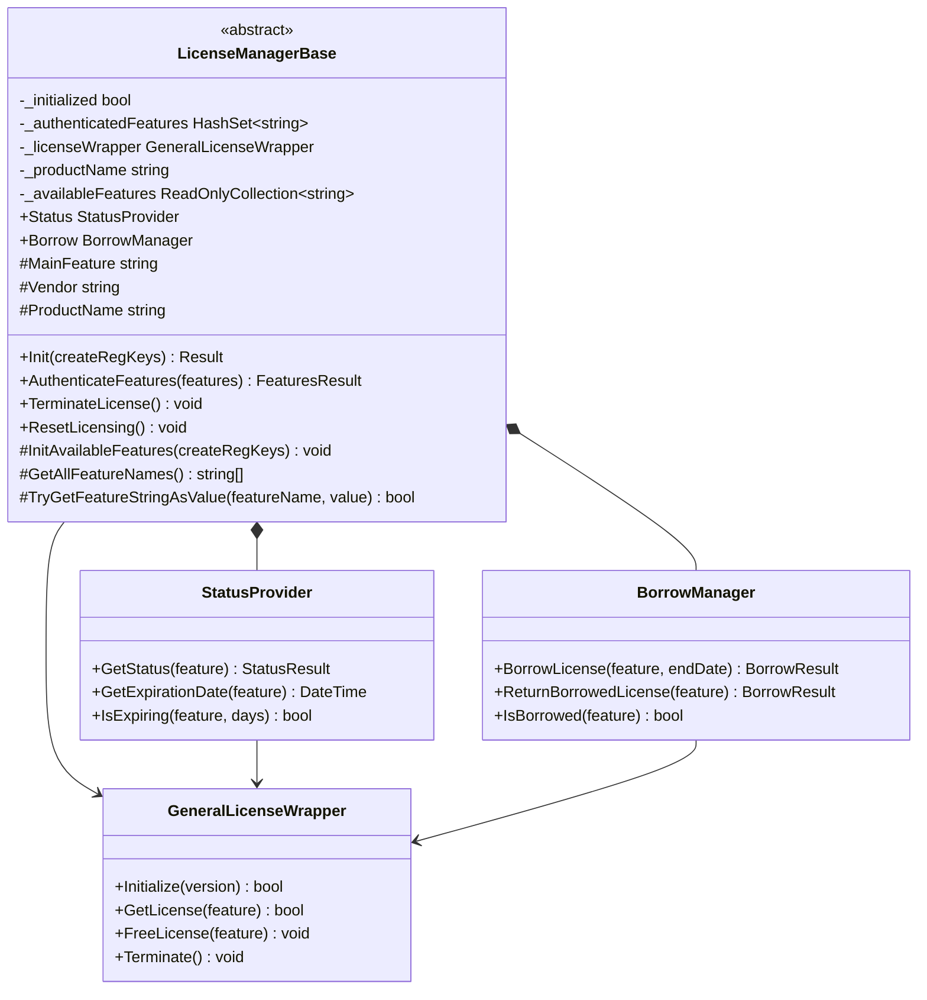
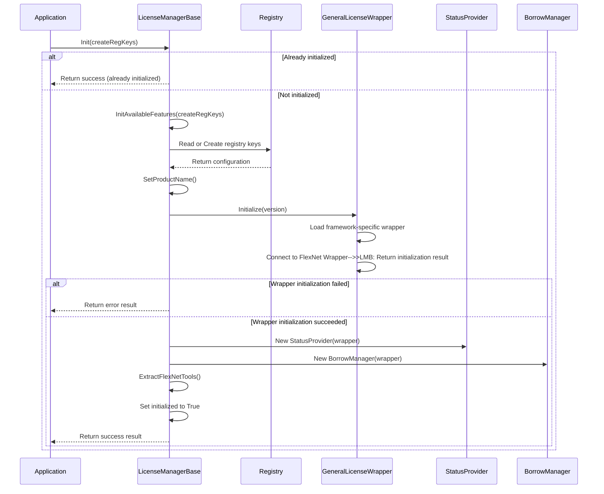
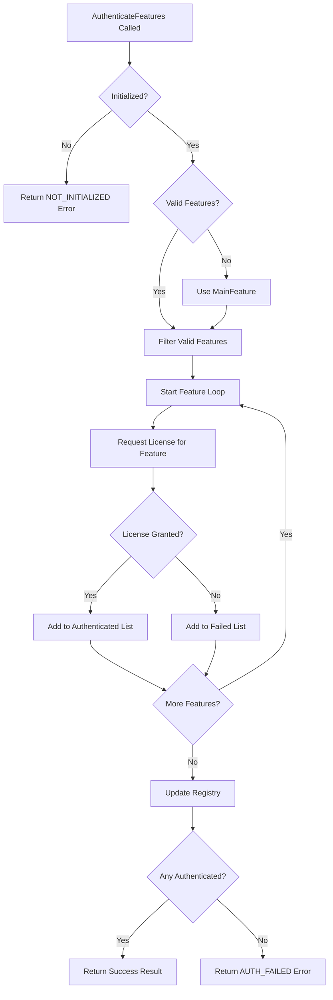

# LicenseManagerBase Deep Dive

This section provides a comprehensive exploration of the `LicenseManagerBase` class, which is the foundational component of the E3.Lib.Licensing library. We'll examine its structure, initialization process, feature management, registry integration, and resource management in detail.

## Core Structure and Responsibilities

The `LicenseManagerBase` class serves as the abstract foundation for all licensing operations in the E3.Lib.Licensing library. It encapsulates the core functionality needed to interact with FlexNet Publisher while providing a clean abstraction for derived classes.

### Class Definition and Architecture



**Diagram Description:** This class diagram shows the LicenseManagerBase structure with its core fields, methods, and composition relationships. The abstract class contains StatusProvider and BorrowManager components and uses GeneralLicenseWrapper for FlexNet communication.

## Initialization Process

The initialization process is the foundation of all licensing operations, establishing the connection to FlexNet Publisher and setting up the necessary infrastructure.

### Init Method Implementation

<details>
<summary>📝 (Code) <strong>Init Method Implementation</strong> - Core initialization logic with registry setup and wrapper initialization</summary>

```vb
Option Strict On
Option Explicit On
Option Infer Off

Public Function Init(Optional createRegKeys As Boolean = False) As Result
    Try
        ' Prevent multiple initialization
        If _initialized Then
            Return New Result(ResultState.Success, "License manager already initialized")
        End If

        ' Initialize available features from registry or default configuration
        InitAvailableFeatures(createRegKeys)

        ' Setup product name for registry keys
        If String.IsNullOrEmpty(_productName) Then
            _productName = GetProductNameFromAssembly()
        End If

        ' Initialize the native license wrapper
        Dim wrapperResult As Boolean = _licenseWrapper.Initialize(GetVersionString())
        If Not wrapperResult Then
            Return New LicenseErrorCodeResult(ResultState.Failed, 
                "Failed to initialize licensing system", 
                LicensingErrorCodes.NOT_INITIALIZED)
        End If

        ' Initialize status and borrow managers
        _status = New StatusProvider(_licenseWrapper)
        _borrow = New BorrowManager(_licenseWrapper)

        ' Extract FlexNet tools if needed
        ExtractFlexNetTools()

        _initialized = True
        Return New Result(ResultState.Success, "License manager initialized successfully")

    Catch ex As Exception
        Return New Result(ex)
    End Try
End Function
```
</details>

### Initialization Sequence Diagram



**Key Steps:**
1. **Initialization Request**: Application calls Init() method, optionally requesting registry key creation
2. **Duplication Check**: LicenseManagerBase checks if already initialized to prevent multiple initialization
3. **Feature Setup**: Initializes available features from registry or creates default configuration
4. **Product Configuration**: Sets up product name for registry operations
5. **Wrapper Initialization**: Initializes GeneralLicenseWrapper with version information
6. **FlexNet Connection**: Wrapper loads appropriate framework-specific implementation and connects to FlexNet
7. **Component Creation**: Creates StatusProvider and BorrowManager instances for monitoring and offline usage
8. **Tool Extraction**: Extracts FlexNet tools if needed for advanced operations
9. **Completion**: Marks system as initialized and returns success result to application

**Diagram Description:** This sequence diagram illustrates the initialization process, showing the conditional logic for preventing multiple initialization, the registry setup, wrapper initialization with framework detection, and the creation of status and borrow management components.

## Feature Authentication System

Feature authentication is the core process of requesting and obtaining licenses for specific application capabilities.

### AuthenticateFeatures Method

<details>
<summary>📝 (Code) <strong>AuthenticateFeatures Implementation</strong> - Feature authentication with error handling and registry updates</summary>

```vb
Option Strict On
Option Explicit On
Option Infer Off

Public Function AuthenticateFeatures(features As String()) As FeaturesResult
    ' Validate initialization state
    If Not _initialized Then
        Return New FeaturesResult(ResultState.Failed, 
            "License manager not initialized", 
            LicensingErrorCodes.NOT_INITIALIZED)
    End If

    ' Validate input parameters
    If features Is Nothing OrElse features.Length = 0 Then
        features = New String() {MainFeature}
    End If

    ' Filter out empty or invalid feature names
    Dim validFeatures As String() = features.Where(Function(f) Not String.IsNullOrWhiteSpace(f)).ToArray()
    
    If validFeatures.Length = 0 Then
        Return New FeaturesResult(ResultState.Failed, 
            "No valid features provided for authentication")
    End If

    Try
        Dim authenticatedFeatures As List(Of String) = New List(Of String)
        Dim failedFeatures As List(Of String) = New List(Of String)

        ' Authenticate each feature individually
        For Each feature As String In validFeatures
            Try
                ' Request license from FlexNet
                Dim success As Boolean = _licenseWrapper.GetLicense(feature)
                
                If success Then
                    authenticatedFeatures.Add(feature)
                    _authenticatedFeatures.Add(feature)
                Else
                    failedFeatures.Add(feature)
                End If

            Catch ex As Exception
                failedFeatures.Add(feature)
                Logger.LogError(String.Format(CultureInfo.InvariantCulture, "Exception authenticating feature {0}: {1}", feature, ex.Message))
            End Try
        Next

        ' Update registry with successfully authenticated features
        If authenticatedFeatures.Count > 0 Then
            UpdateRegistryFeatures(authenticatedFeatures)
        End If

        ' Create and return result
        If authenticatedFeatures.Count > 0 Then
            Return New FeaturesResult(ResultState.Success) With {
                .Features = authenticatedFeatures.ToArray(),
                .FailedFeatures = failedFeatures.ToArray()
            }
        Else
            Return New FeaturesResult(ResultState.Failed, 
                "No features could be authenticated", 
                LicensingErrorCodes.AUTH_FAILED) With {
                .FailedFeatures = failedFeatures.ToArray()
            }
        End If

    Catch ex As Exception
        Return New FeaturesResult(ex, LicensingErrorCodes.AUTH_FAILED)
    End Try
End Function
```
</details>

### Feature Authentication Flow



**Diagram Description:** This flowchart shows the feature authentication process, including validation steps, individual feature processing, registry updates, and result creation based on success/failure counts.

## Registry Integration

The registry integration provides persistent storage of licensing information across application sessions.

### Registry Key Structure

The library uses a hierarchical registry structure:

```
HKEY_LOCAL_MACHINE\SOFTWARE\Zuken\{ProductName}\Licensing\
├── AvailableFeatures (REG_MULTI_SZ)
├── AuthenticatedFeatures (REG_MULTI_SZ)
├── LastInitialization (REG_SZ)
├── Version (REG_SZ)
└── Features\
    ├── {FeatureName1}\
    │   ├── LastAuthenticated (REG_SZ)
    │   ├── ExpirationDate (REG_SZ)
    │   └── Vendor (REG_SZ)
    └── {FeatureName2}\
        ├── LastAuthenticated (REG_SZ)
        ├── ExpirationDate (REG_SZ)
        └── Vendor (REG_SZ)
```

### Registry Operations

<details>
<summary>📝 (Code) <strong>Registry Management Implementation</strong> - Registry operations for feature persistence and configuration</summary>

```vb
Option Strict On
Option Explicit On
Option Infer Off

Private Sub InitAvailableFeatures(Optional createRegKeys As Boolean = False, 
                                  Optional availableFeaturesKeySetting As AvailableFeatureKeySettings = Nothing)
    Try
        Dim registryPath As String = String.Format(CultureInfo.InvariantCulture, "SOFTWARE\Zuken\{0}\Licensing", ProductName)
        
        ' Attempt to read existing registry keys
        Using key As RegistryKey = Registry.LocalMachine.OpenSubKey(registryPath, False)
            If key IsNot Nothing Then
                ' Read available features from registry
                Dim storedFeatures As String() = TryCast(key.GetValue(REG_AVAIL_FEATURES_KEY), String())
                If storedFeatures IsNot Nothing AndAlso storedFeatures.Length > 0 Then
                    _availableFeatures = New ReadOnlyCollection(Of String)(storedFeatures.ToList())
                    Return
                End If
            End If
        End Using

        ' Create registry keys if requested and they don't exist
        If createRegKeys Then
            CreateRegistryKeys(registryPath, availableFeaturesKeySetting)
        End If

        ' Fall back to default feature configuration
        _availableFeatures = New ReadOnlyCollection(Of String)(GetAllFeatureNames().ToList())

    Catch ex As Exception
        Logger.LogError(String.Format(CultureInfo.InvariantCulture, "Error initializing available features: {0}", ex.Message))
        ' Use default features on registry error
        _availableFeatures = New ReadOnlyCollection(Of String)(GetAllFeatureNames().ToList())
    End Try
End Sub

Private Sub CreateRegistryKeys(registryPath As String, 
                               availableFeaturesKeySetting As AvailableFeatureKeySettings)
    Try
        Using key As RegistryKey = Registry.LocalMachine.CreateSubKey(registryPath, True)
            If key IsNot Nothing Then
                ' Store available features
                Dim allFeatures As String() = GetAllFeatureNames()
                key.SetValue(REG_AVAIL_FEATURES_KEY, allFeatures, RegistryValueKind.MultiString)
                
                ' Store creation timestamp
                key.SetValue("Created", DateTime.Now.ToString("yyyy-MM-dd HH:mm:ss", CultureInfo.InvariantCulture))
                
                ' Store version information
                key.SetValue("Version", GetVersionString())

                ' Create individual feature subkeys
                For Each feature As String In allFeatures
                    Using featureKey As RegistryKey = key.CreateSubKey(String.Format(CultureInfo.InvariantCulture, "Features\{0}", feature), True)
                        featureKey.SetValue("Created", DateTime.Now.ToString("yyyy-MM-dd HH:mm:ss", CultureInfo.InvariantCulture))
                        featureKey.SetValue("Enabled", True)
                    End Using
                Next

                Logger.LogInfo(String.Format(CultureInfo.InvariantCulture, "Created registry keys at {0}", registryPath))
            End If
        End Using

    Catch ex As UnauthorizedAccessException
        Logger.LogError(String.Format(CultureInfo.InvariantCulture, "Insufficient permissions to create registry keys: {0}", ex.Message))
    Catch ex As Exception
        Logger.LogError(String.Format(CultureInfo.InvariantCulture, "Error creating registry keys: {0}", ex.Message))
    End Try
End Sub

Private Sub UpdateRegistryFeatures(authenticatedFeatures As List(Of String))
    Try
        Dim registryPath As String = String.Format(CultureInfo.InvariantCulture, "SOFTWARE\Zuken\{0}\Licensing", ProductName)
        
        Using key As RegistryKey = Registry.LocalMachine.OpenSubKey(registryPath, True)
            If key IsNot Nothing Then
                ' Update authenticated features list
                key.SetValue("AuthenticatedFeatures", authenticatedFeatures.ToArray(), RegistryValueKind.MultiString)
                key.SetValue("LastAuthentication", DateTime.Now.ToString("yyyy-MM-dd HH:mm:ss", CultureInfo.InvariantCulture))

                ' Update individual feature timestamps
                For Each feature As String In authenticatedFeatures
                    Using featureKey As RegistryKey = key.CreateSubKey(String.Format(CultureInfo.InvariantCulture, "Features\{0}", feature), True)
                        featureKey.SetValue("LastAuthenticated", DateTime.Now.ToString("yyyy-MM-dd HH:mm:ss", CultureInfo.InvariantCulture))
                    End Using
                Next
            End If
        End Using

    Catch ex As Exception
        Logger.LogError(String.Format(CultureInfo.InvariantCulture, "Error updating registry features: {0}", ex.Message))
    End Try
End Sub
```
</details>

## Resource Management and Disposal

Proper resource management is critical in licensing systems to ensure licenses are returned to the pool when no longer needed.

### TerminateLicense Implementation

<details>
<summary>📝 (Code) <strong>TerminateLicense Implementation</strong> - Resource cleanup and license termination</summary>

```vb
Option Strict On
Option Explicit On
Option Infer Off

Public Sub TerminateLicense()
    Try
        If Not _initialized Then
            Return
        End If

        ' Release all authenticated features
        If _authenticatedFeatures.Count > 0 Then
            For Each feature As String In _authenticatedFeatures.ToArray()
                Try
                    _licenseWrapper.FreeLicense(feature)
                    Logger.LogInfo(String.Format(CultureInfo.InvariantCulture, "Released license for feature: {0}", feature))
                Catch ex As Exception
                    Logger.LogError(String.Format(CultureInfo.InvariantCulture, "Error releasing license for feature {0}: {1}", feature, ex.Message))
                End Try
            Next
            
            _authenticatedFeatures.Clear()
        End If

        ' Terminate the license wrapper
        Try
            _licenseWrapper.Terminate()
        Catch ex As Exception
            Logger.LogError(String.Format(CultureInfo.InvariantCulture, "Error terminating license wrapper: {0}", ex.Message))
        End Try

        ' Dispose of status and borrow managers
        If _status IsNot Nothing Then
            _status.Dispose()
        End If
        If _borrow IsNot Nothing Then
            _borrow.Dispose()
        End If

        ' Clean up temporary files
        CleanupTempFiles()

        _initialized = False
        
        Logger.LogInfo("License termination completed successfully")

    Catch ex As Exception
        Logger.LogError(String.Format(CultureInfo.InvariantCulture, "Error during license termination: {0}", ex.Message))
    End Try
End Sub

Private Sub CleanupTempFiles()
    Try
        If _lmBorrowFile IsNot Nothing Then
            _lmBorrowFile.Dispose()
        End If
        If _lmStatFile IsNot Nothing Then
            _lmStatFile.Dispose()
        End If
    Catch ex As Exception
        Logger.LogError(String.Format(CultureInfo.InvariantCulture, "Error cleaning up temporary files: {0}", ex.Message))
    End Try
End Sub
```
</details>

### Dispose Pattern Implementation

<details>
<summary>📝 (Code) <strong>IDisposable Implementation</strong> - Proper disposal pattern for resource cleanup</summary>

```vb
Option Strict On
Option Explicit On
Option Infer Off

' In LicenseManagerBase.Dispose.vb
Private _disposed As Boolean = False

Protected Overridable Sub Dispose(disposing As Boolean)
    If Not _disposed Then
        If disposing Then
            ' Dispose managed resources
            Try
                TerminateLicense()
            Catch ex As Exception
                Logger.LogError(String.Format(CultureInfo.InvariantCulture, "Error during disposal: {0}", ex.Message))
            End Try
        End If

        ' Clean up unmanaged resources would go here
        _disposed = True
    End If
End Sub

Public Sub Dispose() Implements IDisposable.Dispose
    Dispose(True)
    GC.SuppressFinalize(Me)
End Sub

Protected Overrides Sub Finalize()
    Dispose(False)
    MyBase.Finalize()
End Sub

' Process exit handler for emergency cleanup
Private Sub _process_exit(sender As Object, e As EventArgs)
    Try
        If _initialized Then
            TerminateLicense()
        End If
    Catch
        ' Ignore errors during process exit
    End Try
End Sub
```
</details>

## Status and Monitoring Integration

The `LicenseManagerBase` provides integrated access to status monitoring and license borrowing capabilities through composition.

### StatusProvider Integration

```vb
Public ReadOnly Property Status As StatusProvider
    Get
        If _status Is Nothing AndAlso _initialized Then
            _status = New StatusProvider(_licenseWrapper)
        End If
        Return _status
    End Get
End Property
```

### BorrowManager Integration

```vb
Public ReadOnly Property Borrow As BorrowManager
    Get
        If _borrow Is Nothing AndAlso _initialized Then
            _borrow = New BorrowManager(_licenseWrapper)
        End If
        Return _borrow
    End Get
End Property
```

## Error Handling Strategies

The `LicenseManagerBase` implements comprehensive error handling strategies:

### Layered Error Handling

1. **Input Validation**: Parameter validation with descriptive error messages
2. **Operation-Level Handling**: Try-catch blocks around individual operations
3. **Resource Protection**: Ensure resources are cleaned up even on errors
4. **Contextual Information**: Include relevant context in error messages

### Recovery Mechanisms

<details>
<summary>📝 (Code) <strong>ResetLicensing Implementation</strong> - Recovery mechanism for error states</summary>

```vb
Public Sub ResetLicensing()
    Try
        Logger.LogInfo("Resetting licensing system...")

        ' Terminate current licensing state
        If _initialized Then
            TerminateLicense()
        End If

        ' Clear internal state
        _authenticatedFeatures.Clear()
        _initialized = False

        ' Reset wrapper
        _licenseWrapper = New GeneralLicenseWrapper()

        ' Dispose and recreate managers
        _status?.Dispose()
        _borrow?.Dispose()
        _status = Nothing
        _borrow = Nothing        Logger.LogInfo("Licensing system reset completed")    Catch ex As Exception
        Logger.LogError(String.Format(CultureInfo.InvariantCulture, "Error during licensing reset: {0}", ex.Message))
    End Try
End Sub
```
</details>

---

**Previous:** [02 - Architecture Overview](./Documentation-02-Architecture-Overview.md) | **Next:** [04 - Generic LicenseManager](./Documentation-04-Generic-LicenseManager.md)
