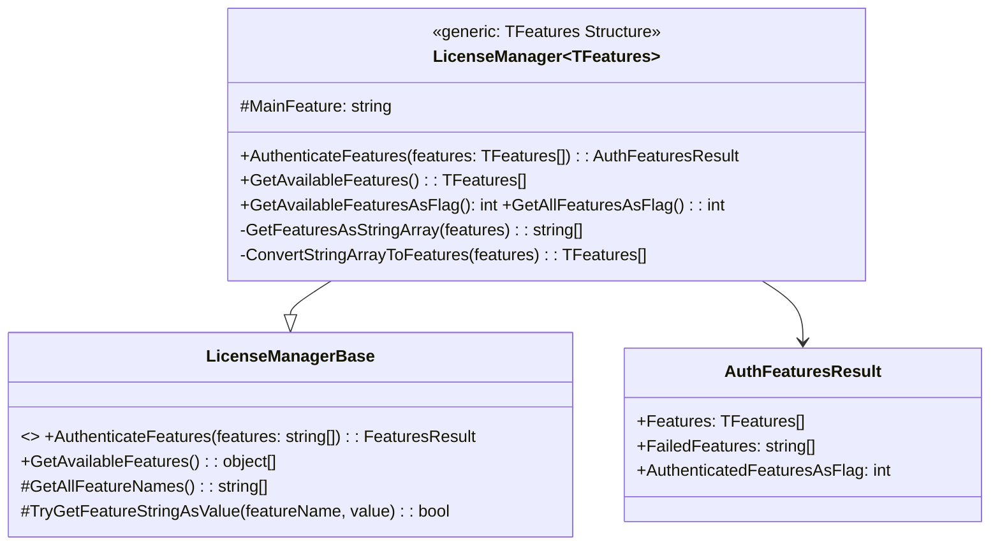
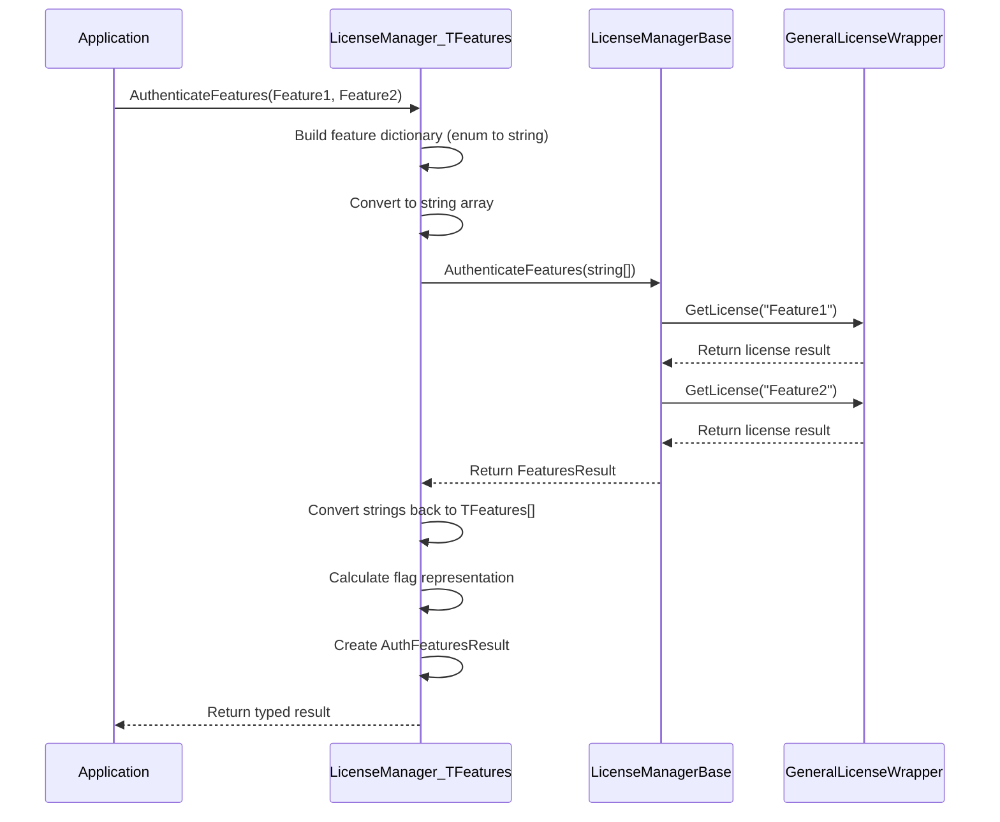
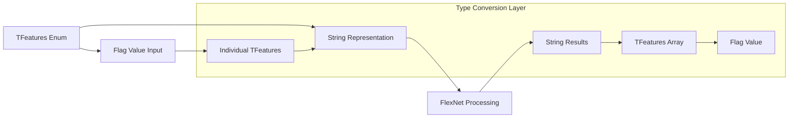

Generic Class Structure# Generic LicenseManager<TFeatures>

This section explores the generic `LicenseManager<TFeatures>` class, which extends `LicenseManagerBase` to provide type-safe feature management. We'll examine how it enables compile-time validation, automatic type conversion, and strongly-typed APIs for licensing operations.

## Type-Safe Feature Management

The generic `LicenseManager<TFeatures>` is the cornerstone of type-safe licensing in E3.Lib.Licensing. It transforms string-based FlexNet operations into strongly-typed, compile-time validated operations.

### Generic Class Structure



**Diagram Description:** This class diagram illustrates how the generic LicenseManager extends LicenseManagerBase to provide type-safe feature management, with automatic conversion between strongly-typed features and string representations.

### TFeatures Constraint and Requirements

The generic parameter `TFeatures` must satisfy specific requirements:

```vb
Public MustInherit Class LicenseManager(Of TFeatures As Structure)
    Inherits LicenseManagerBase
```

**Requirements for TFeatures:**
1. **Structure Constraint**: Must be a value type (typically an enum)
2. **Flag Support**: Should support bitwise operations for multi-feature scenarios
3. **String Conversion**: Must have meaningful string representations for FlexNet

### Common TFeatures Implementation Pattern

<details>
<summary>📝 (Code) <strong>Typical TFeatures Enum Implementation</strong> - Example of properly structured feature enumeration</summary>

```vb
Option Strict On
Option Explicit On
Option Infer Off

' Example feature enumeration for an E3Series application
<Flags>
Public Enum MyAppFeatures As Integer
    ' Base feature (typically required)
    Base = 1

    ' Advanced features (powers of 2 for flag support)
    Advanced = 2
    Export = 4
    Import = 8
    Reporting = 16
    ThreeD = 32
    Simulation = 64
    
    ' Feature combinations
    Standard = Base Or Advanced
    Professional = Standard Or Export Or Import
    Enterprise = Professional Or Reporting Or ThreeD Or Simulation
    
    ' All features
    All = Base Or Advanced Or Export Or Import Or Reporting Or ThreeD Or Simulation
End Enum

' Usage in a concrete license manager
Public Class MyAppLicenseManager
    Inherits LicenseManager(Of MyAppFeatures)
    
    Protected Overrides ReadOnly Property Vendor As String
        Get
            Return "Zuken"
        End Get
    End Property
    
    Protected Friend Overrides ReadOnly Property MainFeature As String
        Get
            Return "MyApp_Base"
        End Get
    End Property
End Class
```
</details>

## Type-Safe Authentication Methods

The generic `LicenseManager<TFeatures>` provides strongly-typed methods that automatically handle conversion between enum values and string representations.

### AuthenticateFeatures Overloads

<details>
<summary>📝 (Code) <strong>Type-Safe AuthenticateFeatures Implementation</strong> - Multiple overloads for different authentication scenarios</summary>

```vb
Option Strict On
Option Explicit On
Option Infer Off

' Primary type-safe authentication method
Public Overloads Function AuthenticateFeatures(ParamArray features As TFeatures()) As AuthFeaturesResult
    ' Build dictionary for feature name to enum mapping
    Dim featureMap As Dictionary(Of String, TFeatures) = New Dictionary(Of String, TFeatures)
    
    For Each feature As TFeatures In features
        ' Get the string representation of the enum value
        Dim featureName As String = [Enum].GetName(GetType(TFeatures), feature)
        If Not String.IsNullOrEmpty(featureName) Then
            featureMap(featureName) = feature
        End If
    Next
    
    ' Convert to string array for base class processing
    Dim featureStrings As String() = featureMap.Keys.ToArray()
    
    ' Call base implementation
    Dim baseResult As FeaturesResult = MyBase.AuthenticateFeatures(featureStrings)
    
    ' Convert result back to strongly-typed format
    Return ConvertToAuthFeaturesResult(baseResult, featureMap)
End Function

' Flag-based authentication method
Public Function AuthenticateFeatures(featuresFlag As Integer) As AuthFeaturesResult
    ' Convert flag value to individual enum values
    Dim individualFeatures As List(Of TFeatures) = New List(Of TFeatures)
    
    For Each enumValue As TFeatures In [Enum].GetValues(GetType(TFeatures))
        Dim enumInt As Integer = Convert.ToInt32(enumValue)
        If enumInt <> 0 AndAlso (featuresFlag And enumInt) = enumInt Then
            individualFeatures.Add(enumValue)
        End If
    Next
    
    Return AuthenticateFeatures(individualFeatures.ToArray())
End Function

' Authenticate all available features
Public Function AuthenticateAllFeatures() As AuthFeaturesResult
    Dim allFeatures As TFeatures() = [Enum].GetValues(GetType(TFeatures)).Cast(Of TFeatures)().ToArray()
    Return AuthenticateFeatures(allFeatures)
End Function

' Result conversion helper
Private Function ConvertToAuthFeaturesResult(baseResult As FeaturesResult, 
                                             featureMap As Dictionary(Of String, TFeatures)) As AuthFeaturesResult
    Try
        Dim result As AuthFeaturesResult = New AuthFeaturesResult(baseResult.ResultState, baseResult.Message, baseResult.ErrorCode)
        
        If baseResult.IsSuccess AndAlso baseResult.Features IsNot Nothing Then
            ' Convert authenticated features back to enum values
            Dim authenticatedFeatures As List(Of TFeatures) = New List(Of TFeatures)
            Dim authenticatedStrings As String() = TryCast(baseResult.Features, String())
            
            If authenticatedStrings IsNot Nothing Then
                For Each featureString As String In authenticatedStrings
                    If featureMap.ContainsKey(featureString) Then
                        authenticatedFeatures.Add(featureMap(featureString))
                    End If
                Next
            End If
            
            result.Features = authenticatedFeatures.ToArray()
            result.AuthenticatedFeaturesAsFlag = ConvertFeaturesToFlag(authenticatedFeatures)
        End If
        
        ' Copy failed features
        result.FailedFeatures = baseResult.FailedFeatures
        
        Return result
        
    Catch ex As Exception
        Return New AuthFeaturesResult(ex, LicensingErrorCodes.AUTH_FAILED)
    End Try
End Function
```
</details>

### Authentication Flow with Type Safety



**Diagram Description:** This sequence diagram shows the type-safe authentication flow, including the conversion from strongly-typed enums to strings for FlexNet processing and back to typed results.

**Key Steps:**
1. **Application Request**: Application calls AuthenticateFeatures with strongly-typed enum values
2. **Type Conversion**: LicenseManager converts enums to string dictionary, then to string array
3. **Base Delegation**: Calls base class with string array for FlexNet compatibility
4. **License Requests**: Base class requests individual licenses from the wrapper
5. **Result Processing**: Base returns FeaturesResult with string-based information
6. **Type Restoration**: LicenseManager converts strings back to typed features and calculates flag representation
7. **Typed Response**: Returns strongly-typed AuthFeaturesResult to the application

## Feature Availability and Query Methods

The generic license manager provides type-safe methods for querying available features and their status.

### GetAvailableFeatures Methods

<details>
<summary>📝 (Code) <strong>Type-Safe Feature Query Implementation</strong> - Methods for retrieving available features with type safety</summary>

```vb
' Get available features as strongly-typed array
Public Shadows Function GetAvailableFeatures() As TFeatures()
    Try
        ' Get string-based features from base class
        Dim stringFeatures = MyBase.GetAvailableFeatures()
        
        If stringFeatures Is Nothing Then
            Return New TFeatures() {}
        End If
        
        ' Convert to strongly-typed features
        Return ConvertStringArrayToFeatures(TryCast(stringFeatures, String()))
        
    Catch ex As Exception
        Logger.LogError($"Error getting available features: {ex.Message}")
        Return New TFeatures() {}
    End Try
End Function

' Get available features as combined flag value
Public Function GetAvailableFeaturesAsFlag() As Integer
    Try
        Dim features = GetAvailableFeatures()
        Return ConvertFeaturesToFlag(features)
    Catch ex As Exception
        Logger.LogError($"Error getting available features as flag: {ex.Message}")
        Return 0
    End Try
End Function

' Get all possible features (from enum definition)
Public Function GetAllFeaturesAsFlag() As Integer
    Try
        Dim allFeatures = [Enum].GetValues(GetType(TFeatures)).Cast(Of TFeatures)()
        Return ConvertFeaturesToFlag(allFeatures)
    Catch ex As Exception
        Logger.LogError($"Error getting all features as flag: {ex.Message}")
        Return 0
    End Try
End Function

' Check if specific features are available
Public Function AreAvailable(ParamArray features As TFeatures()) As Boolean
    Try
        Dim availableFeatures = GetAvailableFeatures()
        Return features.All(Function(f) availableFeatures.Contains(f))
    Catch ex As Exception
        Logger.LogError($"Error checking feature availability: {ex.Message}")
        Return False
    End Try
End Function

' Helper method: Convert string array to TFeatures array
Private Function ConvertStringArrayToFeatures(stringFeatures As String()) As TFeatures()
    If stringFeatures Is Nothing Then
        Return New TFeatures() {}
    End If
    
    Dim features As New List(Of TFeatures)
    
    For Each featureString As String In stringFeatures
        Dim featureValue As TFeatures
        If [Enum].TryParse(featureString, True, featureValue) Then
            features.Add(featureValue)
        End If
    Next
    
    Return features.ToArray()
End Function

' Helper method: Convert TFeatures collection to flag value
Private Function ConvertFeaturesToFlag(features As IEnumerable(Of TFeatures)) As Integer
    Dim flag As Integer = 0
    
    For Each feature As TFeatures In features
        flag = flag Or Convert.ToInt32(feature)
    Next
    
    Return flag
End Function
```
</details>

## Feature Conversion and Validation

The generic license manager handles automatic conversion between different feature representations.

### Conversion Architecture



**Diagram Description:** This flowchart illustrates the various conversion paths between different feature representations, showing how the type conversion layer handles transformations between enums, strings, arrays, and flag values.

### Conversion Implementation

<details>
<summary>📝 (Code) <strong>Feature Conversion Implementation</strong> - Robust conversion between different feature representations</summary>

```vb
Option Strict On
Option Explicit On
Option Infer Off

' Core conversion method: enum to string
Protected Overrides Function GetFeaturesAsString(result As FeaturesResult) As String()
    Try
        Dim stringFeatures As List(Of String) = New List(Of String)
        
        ' Handle TFeatures array
        If TypeOf result.Features Is TFeatures() Then
            Dim typedFeatures As TFeatures() = DirectCast(result.Features, TFeatures())
            For Each feature As TFeatures In typedFeatures
                stringFeatures.Add([Enum].GetName(GetType(TFeatures), feature))
            Next
            
        ' Handle flag value
        ElseIf IsNumeric(result.Features) Then
            Dim flagValue As Integer = CInt(result.Features)
            Dim individualFeatures As TFeatures() = ConvertFlagToFeatures(flagValue)
            For Each feature As TFeatures In individualFeatures
                stringFeatures.Add([Enum].GetName(GetType(TFeatures), feature))
            Next
            
        ' Handle individual enum value
        ElseIf TypeOf result.Features Is TFeatures Then
            Dim feature As TFeatures = DirectCast(result.Features, TFeatures)
            stringFeatures.Add([Enum].GetName(GetType(TFeatures), feature))
            
        ' Fallback to main feature
        ElseIf MainFeature IsNot Nothing Then
            stringFeatures.Add(MainFeature)
        End If
        
        ' Filter out ignored features
        Return FilterIgnoredFeatures(stringFeatures)
        
    Catch ex As Exception
        Logger.LogError(String.Format(CultureInfo.InvariantCulture, "Error converting features to strings: {0}", ex.Message))
        Return New String() {MainFeature}
    End Try
End Function

' Convert flag value to individual features
Private Function ConvertFlagToFeatures(flagValue As Integer) As TFeatures()
    Dim features As List(Of TFeatures) = New List(Of TFeatures)
    
    For Each enumValue As TFeatures In [Enum].GetValues(GetType(TFeatures))
        Dim enumInt As Integer = Convert.ToInt32(enumValue)
        ' Check if this enum value is set in the flag (and is not zero)
        If enumInt <> 0 AndAlso (flagValue And enumInt) = enumInt Then
            features.Add(enumValue)
        End If
    Next
    
    Return features.ToArray()
End Function

' Validate feature string against TFeatures enum
Protected Overrides Function TryGetFeatureStringAsValue(featureName As String, ByRef value As Object) As Boolean
    Try
        Dim featureValue As TFeatures = Nothing
        If [Enum].TryParse(featureName, True, featureValue) Then
            value = featureValue
            Return True
        End If
        
        value = Nothing
        Return False
        
    Catch ex As Exception
        Logger.LogError(String.Format(CultureInfo.InvariantCulture, "Error validating feature string '{0}': {1}", featureName, ex.Message))
        value = Nothing
        Return False
    End Try
End Function

' Filter out features marked as ignored
Private Function FilterIgnoredFeatures(features As List(Of String)) As String()
    If IgnoreFeatures IsNot Nothing AndAlso IgnoreFeatures.Length > 0 Then
        Return features.Where(Function(f) Not IgnoreFeatures.Any(Function(ignore) 
            String.Equals(ignore, f, StringComparison.OrdinalIgnoreCase))).ToArray()
    End If
    
    Return features.ToArray()
End Function
```
</details>

## Main Feature and Default Handling

The generic license manager provides sophisticated handling of main features and default behaviors.

### Main Feature Implementation

<details>
<summary>📝 (Code) <strong>Main Feature Management</strong> - Automatic main feature detection and management</summary>

```vb
' Main feature property with automatic detection
Protected Friend Overrides ReadOnly Property MainFeature As String
    Get
        Static _mainFeature As Nullable(Of KeyValuePair(Of String, Object)) = Nothing
        
        If Not _mainFeature.HasValue Then
            ' Find the first feature that's not in the ignore list
            Dim allFeatures = [Enum](Of TFeatures).GetValuesAndNames()
            
            _mainFeature = allFeatures.Where(Function(kv) 
                Not IgnoreFeatures.Any(Function(ignore) 
                    String.Equals(ignore, kv.Key, StringComparison.OrdinalIgnoreCase))
            ).FirstOrDefault()
        End If
        
        Return _mainFeature.GetValueOrDefault().Key
    End Get
End Property

' Get the enum value of the main feature
Private Function GetValueOfMainFeature() As Object
    Try
        Dim mainFeatureValue As Object = Nothing
        If TryGetFeatureStringAsValue(MainFeature, mainFeatureValue) Then
            Return mainFeatureValue
        End If
        
        ' Return first enum value as fallback
        Dim firstValue = [Enum].GetValues(GetType(TFeatures)).GetValue(0)
        Return firstValue
        
    Catch ex As Exception
        Logger.LogError($"Error getting main feature value: {ex.Message}")
        Return [Enum].GetValues(GetType(TFeatures)).GetValue(0)
    End Try
End Function

' Initialize available features with type-specific logic
Protected Overrides Sub InitAvailableFeatures(Optional createRegKeys As Boolean = False, 
                                              Optional availableFeaturesKeySetting As AvailableFeatureKeySettings = Nothing)
    ' Use all features as default if no specific setting provided
    If availableFeaturesKeySetting Is Nothing Then
        availableFeaturesKeySetting = New AvailableFeatureKeySettings(
            GetAllFeaturesAsFlag(), 
            GetAllFeaturesAsFlag()
        )
    End If
    
    MyBase.InitAvailableFeatures(createRegKeys, availableFeaturesKeySetting)
End Sub
```
</details>

## Usage Examples and Best Practices

### Basic Usage Pattern

<details>
<summary>📝 (Code) <strong>Basic Usage Example</strong> - Typical implementation and usage of generic license manager</summary>

```vb
Option Strict On
Option Explicit On
Option Infer Off

' Define feature enumeration
<Flags>
Public Enum E3HarnessFeatures As Integer
    Base = 1
    Advanced = 2
    Export = 4
    Import = 8
    Reporting = 16
    ThreeD = 32
End Enum

' Implement concrete license manager
Public Class E3HarnessLicenseManager
    Inherits LicenseManager(Of E3HarnessFeatures)
    
    Protected Overrides ReadOnly Property Vendor As String
        Get
            Return "Zuken"
        End Get
    End Property
    
    Protected Friend Overrides ReadOnly Property MainFeature As String
        Get
            Return "E3_Harness_Base"
        End Get
    End Property
End Class

' Application usage
Public Class Application
    Private _licenseManager As E3HarnessLicenseManager
    
    Public Sub InitializeLicensing()
        _licenseManager = New E3HarnessLicenseManager()
        
        ' Initialize licensing system
        Dim initResult As Result = _licenseManager.Init(createRegKeys:=True)
        If Not initResult.IsSuccess Then
            MessageBox.Show(String.Format(CultureInfo.InvariantCulture, "Failed to initialize licensing: {0}", initResult.Message))
            Return
        End If
        
        ' Authenticate required features
        Dim authResult As AuthFeaturesResult = _licenseManager.AuthenticateFeatures(
            E3HarnessFeatures.Base, 
            E3HarnessFeatures.Advanced,
            E3HarnessFeatures.Export
        )
        
        If authResult.IsSuccess Then
            Console.WriteLine(String.Format(CultureInfo.InvariantCulture, "Authenticated features: {0}", String.Join(", ", authResult.Features)))
            EnableFeatures(authResult.Features)
        Else
            Console.WriteLine(String.Format(CultureInfo.InvariantCulture, "Authentication failed: {0}", authResult.Message))
            If authResult.FailedFeatures IsNot Nothing AndAlso authResult.FailedFeatures.Length > 0 Then
                Console.WriteLine(String.Format(CultureInfo.InvariantCulture, "Failed features: {0}", String.Join(", ", authResult.FailedFeatures)))
            End If
        End If
    End Sub
    
    Private Sub EnableFeatures(authenticatedFeatures As E3HarnessFeatures())
        For Each feature As E3HarnessFeatures In authenticatedFeatures
            Select Case feature
                Case E3HarnessFeatures.Base
                    EnableBaseFunctionality()
                Case E3HarnessFeatures.Advanced
                    EnableAdvancedFunctionality()
                Case E3HarnessFeatures.Export
                    EnableExportFunctionality()
            End Select
        Next
    End Sub
End Class
```
</details>

### Advanced Usage Patterns

<details>
<summary>📝 (Code) <strong>Advanced Usage Patterns</strong> - Complex scenarios and optimization techniques</summary>

```vb
' Feature availability checking
Public Function CheckFeatureAvailability() As Boolean
    ' Check if specific features are available
    If _licenseManager.AreAvailable(E3HarnessFeatures.ThreeD, E3HarnessFeatures.Reporting) Then
        Return True
    End If
    
    ' Check using flag value
    Dim requiredFeatures = E3HarnessFeatures.Base Or E3HarnessFeatures.Advanced
    Dim availableFlag = _licenseManager.GetAvailableFeaturesAsFlag()
    
    Return (availableFlag And CInt(requiredFeatures)) = CInt(requiredFeatures)
End Function

' Conditional feature authentication
Public Sub AuthenticateBasedOnUserLevel(userLevel As String)
    Dim featuresToAuthenticate As New List(Of E3HarnessFeatures)
    
    ' Always include base
    featuresToAuthenticate.Add(E3HarnessFeatures.Base)
    
    Select Case userLevel.ToUpper()
        Case "STANDARD"
            featuresToAuthenticate.Add(E3HarnessFeatures.Advanced)
        Case "PROFESSIONAL"
            featuresToAuthenticate.AddRange({
                E3HarnessFeatures.Advanced,
                E3HarnessFeatures.Export,
                E3HarnessFeatures.Import
            })
        Case "ENTERPRISE"
            ' Authenticate all features
            featuresToAuthenticate.AddRange(
                [Enum].GetValues(GetType(E3HarnessFeatures)).Cast(Of E3HarnessFeatures)()
            )
    End Select
    
    Dim result = _licenseManager.AuthenticateFeatures(featuresToAuthenticate.ToArray())
    ProcessAuthenticationResult(result)
End Sub

' Feature-based UI enabling
Public Sub UpdateUI(authenticatedFeatures As E3HarnessFeatures())
    ' Convert to flag for efficient checking
    Dim featureFlag = 0
    For Each feature In authenticatedFeatures
        featureFlag = featureFlag Or CInt(feature)
    Next
    
    ' Enable/disable UI elements based on features
    exportButton.Enabled = (featureFlag And CInt(E3HarnessFeatures.Export)) <> 0
    importButton.Enabled = (featureFlag And CInt(E3HarnessFeatures.Import)) <> 0
    reportingMenu.Enabled = (featureFlag And CInt(E3HarnessFeatures.Reporting)) <> 0
    threeDViewer.Enabled = (featureFlag And CInt(E3HarnessFeatures.ThreeD)) <> 0
End Sub
```
</details>

---

**Previous:** [03 - LicenseManagerBase Deep Dive](./Documentation-03-LicenseManagerBase-Deep-Dive.md) | **Next:** [05 - Result System](./Documentation-05-Result-System.md)
