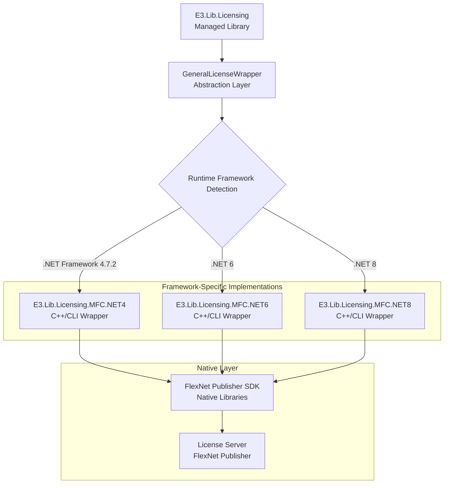

# FlexNet Integration

This section explores the FlexNet Publisher integration layer of the E3.Lib.Licensing library, which provides the bridge between managed .NET code and the native FlexNet SDK. We'll examine the multi-framework wrapper architecture, native interop patterns, and platform-specific considerations.

## Multi-Framework Wrapper Architecture

The E3.Lib.Licensing library uses a sophisticated multi-framework approach to support different .NET runtime versions while maintaining a consistent API surface.

### Wrapper Architecture Overview



**Diagram Description:** This architecture diagram illustrates the multi-framework wrapper system, showing how the managed library abstracts framework-specific implementations while maintaining consistent access to FlexNet Publisher functionality.

## GeneralLicenseWrapper

The `GeneralLicenseWrapper` serves as the abstraction layer that automatically selects and delegates to the appropriate framework-specific wrapper.

### Wrapper Selection and Delegation

<details>
<summary>📝 (Code) <strong>GeneralLicenseWrapper Implementation</strong> - Framework detection and wrapper delegation</summary>

```vb
Option Strict On
Option Explicit On
Option Infer Off

Public Class GeneralLicenseWrapper
    Implements IDisposable

    Private _activeWrapper As INativeLicenseWrapper
    Private _frameworkType As FrameworkType
    Private _initialized As Boolean

    ' Framework detection and wrapper creation
    Public Function Initialize(version As String) As Boolean
        Try
            ' Detect the current runtime framework
            _frameworkType = DetectFrameworkType()
            
            ' Create the appropriate wrapper based on framework
            _activeWrapper = CreateFrameworkSpecificWrapper(_frameworkType)
            
            If _activeWrapper Is Nothing Then
                Logger.LogError(String.Format(CultureInfo.InvariantCulture, "Unable to create wrapper for framework: {0}", _frameworkType))
                Return False
            End If
            
            ' Initialize the native wrapper
            Dim success As Boolean = _activeWrapper.Initialize(version)
            
            If success Then
                _initialized = True
                Logger.LogInfo(String.Format(CultureInfo.InvariantCulture, "FlexNet wrapper initialized successfully for {0}", _frameworkType))
            Else
                Logger.LogError(String.Format(CultureInfo.InvariantCulture, "Failed to initialize FlexNet wrapper for {0}", _frameworkType))
            End If
            
            Return success
            
        Catch ex As Exception
            Logger.LogError($"Error initializing FlexNet wrapper: {ex.Message}")
            Return False
        End Try
    End Function

    ' Framework detection logic
    Private Function DetectFrameworkType() As FrameworkType
        Try
            ' Get the framework description from the runtime
            Dim frameworkDescription = RuntimeInformation.FrameworkDescription
            
            ' Parse the framework version
            If frameworkDescription.Contains(".NET Framework") Then
                Return FrameworkType.NetFramework472
            ElseIf frameworkDescription.Contains(".NET 6") OrElse frameworkDescription.Contains(".NET Core 6") Then
                Return FrameworkType.Net6
            ElseIf frameworkDescription.Contains(".NET 8") OrElse frameworkDescription.Contains(".NET Core 8") Then
                Return FrameworkType.Net8
            Else
                ' Default fallback based on Environment.Version
                Dim version = Environment.Version
                If version.Major = 4 Then
                    Return FrameworkType.NetFramework472
                ElseIf version.Major = 6 Then
                    Return FrameworkType.Net6
                ElseIf version.Major >= 8 Then
                    Return FrameworkType.Net8
                Else
                    Logger.LogWarning($"Unknown framework version: {frameworkDescription}, defaulting to .NET Framework 4.7.2")
                    Return FrameworkType.NetFramework472
                End If
            End If
            
        Catch ex As Exception
            Logger.LogError($"Error detecting framework type: {ex.Message}")
            ' Default to .NET Framework as safest fallback
            Return FrameworkType.NetFramework472
        End Try
    End Function

    ' Factory method for creating framework-specific wrappers
    Private Function CreateFrameworkSpecificWrapper(frameworkType As FrameworkType) As INativeLicenseWrapper
        Try
            Select Case frameworkType
                Case FrameworkType.NetFramework472
                    Return CreateNetFramework472Wrapper()
                    
                Case FrameworkType.Net6
                    Return CreateNet6Wrapper()
                    
                Case FrameworkType.Net8
                    Return CreateNet8Wrapper()
                    
                Case Else
                    Logger.LogError($"Unsupported framework type: {frameworkType}")
                    Return Nothing
            End Select
            
        Catch ex As Exception
            Logger.LogError($"Error creating framework-specific wrapper: {ex.Message}")
            Return Nothing
        End Try
    End Function

    ' Wrapper creation methods for each framework
    Private Function CreateNetFramework472Wrapper() As INativeLicenseWrapper
        Try
            ' Load the .NET Framework 4.7.2 specific wrapper
            Dim wrapperAssembly = LoadWrapperAssembly("E3.Lib.Licensing.MFC.NET4.dll")
            Dim wrapperType = wrapperAssembly.GetType("E3.Lib.Licensing.MFC.NET4.LicenseWrapperNET4")
            
            Return DirectCast(Activator.CreateInstance(wrapperType), INativeLicenseWrapper)
            
        Catch ex As Exception
            Logger.LogError($"Error creating .NET Framework 4.7.2 wrapper: {ex.Message}")
            Throw
        End Try
    End Function

    Private Function CreateNet6Wrapper() As INativeLicenseWrapper
        Try
            ' Load the .NET 6 specific wrapper
            Dim wrapperAssembly = LoadWrapperAssembly("E3.Lib.Licensing.MFC.NET6.dll")
            Dim wrapperType = wrapperAssembly.GetType("E3.Lib.Licensing.MFC.NET6.LicenseWrapperNET6")
            
            Return DirectCast(Activator.CreateInstance(wrapperType), INativeLicenseWrapper)
            
        Catch ex As Exception
            Logger.LogError($"Error creating .NET 6 wrapper: {ex.Message}")
            Throw
        End Try
    End Function

    Private Function CreateNet8Wrapper() As INativeLicenseWrapper
        Try
            ' Load the .NET 8 specific wrapper
            Dim wrapperAssembly = LoadWrapperAssembly("E3.Lib.Licensing.MFC.NET8.dll")
            Dim wrapperType = wrapperAssembly.GetType("E3.Lib.Licensing.MFC.NET8.LicenseWrapperNET8")
            
            Return DirectCast(Activator.CreateInstance(wrapperType), INativeLicenseWrapper)
            
        Catch ex As Exception
            Logger.LogError($"Error creating .NET 8 wrapper: {ex.Message}")
            Throw
        End Try
    End Function

    ' Helper method to load wrapper assemblies
    Private Function LoadWrapperAssembly(assemblyFileName As String) As Assembly
        Try
            ' Get the directory containing the current assembly
            Dim assemblyDirectory = Path.GetDirectoryName(Assembly.GetExecutingAssembly().Location)
            Dim wrapperPath = Path.Combine(assemblyDirectory, assemblyFileName)
            
            If Not File.Exists(wrapperPath) Then
                Throw New FileNotFoundException($"Wrapper assembly not found: {wrapperPath}")
            End If
            
            ' Load the wrapper assembly
            Return Assembly.LoadFrom(wrapperPath)
            
        Catch ex As Exception
            Logger.LogError($"Error loading wrapper assembly '{assemblyFileName}': {ex.Message}")
            Throw
        End Try
    End Function

    ' Enumeration for framework types
    Private Enum FrameworkType
        NetFramework472
        Net6
        Net8
    End Enum
End Class
```
</details>

### Native Interface Definition

<details>
<summary>📝 (Code) <strong>INativeLicenseWrapper Interface</strong> - Common interface for all framework-specific wrappers</summary>

```vb
Option Strict On
Option Explicit On
Option Infer Off

' Common interface that all framework-specific wrappers must implement
Public Interface INativeLicenseWrapper
    Inherits IDisposable

    ' Core licensing operations
    Function Initialize(version As String) As Boolean
    Function GetLicense(featureName As String) As Boolean
    Sub FreeLicense(featureName As String)
    Sub Terminate()

    ' Status and information queries
    Function GetLicenseStatus(featureName As String) As LicenseStatusInfo
    Function GetLicenseInfo(featureName As String) As LicenseInfo
    Function GetServerInfo() As ServerInfo
    Function TestServerConnection() As Boolean

    ' Feature discovery
    Function QueryServerFeatures() As String()
    Function GetBorrowedFeatures() As String()
    Function IsFeatureBorrowed(featureName As String) As Boolean

    ' Borrowing operations
    Function BorrowLicense(featureName As String, days As Integer) As Boolean
    Function ReturnBorrowedLicense(featureName As String) As Boolean
    Function ReturnAllBorrowedFeatures() As Boolean
    Function GetBorrowEndDate(featureName As String) As DateTime

    ' Utility methods
    Function GetServerNameForFeature(featureName As String) As String
    Function GetLastError() As String
    Function GetDiagnosticInfo() As String
End Interface

' Supporting data structures
Public Class LicenseStatusInfo
    Public Property IsValid As Boolean
    Public Property ExpirationDate As DateTime
    Public Property Vendor As String
    Public Property Version As String
    Public Property LicenseCount As Integer
    Public Property CheckedOutCount As Integer
End Class

Public Class ServerInfo
    Public Property Name As String
    Public Property Version As String
    Public Property Port As String
    Public Property FeatureCount As Integer
    Public Property ConnectionCount As Integer
    Public Property Uptime As TimeSpan
End Class
```
</details>

## Framework-Specific Wrapper Implementation

Each framework-specific wrapper implements the common interface while handling framework-specific native interop requirements.

### .NET Framework 4.7.2 Wrapper Example

<details>
<summary>📝 (Code) <strong>.NET Framework 4.7.2 Wrapper</strong> - C++/CLI implementation for .NET Framework</summary>

```cpp
// E3.Lib.Licensing.MFC.NET4.h
#pragma once

#include "FlexNetSDK.h" // FlexNet Publisher SDK headers
#using <System.dll>

using namespace System;
using namespace System::Runtime::InteropServices;

namespace E3 {
    namespace Lib {
        namespace Licensing {
            namespace MFC {
                namespace NET4 {

                    // .NET Framework 4.7.2 specific wrapper implementation
                    public ref class LicenseWrapperNET4 : public INativeLicenseWrapper
                    {
                    private:
                        bool m_initialized;
                        LM_HANDLE* m_lmHandle;
                        String^ m_lastError;

                    public:
                        LicenseWrapperNET4();
                        ~LicenseWrapperNET4();
                        !LicenseWrapperNET4();

                        // INativeLicenseWrapper implementation
                        virtual bool Initialize(String^ version);
                        virtual bool GetLicense(String^ featureName);
                        virtual void FreeLicense(String^ featureName);
                        virtual void Terminate();

                        virtual LicenseStatusInfo^ GetLicenseStatus(String^ featureName);
                        virtual LicenseInfo^ GetLicenseInfo(String^ featureName);
                        virtual ServerInfo^ GetServerInfo();
                        virtual bool TestServerConnection();

                        virtual array<String^>^ QueryServerFeatures();
                        virtual array<String^>^ GetBorrowedFeatures();
                        virtual bool IsFeatureBorrowed(String^ featureName);

                        virtual bool BorrowLicense(String^ featureName, int days);
                        virtual bool ReturnBorrowedLicense(String^ featureName);
                        virtual bool ReturnAllBorrowedFeatures();
                        virtual DateTime GetBorrowEndDate(String^ featureName);

                        virtual String^ GetServerNameForFeature(String^ featureName);
                        virtual String^ GetLastError();
                        virtual String^ GetDiagnosticInfo();

                    private:
                        // Helper methods for string conversion
                        char* MarshalString(String^ managedString);
                        void FreeString(char* nativeString);
                        String^ UnmarshalString(const char* nativeString);

                        // FlexNet SDK wrapper methods
                        bool InitializeFlexNet(const char* version);
                        bool CheckoutLicense(const char* featureName);
                        void CheckinLicense(const char* featureName);
                        void TerminateFlexNet();

                        // Error handling
                        void SetLastError(const char* error);
                        void SetLastErrorFromFlexNet();
                    };

                }
            }
        }
    }
}
```

```cpp
// E3.Lib.Licensing.MFC.NET4.cpp - Implementation
#include "stdafx.h"
#include "E3.Lib.Licensing.MFC.NET4.h"

using namespace E3::Lib::Licensing::MFC::NET4;

LicenseWrapperNET4::LicenseWrapperNET4()
    : m_initialized(false), m_lmHandle(nullptr)
{
}

LicenseWrapperNET4::~LicenseWrapperNET4()
{
    this->!LicenseWrapperNET4();
}

LicenseWrapperNET4::!LicenseWrapperNET4()
{
    if (m_initialized)
    {
        Terminate();
    }
}

bool LicenseWrapperNET4::Initialize(String^ version)
{
    try
    {
        if (m_initialized)
        {
            return true;
        }

        // Convert managed string to native
        char* nativeVersion = MarshalString(version);
        
        // Initialize FlexNet SDK
        bool success = InitializeFlexNet(nativeVersion);
        
        // Cleanup
        FreeString(nativeVersion);
        
        if (success)
        {
            m_initialized = true;
        }
        
        return success;
    }
    catch (...)
    {
        SetLastError("Exception during FlexNet initialization");
        return false;
    }
}

bool LicenseWrapperNET4::GetLicense(String^ featureName)
{
    try
    {
        if (!m_initialized)
        {
            SetLastError("License wrapper not initialized");
            return false;
        }

        // Convert managed string to native
        char* nativeFeatureName = MarshalString(featureName);
        
        // Checkout license through FlexNet SDK
        bool success = CheckoutLicense(nativeFeatureName);
        
        // Cleanup
        FreeString(nativeFeatureName);
        
        return success;
    }
    catch (...)
    {
        SetLastError("Exception during license checkout");
        return false;
    }
}

void LicenseWrapperNET4::FreeLicense(String^ featureName)
{
    try
    {
        if (!m_initialized)
        {
            return;
        }

        // Convert managed string to native
        char* nativeFeatureName = MarshalString(featureName);
        
        // Checkin license through FlexNet SDK
        CheckinLicense(nativeFeatureName);
        
        // Cleanup
        FreeString(nativeFeatureName);
    }
    catch (...)
    {
        SetLastError("Exception during license checkin");
    }
}

// String marshaling helpers for .NET Framework 4.7.2
char* LicenseWrapperNET4::MarshalString(String^ managedString)
{
    if (managedString == nullptr)
    {
        return nullptr;
    }

    // Convert to ANSI string for FlexNet SDK
    IntPtr ptr = Marshal::StringToHGlobalAnsi(managedString);
    char* nativeString = static_cast<char*>(ptr.ToPointer());
    return nativeString;
}

void LicenseWrapperNET4::FreeString(char* nativeString)
{
    if (nativeString != nullptr)
    {
        Marshal::FreeHGlobal(IntPtr(nativeString));
    }
}

String^ LicenseWrapperNET4::UnmarshalString(const char* nativeString)
{
    if (nativeString == nullptr)
    {
        return nullptr;
    }

    return Marshal::PtrToStringAnsi(IntPtr(const_cast<char*>(nativeString)));
}

// FlexNet SDK integration methods
bool LicenseWrapperNET4::InitializeFlexNet(const char* version)
{
    try
    {
        // Initialize FlexNet licensing
        m_lmHandle = new LM_HANDLE;
        
        int result = lc_new_job(m_lmHandle, 0, nullptr, nullptr);
        if (result != 0)
        {
            SetLastErrorFromFlexNet();
            return false;
        }

        // Set vendor and product information
        result = lc_set_attr(*m_lmHandle, LM_A_USER_VENDOR, (LM_A_VAL_TYPE)"Zuken");
        if (result != 0)
        {
            SetLastErrorFromFlexNet();
            return false;
        }

        return true;
    }
    catch (...)
    {
        SetLastError("Exception in FlexNet initialization");
        return false;
    }
}

bool LicenseWrapperNET4::CheckoutLicense(const char* featureName)
{
    try
    {
        if (m_lmHandle == nullptr)
        {
            SetLastError("FlexNet not initialized");
            return false;
        }

        // Checkout license from FlexNet
        int result = lc_checkout(*m_lmHandle, const_cast<char*>(featureName), 
                                nullptr, 1, LM_CO_NOWAIT, nullptr, 0);
        
        if (result == 0)
        {
            return true;
        }
        else
        {
            SetLastErrorFromFlexNet();
            return false;
        }
    }
    catch (...)
    {
        SetLastError("Exception during license checkout");
        return false;
    }
}

void LicenseWrapperNET4::SetLastErrorFromFlexNet()
{
    if (m_lmHandle != nullptr)
    {
        char* errorString = lc_errstring(*m_lmHandle);
        if (errorString != nullptr)
        {
            m_lastError = UnmarshalString(errorString);
        }
        else
        {
            m_lastError = "Unknown FlexNet error";
        }
    }
    else
    {
        m_lastError = "FlexNet not initialized";
    }
}
```
</details>

### .NET 6 and .NET 8 Wrapper Considerations

<details>
<summary>📝 (Code) <strong>Modern .NET Wrapper Differences</strong> - Key differences for .NET 6 and .NET 8 implementations</summary>

```cpp
// Key differences for .NET 6/8 wrappers:

// 1. Different string marshaling approach
char* LicenseWrapperNET6::MarshalString(String^ managedString)
{
    if (managedString == nullptr)
    {
        return nullptr;
    }

    // .NET 6+ uses different marshaling strategy
    pin_ptr<const wchar_t> nativeString = PtrToStringChars(managedString);
    
    // Convert to ANSI for FlexNet SDK
    int bufferSize = WideCharToMultiByte(CP_ACP, 0, nativeString, -1, nullptr, 0, nullptr, nullptr);
    char* ansiString = new char[bufferSize];
    WideCharToMultiByte(CP_ACP, 0, nativeString, -1, ansiString, bufferSize, nullptr, nullptr);
    
    return ansiString;
}

void LicenseWrapperNET6::FreeString(char* nativeString)
{
    if (nativeString != nullptr)
    {
        delete[] nativeString; // Different cleanup for .NET 6+
    }
}

// 2. Different exception handling
bool LicenseWrapperNET6::Initialize(String^ version)
{
    try
    {
        // .NET 6+ specific initialization
        if (m_initialized)
        {
            return true;
        }

        // Enhanced error handling for modern .NET
        char* nativeVersion = MarshalString(version);
        
        try
        {
            bool success = InitializeFlexNet(nativeVersion);
            
            if (success)
            {
                m_initialized = true;
                // .NET 6+ specific logging
                System::Diagnostics::Debug::WriteLine("FlexNet initialized for .NET 6+");
            }
            
            return success;
        }
        finally
        {
            FreeString(nativeVersion);
        }
    }
    catch (System::Exception^ ex)
    {
        // .NET 6+ exception handling
        String^ errorMessage = String::Format("Exception during FlexNet initialization: {0}", ex->Message);
        SetLastError(MarshalString(errorMessage));
        return false;
    }
}

// 3. Enhanced diagnostics for modern .NET
String^ LicenseWrapperNET6::GetDiagnosticInfo()
{
    try
    {
        System::Text::StringBuilder^ diagnostics = gcnew System::Text::StringBuilder();
        
        diagnostics->AppendLine("=== FlexNet Wrapper Diagnostics ===");
        diagnostics->AppendLine(String::Format("Framework: .NET 6"));
        diagnostics->AppendLine(String::Format("Initialized: {0}", m_initialized));
        diagnostics->AppendLine(String::Format("Handle Valid: {0}", m_lmHandle != nullptr));
        
        if (m_lmHandle != nullptr)
        {
            // Get detailed FlexNet status
            char statusBuffer[1024];
            int result = lc_status(*m_lmHandle, statusBuffer, sizeof(statusBuffer));
            if (result == 0)
            {
                diagnostics->AppendLine(String::Format("FlexNet Status: {0}", UnmarshalString(statusBuffer)));
            }
        }
        
        diagnostics->AppendLine(String::Format("Last Error: {0}", m_lastError ? m_lastError : "None"));
        
        return diagnostics->ToString();
    }
    catch (...)
    {
        return "Error generating diagnostic information";
    }
}

// 4. Memory management improvements for .NET 8
// Similar to .NET 6 but with additional optimizations
```
</details>

## Native FlexNet SDK Integration

### FlexNet API Patterns

<details>
<summary>📝 (Code) <strong>FlexNet SDK Integration Patterns</strong> - Common patterns for interacting with FlexNet Publisher SDK</summary>

```cpp
// Common FlexNet SDK integration patterns used across all wrappers

// 1. License Handle Management
class FlexNetHandleManager
{
private:
    LM_HANDLE m_handle;
    bool m_initialized;

public:
    FlexNetHandleManager() : m_initialized(false) {}
    
    bool Initialize()
    {
        if (m_initialized) return true;
        
        int result = lc_new_job(&m_handle, 0, nullptr, nullptr);
        if (result == 0)
        {
            m_initialized = true;
            
            // Set common attributes
            lc_set_attr(m_handle, LM_A_USER_VENDOR, (LM_A_VAL_TYPE)"Zuken");
            lc_set_attr(m_handle, LM_A_RETRY_COUNT, (LM_A_VAL_TYPE)3);
            lc_set_attr(m_handle, LM_A_RETRY_INTERVAL, (LM_A_VAL_TYPE)1);
        }
        
        return m_initialized;
    }
    
    void Terminate()
    {
        if (m_initialized)
        {
            lc_free_job(m_handle);
            m_initialized = false;
        }
    }
    
    LM_HANDLE GetHandle() const { return m_handle; }
    bool IsInitialized() const { return m_initialized; }
};

// 2. License Checkout Pattern
bool CheckoutLicenseWithRetry(LM_HANDLE handle, const char* featureName, int retryCount = 3)
{
    for (int attempt = 0; attempt < retryCount; ++attempt)
    {
        int result = lc_checkout(handle, const_cast<char*>(featureName), 
                                nullptr, 1, LM_CO_NOWAIT, nullptr, 0);
        
        if (result == 0)
        {
            // Success
            return true;
        }
        
        // Check if error is retryable
        if (result == LM_MAXUSERS || result == LM_USERSQUEUED)
        {
            // Wait before retry for user/queue related errors
            Sleep(1000 * (attempt + 1)); // Exponential backoff
            continue;
        }
        else
        {
            // Non-retryable error
            break;
        }
    }
    
    return false;
}

// 3. Status Information Extraction
struct LicenseStatusExtractor
{
    static LicenseStatusInfo ExtractStatusInfo(LM_HANDLE handle, const char* featureName)
    {
        LicenseStatusInfo info = {};
        
        // Query feature status
        CONFIG* config = lc_auth_data(handle, const_cast<char*>(featureName));
        if (config != nullptr)
        {
            info.IsValid = true;
            
            // Extract expiration date
            if (config->date.flag == LM_EXPR_EXISTS)
            {
                struct tm exprDate = config->date.date;
                info.ExpirationDate = ConvertToDateTime(exprDate);
            }
            
            // Extract vendor
            if (config->vendor && strlen(config->vendor) > 0)
            {
                strncpy_s(info.Vendor, sizeof(info.Vendor), config->vendor, _TRUNCATE);
            }
            
            // Extract version
            if (config->version && strlen(config->version) > 0)
            {
                strncpy_s(info.Version, sizeof(info.Version), config->version, _TRUNCATE);
            }
            
            // Extract license count
            info.LicenseCount = config->users;
        }
        
        return info;
    }
    
private:
    static DateTime ConvertToDateTime(const struct tm& tmDate)
    {
        // Convert tm structure to .NET DateTime
        DateTime dateTime(tmDate.tm_year + 1900, tmDate.tm_mon + 1, tmDate.tm_mday,
                         tmDate.tm_hour, tmDate.tm_min, tmDate.tm_sec);
        return dateTime;
    }
};

// 4. Error Information Management
class FlexNetErrorManager
{
private:
    std::string m_lastError;
    int m_lastErrorCode;

public:
    void SetLastError(LM_HANDLE handle)
    {
        char* errorString = lc_errstring(handle);
        if (errorString != nullptr && strlen(errorString) > 0)
        {
            m_lastError = errorString;
        }
        else
        {
            m_lastError = "Unknown FlexNet error";
        }
        
        m_lastErrorCode = lc_get_errno(handle);
    }
    
    void SetLastError(const std::string& error, int errorCode = 0)
    {
        m_lastError = error;
        m_lastErrorCode = errorCode;
    }
    
    const std::string& GetLastError() const { return m_lastError; }
    int GetLastErrorCode() const { return m_lastErrorCode; }
    
    void ClearError()
    {
        m_lastError.clear();
        m_lastErrorCode = 0;
    }
};

// 5. License Borrowing Pattern
bool BorrowLicenseWithValidation(LM_HANDLE handle, const char* featureName, int days)
{
    // Validate borrowing parameters
    if (days <= 0 || days > 365)
    {
        return false;
    }
    
    // Check if feature is available for borrowing
    CONFIG* config = lc_auth_data(handle, const_cast<char*>(featureName));
    if (config == nullptr || !(config->flags & LM_CO_ALLOW_BORROW))
    {
        return false;
    }
    
    // Perform the borrow operation
    BORROW_STAT borrowStatus;
    int result = lc_borrow(handle, const_cast<char*>(featureName), 
                          days, &borrowStatus);
    
    return (result == 0);
}

// 6. Server Information Retrieval
struct ServerInfoExtractor
{
    static ServerInfo ExtractServerInfo(LM_HANDLE handle)
    {
        ServerInfo info = {};
        
        // Get server status
        char statusBuffer[4096];
        int result = lc_status(handle, statusBuffer, sizeof(statusBuffer));
        
        if (result == 0)
        {
            // Parse server information from status string
            ParseServerStatus(statusBuffer, info);
        }
        
        return info;
    }
    
private:
    static void ParseServerStatus(const char* statusString, ServerInfo& info)
    {
        // Parse FlexNet status output
        // Format varies by FlexNet version, implement parsing logic
        std::string status(statusString);
        
        // Extract server name
        size_t serverPos = status.find("License server status:");
        if (serverPos != std::string::npos)
        {
            // Parse server information from status output
            // Implementation depends on FlexNet status format
        }
    }
};
```
</details>

## Platform-Specific Considerations

### Deployment and Distribution

<details>
<summary>📝 (Code) <strong>Deployment Considerations</strong> - Platform-specific deployment and distribution strategies</summary>

```xml
<!-- NuGet package structure for multi-framework support -->
<Project Sdk="Microsoft.NET.Sdk">
  <PropertyGroup>
    <TargetFrameworks>net472;net6.0;net8.0</TargetFrameworks>
    <GeneratePackageOnBuild>true</GeneratePackageOnBuild>
    <PackageId>E3.Lib.Licensing</PackageId>
    <Version>1.0.0</Version>
  </PropertyGroup>

  <!-- Framework-specific native dependencies -->
  <ItemGroup Condition="'$(TargetFramework)' == 'net472'">
    <Content Include="native\net472\E3.Lib.Licensing.MFC.NET4.dll">
      <CopyToOutputDirectory>Always</CopyToOutputDirectory>
      <PackagePath>runtimes\win-x64\native\</PackagePath>
    </Content>
  </ItemGroup>

  <ItemGroup Condition="'$(TargetFramework)' == 'net6.0'">
    <Content Include="native\net6\E3.Lib.Licensing.MFC.NET6.dll">
      <CopyToOutputDirectory>Always</CopyToOutputDirectory>
      <PackagePath>runtimes\win-x64\native\</PackagePath>
    </Content>
  </ItemGroup>

  <ItemGroup Condition="'$(TargetFramework)' == 'net8.0'">
    <Content Include="native\net8\E3.Lib.Licensing.MFC.NET8.dll">
      <CopyToOutputDirectory>Always</CopyToOutputDirectory>
      <PackagePath>runtimes\win-x64\native\</PackagePath>
    </Content>
  </ItemGroup>

  <!-- FlexNet SDK dependencies -->
  <ItemGroup>
    <Content Include="native\flexnet\lmgr*.dll">
      <CopyToOutputDirectory>Always</CopyToOutputDirectory>
      <PackagePath>runtimes\win-x64\native\</PackagePath>
    </Content>
  </ItemGroup>
</Project>
```

```vb
' Deployment validation and diagnostics
Public Class DeploymentValidator
    Public Shared Function ValidateDeployment() As ValidationResult
        Dim result As New ValidationResult()
        
        Try            ' Check framework detection
            Dim frameworkType As FrameworkType = DetectCurrentFramework()
            result.FrameworkDetected = frameworkType.ToString()
            
            ' Check wrapper availability
            Dim wrapperPath As String = GetExpectedWrapperPath(frameworkType)
            result.WrapperExists = File.Exists(wrapperPath)
            
            If Not result.WrapperExists Then
                result.Errors.Add(String.Format(CultureInfo.InvariantCulture, "Wrapper not found at: {0}", wrapperPath))
            End If
            
            ' Check FlexNet SDK availability
            Dim flexNetPaths = GetRequiredFlexNetLibraries()
            For Each path In flexNetPaths
                If File.Exists(path) Then
                    result.FlexNetLibraries.Add(path)
                Else
                    result.Errors.Add($"FlexNet library not found: {path}")
                End If
            Next
            
            ' Test wrapper loading
            Try
                Dim wrapper = CreateWrapperForFramework(frameworkType)
                If wrapper IsNot Nothing Then
                    result.WrapperLoadable = True
                    wrapper.Dispose()
                Else
                    result.WrapperLoadable = False
                    result.Errors.Add("Wrapper creation failed")
                End If
            Catch ex As Exception
                result.WrapperLoadable = False
                result.Errors.Add($"Wrapper loading error: {ex.Message}")
            End Try
            
            ' Overall validation status
            result.IsValid = result.WrapperExists AndAlso 
                           result.WrapperLoadable AndAlso 
                           result.FlexNetLibraries.Count > 0 AndAlso
                           result.Errors.Count = 0
            
        Catch ex As Exception
            result.IsValid = False
            result.Errors.Add($"Validation error: {ex.Message}")
        End Try
        
        Return result
    End Function
    
    Private Shared Function GetExpectedWrapperPath(frameworkType As FrameworkType) As String
        Dim assemblyDir = Path.GetDirectoryName(Assembly.GetExecutingAssembly().Location)
        
        Select Case frameworkType
            Case FrameworkType.NetFramework472
                Return Path.Combine(assemblyDir, "E3.Lib.Licensing.MFC.NET4.dll")
            Case FrameworkType.Net6
                Return Path.Combine(assemblyDir, "E3.Lib.Licensing.MFC.NET6.dll")
            Case FrameworkType.Net8
                Return Path.Combine(assemblyDir, "E3.Lib.Licensing.MFC.NET8.dll")
            Case Else
                Return String.Empty
        End Select
    End Function
    
    Private Shared Function GetRequiredFlexNetLibraries() As String()
        Dim assemblyDir = Path.GetDirectoryName(Assembly.GetExecutingAssembly().Location)
        
        Return {
            Path.Combine(assemblyDir, "lmgr11.dll"),
            Path.Combine(assemblyDir, "libact.dll"),
            Path.Combine(assemblyDir, "libeay32.dll"),
            Path.Combine(assemblyDir, "ssleay32.dll")
        }
    End Function
End Class

Public Class ValidationResult
    Public Property IsValid As Boolean
    Public Property FrameworkDetected As String
    Public Property WrapperExists As Boolean
    Public Property WrapperLoadable As Boolean
    Public Property FlexNetLibraries As New List(Of String)
    Public Property Errors As New List(Of String)
    
    Public Overrides Function ToString() As String
        Dim sb As New StringBuilder()
        sb.AppendLine("=== Deployment Validation Results ===")
        sb.AppendLine($"Overall Valid: {IsValid}")
        sb.AppendLine($"Framework: {FrameworkDetected}")
        sb.AppendLine($"Wrapper Exists: {WrapperExists}")
        sb.AppendLine($"Wrapper Loadable: {WrapperLoadable}")
        sb.AppendLine($"FlexNet Libraries Found: {FlexNetLibraries.Count}")
        
        If Errors.Count > 0 Then
            sb.AppendLine("Errors:")
            For Each errorMsg In Errors
                sb.AppendLine($"  - {errorMsg}")
            Next
        End If
        
        Return sb.ToString()
    End Function
End Class
```
</details>

---

**Previous:** [07 - Borrow Management](./Documentation-07-Borrow-Management.md) | **Next:** [09 - Registry Integration](./Documentation-09-Registry-Integration.md)
