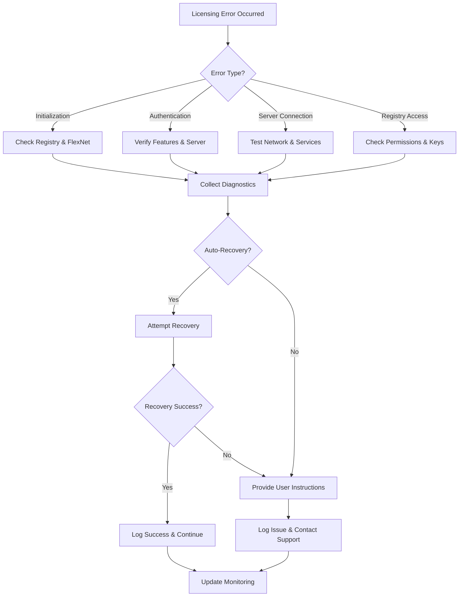

# Error Handling and Diagnostics

The E3.Lib.Licensing library implements a comprehensive error handling and diagnostic system that provides detailed information about licensing failures, system states, and recovery options. This system enables applications to gracefully handle licensing issues and provide meaningful feedback to users and administrators.

### Overview

Error handling in E3.Lib.Licensing is built around several key principles:
- **Structured Error Reporting**: Hierarchical error codes with detailed diagnostic information
- **Graceful Degradation**: Continue operation when possible, fail safely when necessary
- **Recovery Guidance**: Provide actionable information for resolving licensing issues
- **Diagnostic Transparency**: Expose enough detail for troubleshooting without compromising security

## Error Code Hierarchy

The licensing system uses a multi-layered error code structure to provide precise error classification:

### LicensingErrorCodes Enumeration

```vb
Public Enum LicensingErrorCodes
    ' General/undefined error
    Undefined = 0
    
    ' Borrowing-related errors
    NO_FEATURES_BORROWED = 1
    BORROW_FEATURES_FAILED = 2
    
    ' Authentication errors
    AUTH_FAILED = 3
    
    ' Server-related errors
    SERVER_REMOVE_FEATURE_FAILED = 4
    SERVER_NOT_ACCESSIBLE = 5
    
    ' License expiration errors
    DATE_EXPIRED = 6
    
    ' Service errors
    VENDOR_DEAMON_DOWN = 7
    
    ' Initialization errors
    NOT_INITIALIZED = 8
    
    ' Registry-related errors (extended from base set)
    RegistryKeyMissing = 100
    RegistryAccessDenied = 101
    RegistryValueCorrupted = 102
End Enum
```

### Diagnostics Error Codes

The system integrates with the broader E3.Lib diagnostics framework:

```vb
' From System.Diagnostics.ErrorCodes (DotNet.Expansions)
Public Enum ErrorCodes
    NONE = 0
    ERROR_UNKNOWN = -1
    ERROR_ACCESS_DENIED = 5
    ERROR_IO_DEVICE = 1117
    ERROR_GEN_FAILURE = 31
    ERROR_NOT_ENOUGH_MEMORY = 8
    ERROR_FILE_NOT_FOUND = 2
    ERROR_INVALID_PARAMETER = 87
    ' ... additional system error codes
End Enum
```

## Error Conversion and Mapping

### FlexNet Error Code Conversion

The system provides mapping between FlexNet exit codes and licensing error codes:

```vb
Public Shared Function ConvertExitCodeToLicError(exitCode As Integer) As LicensingErrorCodes
    Select Case exitCode
        Case -97
            Return LicensingErrorCodes.VENDOR_DEAMON_DOWN
        Case -5
            Return LicensingErrorCodes.SERVER_NOT_ACCESSIBLE
        Case -6
            Return LicensingErrorCodes.DATE_EXPIRED
        Case -3
            Return LicensingErrorCodes.AUTH_FAILED
        Case Else
            Return LicensingErrorCodes.Undefined
    End Select
End Function
```

### Error Object Structure

The `Error` class encapsulates detailed error information:

```vb
Public Class [Error]
    Public Sub New()
    End Sub
    
    Public Sub New(msg As String, exitCode As ErrorCodes)
        Me.Message = msg
        Me.ExitCode = exitCode
    End Sub
    
    ReadOnly Property ExitCode As System.Diagnostics.ErrorCodes
    ReadOnly Property Message As String
End Class
```

## Diagnostic Result Types

### ErrorCodeResult Class

Combines licensing errors with diagnostic information:

```vb
Public Class ErrorCodeResult
    Inherits LicenseErrorCodeResult
    
    Public Sub New([error] As [Error], Optional licenseErrCode As LicensingErrorCodes = LicensingErrorCodes.Undefined)
        MyBase.New(ResultState.Faulted, [error].Message, licenseErrCode)
        Me.DiagnosticsErrorCode = [error].ExitCode
    End Sub
    
    Public Sub New(result As ResultState, Optional message As String = "", 
                   Optional diagErrorCode As ErrorCodes = ErrorCodes.NONE, 
                   Optional licErrorCode As LicensingErrorCodes = LicensingErrorCodes.Undefined)
        MyBase.New(result, message, licErrorCode)
        Me.DiagnosticsErrorCode = diagErrorCode
    End Sub
    
    ReadOnly Property DiagnosticsErrorCode As System.Diagnostics.ErrorCodes
End Class
```

### AuthFeaturesResult Class

Specialized result for feature authentication with detailed failure information:

```vb
Public Class AuthFeaturesResult
    Inherits ErrorCodeResult
    
    ' Constructor for successful authentication
    Friend Sub New(result As ResultState, licensedFeatures As IEnumerable(Of String), 
                   Optional failedFeatures As IEnumerable(Of Tuple(Of String, [Error], LicensingErrorCodes)) = Nothing,
                   Optional message As String = Nothing, 
                   Optional errorCode As ErrorCodes = ErrorCodes.NONE,
                   Optional licErrorCode As LicensingErrorCodes = LicensingErrorCodes.Undefined)
        MyBase.New(result, message, If(failedFeatures IsNot Nothing, 
                                      (failedFeatures.FirstOrDefault?.Item2.ExitCode).GetValueOrDefault(errorCode), 
                                      errorCode), licErrorCode)
        Me.LicensedFeatures = New ReadOnlyCollection(Of String)(licensedFeatures.ToList)
        If failedFeatures IsNot Nothing Then
            Me.FailedFeatures = New ReadOnlyCollection(Of Tuple(Of String, [Error], LicensingErrorCodes))(failedFeatures.ToList)
        End If
    End Sub
    
    ReadOnly Property LicensedFeatures As ReadOnlyCollection(Of String)
    ReadOnly Property FailedFeatures As ReadOnlyCollection(Of Tuple(Of String, [Error], LicensingErrorCodes))
End Class
```

## Registry Diagnostics

### Registry Key Validation

The system provides comprehensive registry key diagnostics:

```vb
Public Enum FeaturesRegistryKey
    None = 0
    CurrentUser = 1      ' HKEY_CURRENT_USER accessible
    Software = 2         ' Software key accessible
    Company = 4          ' Zuken key accessible
    Product = 8          ' Product-specific key accessible
    AvailableFeatures = 16  ' AvailableFeatures value exists
End Enum

' Registry validation example
If Not RegistryKeys.HasFlag(FeaturesRegistryKey.Product) AndAlso features.Length > 0 Then
    Return New AuthFeaturesResult(
        New [Error](ErrorCodes.FEATURE_REGISTRY_KEY_MISSING, 
                   "Registry key for product features could not be found or created"),
        LicensingErrorCodes.RegistryKeyMissing
    )
End If
```

### Registry Error Scenarios

Common registry-related error patterns:

```vb
' Registry access validation
Private Function ValidateRegistryAccess() As ErrorCodeResult
    Try
        Dim regResult As FeaturesResult = GetOrCreateAvailableRegistryFeatures(createNeededKeys:=False)
        
        If Not regResult.RegistryKeys.HasFlag(FeaturesRegistryKey.CurrentUser) Then
            Return New ErrorCodeResult(
                ResultState.Faulted,
                "Cannot access HKEY_CURRENT_USER registry hive",
                ErrorCodes.ERROR_ACCESS_DENIED,
                LicensingErrorCodes.RegistryAccessDenied
            )
        End If
        
        If Not regResult.RegistryKeys.HasFlag(FeaturesRegistryKey.Software) Then
            Return New ErrorCodeResult(
                ResultState.Faulted,
                "Cannot access Software registry key",
                ErrorCodes.ERROR_ACCESS_DENIED,
                LicensingErrorCodes.RegistryKeyMissing
            )
        End If
        
        Return New ErrorCodeResult(ResultState.Success)
        
    Catch ex As UnauthorizedAccessException
        Return New ErrorCodeResult(
            ResultState.Faulted,
            $"Registry access denied: {ex.Message}",
            ErrorCodes.ERROR_ACCESS_DENIED,
            LicensingErrorCodes.RegistryAccessDenied
        )
    Catch ex As Security.SecurityException
        Return New ErrorCodeResult(
            ResultState.Faulted,
            $"Registry security error: {ex.Message}",
            ErrorCodes.ERROR_ACCESS_DENIED,
            LicensingErrorCodes.RegistryAccessDenied
        )
    End Try
End Function
```

## FlexNet Error Integration

### Native FlexNet Error Handling

Integration with FlexNet's native error reporting:

```vb
Protected Function GetFlexNetError() As [Error]
    Try
        Dim flexNetErrorCode As Integer = _licenseWrapper.E3Auth.GetErrCode
        Dim flexNetErrorMessage As String = _licenseWrapper.E3Auth.GetErrString
        
        Return New [Error](flexNetErrorMessage, CType(flexNetErrorCode, ErrorCodes))
    Catch ex As Exception
        Return New [Error]("Error reading License: " & ex.Message, ErrorCodes.ERROR_UNKNOWN)
    End Try
End Function
```

### FlexNet Exit Code Analysis

```vb
Public Shared Function AnalyzeFlexNetExitCode(exitCode As Integer) As String
    Select Case exitCode
        Case 0
            Return "Operation completed successfully"
        Case -1
            Return "General FlexNet error"
        Case -3
            Return "Feature not available or authentication failed"
        Case -5
            Return "License server not accessible or down"
        Case -6
            Return "License has expired"
        Case -18
            Return "License server quota exceeded"
        Case -25
            Return "Borrow period has expired"
        Case -39
            Return "Feature version not supported"
        Case -97
            Return "Vendor daemon is down"
        Case -103
            Return "Maximum number of users exceeded"
        Case Else
            Return $"Unknown FlexNet error code: {exitCode}"
    End Select
End Function
```

## Error Handling Patterns

### Exception to Result Conversion

Converting exceptions to structured results:

```vb
Protected Function SafeExecute(Of TResult As IResult)(operation As Func(Of TResult)) As TResult
    Try
        Return operation()
    Catch ex As LicenseException
        Return DirectCast(New LicenseErrorCodeResult(
            ResultState.Faulted, 
            ex.Message, 
            LicensingErrorCodes.AUTH_FAILED
        ), TResult)
    Catch ex As TimeoutException
        Return DirectCast(New LicenseErrorCodeResult(
            ResultState.Faulted, 
            "License operation timed out", 
            LicensingErrorCodes.SERVER_NOT_ACCESSIBLE
        ), TResult)
    Catch ex As UnauthorizedAccessException
        Return DirectCast(New ErrorCodeResult(
            New [Error](ex.Message, ErrorCodes.ERROR_ACCESS_DENIED),
            LicensingErrorCodes.RegistryAccessDenied
        ), TResult)
    Catch ex As Exception
        Return DirectCast(New ErrorCodeResult(
            New [Error](ex.GetInnerOrDefaultMessage, ErrorCodes.ERROR_GEN_FAILURE)
        ), TResult)
    End Try
End Function
```

### Cascading Error Handling

Handling multiple failure scenarios in sequence:

```vb
Public Function InitAndAuthenticateFeatures(Optional features As String() = Nothing) As Result
    ' Validate inputs
    If features Is Nothing Then
        features = New String() {}
    End If
    
    ' Initialize licensing system
    Dim initResult As Result = Init()
    If Not initResult.IsSuccess Then
        Return New AuthFeaturesResult(
            New [Error]($"Initialization failed: {initResult.Message}", ErrorCodes.ERROR_GEN_FAILURE),
            LicensingErrorCodes.NOT_INITIALIZED
        )
    End If
    
    ' Validate registry access
    Dim registryResult As ErrorCodeResult = ValidateRegistryAccess()
    If Not registryResult.IsSuccess Then
        ' Continue with authentication but log the registry issue
        Logger.LogWarning($"Registry validation failed: {registryResult.Message}")
    End If
    
    ' Attempt feature authentication
    Try
        Return AuthenticateFeatures(features)
    Catch ex As Exception
        Return New AuthFeaturesResult(
            New [Error]($"Feature authentication failed: {ex.GetInnerOrDefaultMessage}", 
                       ErrorCodes.ERROR_GEN_FAILURE),
            LicensingErrorCodes.AUTH_FAILED
        )
    End Try
End Function
```

## Diagnostic Information Collection

### System State Diagnostics

Comprehensive system state collection for troubleshooting:

```vb
Public Function CollectDiagnosticInformation() As DiagnosticReport
    Dim report As New DiagnosticReport()
    
    ' Basic system information
    report.Timestamp = DateTime.UtcNow
    report.ProductName = Me.ProductName
    report.IsInitialized = Me._initialized
    
    ' Registry state
    report.RegistryKeys = Me.RegistryKeys
    report.AvailableFeatures = If(Me._availableFeatures?.ToArray(), New String() {})
    
    ' FlexNet state
    Try
        report.FlexNetVersion = _licenseWrapper.E3Auth.GetVersion()
        report.LastFlexNetError = GetFlexNetError()
    Catch ex As Exception
        report.FlexNetError = ex.Message
    End Try
    
    ' Environment information
    report.EnvironmentVariables = New Dictionary(Of String, String) From {
        {ZUKEN_LICENSE_FILE, Environment.GetEnvironmentVariable(ZUKEN_LICENSE_FILE)},
        {ECADLM_LICENSE_FILE, Environment.GetEnvironmentVariable(ECADLM_LICENSE_FILE)},
        {LM_LICENSE_FILE, Environment.GetEnvironmentVariable(LM_LICENSE_FILE)}
    }
    
    ' License server connectivity
    report.ServerConnectivity = TestServerConnectivity()
    
    Return report
End Function

Public Class DiagnosticReport
    Public Property Timestamp As DateTime
    Public Property ProductName As String
    Public Property IsInitialized As Boolean
    Public Property RegistryKeys As FeaturesRegistryKey
    Public Property AvailableFeatures As String()
    Public Property FlexNetVersion As String
    Public Property LastFlexNetError As [Error]
    Public Property FlexNetError As String
    Public Property EnvironmentVariables As Dictionary(Of String, String)
    Public Property ServerConnectivity As ServerConnectivityResult
End Class
```

### Server Connectivity Diagnostics

Testing and reporting license server accessibility:

```vb
Private Function TestServerConnectivity() As ServerConnectivityResult
    Dim result As New ServerConnectivityResult()
    
    Try
        ' Test lmstat connectivity
        Dim lmstatResult As LmStatResult = ExecuteLmStat("-a")
        result.LmStatAccessible = lmstatResult.IsSuccess
        result.LmStatOutput = lmstatResult.OutputLines?.Take(10)?.ToArray() ' First 10 lines
        
        If lmstatResult.IsSuccess Then
            result.DetectedServers = ParseServersFromLmStat(lmstatResult.OutputLines)
        End If
        
    Catch ex As Exception
        result.LmStatError = ex.Message
    End Try
    
    Return result
End Function

Public Class ServerConnectivityResult
    Public Property LmStatAccessible As Boolean
    Public Property LmStatOutput As String()
    Public Property LmStatError As String
    Public Property DetectedServers As String()
End Class
```

## Recovery Strategies

### Automatic Recovery Patterns

Implementing self-healing mechanisms:

```vb
Public Function AttemptRecovery(result As ILicenseErrorCodeResult) As Result
    Select Case result.ErrorCode
        Case LicensingErrorCodes.NOT_INITIALIZED
            ' Attempt reinitialization
            Return Init(createRegKeys:=True)
            
        Case LicensingErrorCodes.SERVER_NOT_ACCESSIBLE
            ' Wait and retry with exponential backoff
            Return RetryServerConnection()
            
        Case LicensingErrorCodes.RegistryKeyMissing
            ' Attempt to recreate registry keys
            Return RecreateRegistryKeys()
            
        Case LicensingErrorCodes.VENDOR_DEAMON_DOWN
            ' Check if daemon can be restarted
            Return CheckDaemonRecovery()
            
        Case Else
            Return New Result(ResultState.Faulted, "No automatic recovery available")
    End Select
End Function

Private Function RetryServerConnection() As Result
    Const maxRetries As Integer = 3
    Const baseDelayMs As Integer = 1000
    
    For attempt As Integer = 1 To maxRetries
        Try
            Thread.Sleep(baseDelayMs * attempt) ' Exponential backoff
            
            Dim testResult As LmStatResult = ExecuteLmStat("-a")
            If testResult.IsSuccess Then
                Return New Result(ResultState.Success, "Server connection recovered")
            End If
            
        Catch ex As Exception
            If attempt = maxRetries Then
                Return New Result(ResultState.Faulted, $"Server recovery failed after {maxRetries} attempts: {ex.Message}")
            End If
        End Try
    Next
    
    Return New Result(ResultState.Faulted, "Server connection could not be recovered")
End Function
```

### User-Guided Recovery

Providing actionable recovery instructions:

```vb
Public Function GetRecoveryInstructions(result As ILicenseErrorCodeResult) As RecoveryInstructions
    Dim instructions As New RecoveryInstructions()
    
    Select Case result.ErrorCode
        Case LicensingErrorCodes.SERVER_NOT_ACCESSIBLE
            instructions.Title = "License Server Connection Issue"
            instructions.Description = "The application cannot connect to the license server."
            instructions.Steps = {
                "1. Check your network connection",
                "2. Verify the license server is running",
                "3. Check firewall settings for port 27000-27009",
                "4. Contact your system administrator if the problem persists"
            }
            instructions.ContactSupport = True
            
        Case LicensingErrorCodes.DATE_EXPIRED
            instructions.Title = "License Has Expired"
            instructions.Description = "Your license has expired and needs to be renewed."
            instructions.Steps = {
                "1. Contact your license administrator",
                "2. Request license renewal",
                "3. Install the updated license file"
            }
            instructions.ContactSupport = True
            instructions.IsBlocking = True
            
        Case LicensingErrorCodes.AUTH_FAILED
            instructions.Title = "Feature Authentication Failed"
            instructions.Description = "The requested features are not available with your license."
            instructions.Steps = {
                "1. Check that you have the required license features",
                "2. Verify no other users are using all available licenses",
                "3. Try again in a few minutes",
                "4. Contact your license administrator if needed"
            }
            
        Case LicensingErrorCodes.RegistryKeyMissing
            instructions.Title = "Registry Configuration Issue"
            instructions.Description = "License configuration information is missing from the registry."
            instructions.Steps = {
                "1. Run the application as Administrator once to recreate registry keys",
                "2. If the problem persists, reinstall the application",
                "3. Check Windows Registry permissions"
            }
            instructions.RequiresAdminRights = True
    End Select
    
    Return instructions
End Function

Public Class RecoveryInstructions
    Public Property Title As String
    Public Property Description As String
    Public Property Steps As String()
    Public Property ContactSupport As Boolean
    Public Property IsBlocking As Boolean
    Public Property RequiresAdminRights As Boolean
End Class
```

## Logging and Monitoring

### Structured Logging

Comprehensive logging for diagnostics and monitoring:

```vb
Private Sub LogLicenseEvent(eventType As LicenseEventType, message As String, 
                           Optional errorCode As LicensingErrorCodes = LicensingErrorCodes.Undefined,
                           Optional exception As Exception = Nothing)
    Dim logEntry As New LicenseLogEntry() With {
        .Timestamp = DateTime.UtcNow,
        .EventType = eventType,
        .ProductName = Me.ProductName,
        .Message = message,
        .ErrorCode = errorCode,
        .Exception = exception,
        .UserName = Environment.UserName,
        .MachineName = Environment.MachineName
    }
    
    Select Case eventType
        Case LicenseEventType.Error, LicenseEventType.CriticalError
            Logger.LogError(logEntry.ToString())
        Case LicenseEventType.Warning
            Logger.LogWarning(logEntry.ToString())
        Case LicenseEventType.Information
            Logger.LogInformation(logEntry.ToString())
        Case LicenseEventType.Debug
            Logger.LogDebug(logEntry.ToString())
    End Select
    
    ' Send to monitoring system if configured
    If MonitoringEnabled Then
        MonitoringClient.SendEvent(logEntry)
    End If
End Sub

Public Enum LicenseEventType
    Debug
    Information
    Warning
    [Error]
    CriticalError
End Enum
```

### Performance Metrics

Tracking licensing operation performance:

```vb
Public Class LicensePerformanceMetrics
    Private _stopwatch As New Stopwatch()
    Private _operationName As String
    
    Public Sub New(operationName As String)
        _operationName = operationName
        _stopwatch.Start()
    End Sub
    
    Public Sub Complete(result As IResult)
        _stopwatch.Stop()
        
        Dim metrics As New Dictionary(Of String, Object) From {
            {"Operation", _operationName},
            {"Duration", _stopwatch.ElapsedMilliseconds},
            {"Success", result.IsSuccess},
            {"Timestamp", DateTime.UtcNow}
        }
        
        If TypeOf result Is ILicenseErrorCodeResult Then
            metrics("ErrorCode") = CType(result, ILicenseErrorCodeResult).ErrorCode
        End If
        
        Logger.LogInformation($"License operation '{_operationName}' completed in {_stopwatch.ElapsedMilliseconds}ms: {If(result.IsSuccess, "Success", "Failed")}")
        
        ' Send metrics to monitoring system
        MetricsCollector.RecordLicenseOperation(metrics)
    End Sub
End Class

' Usage example
Using metrics As New LicensePerformanceMetrics("FeatureAuthentication")
    Dim result As AuthFeaturesResult = AuthenticateFeatures(requestedFeatures)
    metrics.Complete(result)
    Return result
End Using
```

## Best Practices

### Error Handling Guidelines

1. **Always Use Structured Results**: Avoid throwing exceptions for expected licensing failures
2. **Provide Contextual Information**: Include enough detail for troubleshooting
3. **Implement Recovery Mechanisms**: Attempt automatic recovery when possible
4. **Log Comprehensively**: Record all licensing events for monitoring and debugging
5. **Guide Users**: Provide clear, actionable recovery instructions

### Diagnostic Implementation

1. **Collect Comprehensive State**: Include system, registry, and FlexNet state information
2. **Preserve Privacy**: Avoid logging sensitive licensing information
3. **Enable Remote Diagnostics**: Support remote troubleshooting capabilities
4. **Monitor Performance**: Track licensing operation performance metrics
5. **Implement Health Checks**: Regular validation of licensing system health

### Troubleshooting Workflow

This diagram shows the systematic approach to diagnosing and resolving licensing issues:



## Related Components

### Dependencies
- **System.Diagnostics**: Core error code definitions
- **Microsoft.Win32**: Registry access for Windows diagnostics
- **System.Threading**: Retry mechanisms and timeouts
- **Logging Framework**: Structured logging and monitoring

### Integration Points
- **FlexNet SDK**: Native error code translation
- **Registry System**: Configuration and state diagnostics
- **Monitoring Systems**: Performance and health metrics
- **Support Systems**: Diagnostic report generation

---

**Previous:** [09 - Registry Integration](./Documentation-09-Registry-Integration.md) | **Next:** [11 - Advanced Concepts](./Documentation-11-Advanced-Concepts.md)
