# E3.HarnessAnalyzer developer documentation

- The E3.HarnessAnalyzer application consists of several specialized modules that work together to provide a comprehensive harness analysis solution. 
- Each module has specific responsibilities and interfaces with other components and external libraries.

## Application modules

```
E3.HarnessAnalyzer
├── E3.HarnessAnalyzer.Project
│   ├── BaseProject
│   │   └── BaseHcvDocumentCollection
│   │       └── HcvDocument
│   │           ├── DocumentEntitiesCollection
│   │           ├── AsyncBundleRecalculator
│   │           └── TemporalEntitiesResult
│   ├── DiameterCalculation
│   └── WorkUnitWrappedWorkChunk
│       └── DocumentWorkUnitWrappedWorkChunk
│
├── E3.HarnessAnalyzer.Settings
│   ├── GeneralSettingsBase/GeneralSettings
│   ├── DiameterSettings
│   │   ├── CoreWireDiameter
│   │   ├── BundleDiameterRange
│   │   └── GenericDiameterFormulaParameters
│   ├── QMStampSpecifications
│   │   ├── ConnectorSpecification
│   │   ├── FixingSpecification
│   │   ├── ProtectionSpecification
│   │   └── SegmentSpecification
│   ├── WeightSettings
│   │   └── MaterialSpecification
│   ├── ViewPortSizeSettings
│   └── CarTransformationSettings
│
├── E3.HarnessAnalyzer.Shared
│   ├── Constants and Enumerations
│   ├── LicenseManager
│   ├── Collection Extensions
│   ├── XML Utilities
│   └── Path Utilities
│
├── E3.HarnessAnalyzer.Compatibility
│   ├── Printing Components
│   │   ├── Printer_2023
│   │   ├── PageEx_2023
│   │   ├── MilliInch_2023
│   │   ├── MilliInch96_2023
│   │   └── MilliInch100_2023
│   ├── Configuration Components
│   │   ├── ViewportSizeSetting_2023
│   │   ├── CavityCheckSettings_2023
│   │   └── CarTransformationSetting_2023
│   └── Data Model Components
│       └── CheckedCompareResult_2023
│
├── BorrowUtility
│   ├── UI Layer (BorrowUtility.vb)
│   ├── Business Logic Layer
│   │   ├── LicenseManager
│   │   └── FlmBorrowHandler
│   ├── Security Layer
│   │   └── SigningChecker
│   └── Integration Layer
│       ├── lmborrow.exe
│       ├── lmstat.exe
│       └── BorrowHelper.exe
│
└── External Dependencies
    ├── UI Components
    │   ├── E3.App.Windows.Components.AutoCompleteMenu
    │   ├── Infragistics.WinForms.*
    │   ├── VectorDraw.Drawing.Framework
    │   └── DevDept.Eyeshot.Control.Win
    ├── Core Libraries
    │   ├── E3.Lib.CoreTech.V2022
    │   └── E3.Lib.Licensing
    ├── Data Processing Libraries
    │   ├── E3.Lib.IO.Files.*
    │   ├── E3.Lib.Schema.*
    │   ├── E3.Lib.Locator.Splice
    │   ├── E3.Lib.Router.Topology
    │   ├── E3.Lib.Converter.*
    │   └── E3.Lib.DotNet.Expansions
    └── Interop Dependencies
        └── Zuken.E3.Interop
```

### Application Workflow (Sequence diagram)

Here's a sequence diagram showing a more detailled view of the main flow of the E3.HarnessAnalyzer application from startup to shutdown:


### Diagram explained (Application Workflow)

1.	The application follows a coordinated startup sequence:
    - Application bootstraps and creates the MainForm
    - MainForm initializes core components in a specific order
    - Key visualization subsystems (TopologyHub, SchematicsView, D3DController) are initialized
    - Any command-line documents are automatically opened

2.	The document management workflow demonstrates:
    - Clean separation of concerns with MainForm coordinating and MainStateMachine handling document operations
    - Multi-view synchronization where one document is represented in multiple specialized views
    - Event-based communication patterns to maintain view consistency

3.	The user interaction pattern shows:
    - Bidirectional communication between components
    - MainForm acting as a central mediator/coordinator for messages between subsystems
    - Consistent update propagation to ensure all views reflect the current document state

4.	The application shutdown process follows a controlled sequence:
    - Document closure being handled through MainStateMachine
    - View cleanup happening in reverse order of initialization
    - Settings persistence happening during shutdown

### Overview of Key Components

- **MainForm**: The main application window that hosts all components
- **MainStateMachine**: Manages application state and document operations
- **DocumentForm**: Represents an open document in the application
- **TopologyHub**: Manages the topology view of harnesses
- **SchematicsView**: Provides schematic views of harness connectivity
- **D3DController**: Manages 3D visualization components

The application follows a typical document-centric workflow where users can open multiple documents, interact with them through various views (2D, 3D, schematic), and perform operations like searching and comparing harness data.

### Mainform Dependency Diagram

- This diagram shows the key relationships between MainForm and other components of the E3.HarnessAnalyzer application. 
- The MainForm acts as the central coordinator, connecting user interface elements with the application's business logic and specialized visualization components.

<p align="center">
  <a href="https://newmo-oss.github.io/mermaid-viewer/?sequence-number=0#eJzFWEtvGzcQvudX8CJAbutTbosggKyHrcayVK9so6eA4o5WrClSILlKlbb67QX3oR3uciUnKdAcrCz5Def1zfDBBDVmxGmq6fYdIYT0emQ2mD6QyfxxRgYPI7J4nP86Hi5JPB4up/OHHMScFJlRLidKb8lf+aD79/NCqz+A2YjcUS3BmIGk4vAVdDleAwfM8j2MFMu2IG1Eqv+5BWvUiNMtWNAxWMtlaiLSHKmxL8DTja2R/neNG0vLNTyqzI0vqN24RZnlSlJ9OMZWc5n+QtD8sZZ1LseWWphRtuESItIcqbG/zWJLt7t4B4yvOaNOg4lIcLiWWqqdEio93GWriKCPGhGzDWyp5cw8c/gSEfd3qKTVSuSgf95ViexOXTg7OJFVPkxEbqiBO7avRoZKCMjjhdEvSr8ON5l8NQNzkKx/VU9O5Z4KnlALeHS8B2lJqTmP4HBDZcplehEDCXa08KjTyCA7HbpNySTpJydCosWQ1Y+wVXu4CHP5oFyaDmBEbpQSQFEEb8GOZbYFTa3S/auITOvPtrdoMeyfo7blYOpyqkZCSfu0EhH5tBIzutuBRiRXCYiIjMfxwVjY5p9N+j2DNlzJXN4bqYHPVHMq7ZOBZKnycqcWIlIO45AyKlgmqIWbTCYCqhI3mC4x2NyQ+colzRTt4+bwaSWmiWnzqvL7aed4F+BLd4BwQG/B1joics+NPeYSh/ejYwM2Hhe2TRMHrVCXyuARUpCtkimcCBjf65F4vFxOH27jQFlPG3VdNb+FVnuegEauffjApQW9pgw+fvy+hnsLEjQVNbQx4IrsR9vhHc273PvRBKjNNAQq544a1yeHarujGs7i6tYZhPkEafjt00KC5qyCuD0rE3RBdUncMhRnELhVaHjhumZ9SbPmOKKbXyaPriNWUoGpIyabAbtUI1jTTFi/vuge+msuQNItRKTYBtH8vaLJRKvthIsAroMmXkCbDuGADrUyJi7qzzWvbCUQdeaZNTw5CbYBUzOkKxFK+lAlJyvxqFDaG/b3knYQsbEuDG0blqo9VurJf+rRBxS5tvJLzMGWTI0SecUsN5y9uspv2/CQbVeg52sXfuPib2YqKUpNBUK5VAI0lQwWoBlIS1MI+FU17EZm+swp6SLwlbeQ57R/VsMuzqgFzalo9o1cRXDy6JN6qX6E1oFDpGd40AIvRUmbfiOQhttDIPiHXX6kLNZ0X2dY42eiMLS/VyLbnjJ2JuLBvuuVpJISmFU6GPnwLAr9hP/JZRqUDUwhwYVWtmgEQeGOaZx0SN3GHpQOzb29P3ZSqdHnQqHBoS3S3EzlszsdTDLJPINz0LGBKs9Q50HUwkRpp6vPKpOw5qszm18gRf+pA8i2da7qsmG9HnmcP7mTD1kMlneB0w+6sgWIXNjUfdOrYcjY8jx1us7i1jvXPOXyhGhtPTFPJRXhsh0kyUJDAgyMUbqvmyZEbauuPOk4Y98newt2IASKyelc2xEHjxctTHNfPJE/quvgs2Is0xok8/aZN0OrjQRvLJ+V/vyFa3y4ydXTfXkBKpDu83D0tF5ATM0ptIGcTk1O3/652ikZcWkTWFBti705VElefZefxxanlW71YxRBhMfhe/HDVrbERof0Lzen1etOUrt0dSl/t2DLVfum+PWEy7kzjRSt+iNRDXetS4RYKMOLslooLi2+0bnI5PA+y3/8mORDAa/y8Ut+dPlQtddASzGGpxKSN1bLsJ3It9K81yPL+WJ+P7/9PdCF0ZsVdjIGd7125rlrmsWUQ0NTuVbIyOKW/00iU8ktp4J/hb4tLSmeyZbo66ppF1bR3xQF7KjU2MVacm0D8ZlhqdJUQIEpuwIE3iqQ+FBw9hp6rmg4fJE+wV1nBIZpvgvz5wzPy9csSE5OdG3u1btXCaxC6RVGZ+McUl0lqXzP/D8IFLtu1VbVZ5cX8Z+rAtz4tjXewg53KhrfD1wNxnfTRZwPnh7mr6///nj5USgi0+1OQG6VL//T9XXXU3He9PNct0VaTyfnwI2r3zlo+M5yTgI3o3M4fHR0FzBJUzBFhDv8d1Ldb84NXd3APMLoMbchiKfyyHa/WiLJXLSVBCffeoNp6AsKhZ5D3iJ38SWjsUj+p0EHt074jh0SDhOkcDx4KWss0i0fuhA1I45JhEiFDssNdU2B6uQYkUdYQ37e8ZdGS3lO4QOSJ3xGtjiGtFVVRpxR4DkRxHga/Cjhkix0+DtbY/kWvL1JROTJgPkXvVkVkA==" target="_blank" title="Click to view interactive diagram">
    
  </a>
  <br>
  <em>MainForm Dependency Diagram</em>
</p>

#### Additional (non key-) component explanations

1. **Project & Document Management**:
   - Contains HarnessAnalyzerProject to manage document collections
   - Maintains ActiveDocument reference for current user focus
   - Coordinates document operations through MainStateMachine

2. **UI Management**:
   - Manages panes through TabToolPanesCollection
   - Controls specialized views (TopologyHub, SchematicsView)
   - Implements Windows message filtering (IMessageFilter)

3. **Settings Provider**:
   - Implements IHarnessAnalyzerSettingsProvider
   - Manages application configuration through various settings objects
   - Controls feature availability based on licensing

4. **Visualization Components**:
   - Coordinates with D3DController for 3D visualization
   - Manages SchematicsView for connectivity visualization
   - Handles topology visualization through TopologyHub

5. **System Services**:
   - Clipboard management (Attach/DetachFromClipboard)
   - Message processing (ProcessDocumentMessage)
   - Command-line handling (OpenDocumentFromCommandLine)

### MainStateMachine Dependency Diagram

<p align="center">
  <a href="https://newmo-oss.github.io/mermaid-viewer/?sequence-number=0#eJyVVk1z2zgMvfdX6NjOTttDbz50xpHj2JO4ztZJ2itEIRI2FKgBKXsznf73Dm3ZJi066/URwAPx8fBkpcHaCUEl0LzLsixT3pAtgHjlwOECVE2M2a+t0//+Wq5RQOvcMKNytCb3enT+nKn1lDQeLdfsSDAHWaFzxJU9uvJOBNndGSiJq4lRXYPsbG46dsF7LfLe9/5DgNbGYsqxgvVZ+89arSNbbTZz1sQoNkpumhbkkCby3QuxSz5Qm80Nsh/PvtnQfb1Gdtke6NuaEpOtsTwXMyXtUOYOm7xG9YJlXgNXffzvdycLmxppwkWN/XYOLRztE4IGHSYWclL80fH3YuWgaVctKnomBY4MB+5TugQjQRBVD8wPpjXaVK+zrghiVY0NOFL2iXAT1PtlEg7f/IMq7Kbvz2OiVtxY6+T+lr5W2dMuYEQ00cMO0lMV2BBXOfAagldvr+6GlcVz8vmOlhkIo7XpY5rb638dconlLH8KzROSKK4n8H+fwDVDofEHkMs7sUbisSzQWqgwNB5uOT2bLT9zw06MDoe0o/ElxPXj94+E6Gmn9TdoMGzZnwtxdZmugDwIsH020mypGovJqSYMRCVFh9klZd4Werj05YZRhgl7hTml125yvXPWFSvUnhiGwwkGkXem6tc2fOJGoK1JgX7zLW/dtp3Yzp5ZaWTvTZYYpXnUTmBi1MsCGCqUMNU9ME7FNLf4OhRL75xRWSKfSfpgjC5AbCKxdwWk+E5FETLhCivix7YEh/GFlAnjthifMNekXs7VAkWB5aKkVDFQ3IjpWhuZfN9+tIm3oAh2MnTEp7D37DaR2kDiox2W18vQPYj71jVFz9fQFSAJgy56DuTgU94D9SoUPT441fhpOwEHR4PXZT8YLyvgc/u7S53kE4nrQPcV+LfDvPNyUOS8HCdsV0PFHg9NQVQ/CiNLpewPcvVtoRfQtijjS4KCTDfodoNbKtUJskIfQlzF7Q7+jX38+PXwxR9l3/EZt2B7Pnovs6NsR843QhNUuQA12PEFmORnZJQ92rdAgZaNsh7zRnhKAy/BhcoXxJ8HnGrcZXtJidj/QZ5ITgQ9jx1ezijLBcGh/RxuLZ3h06ev0b+jI9Z/Xe3nrXCdqdxjZ3sqbsP/AOzHquc=" target="_blank" title="Click to view interactive diagram">
    
  </a>
  <br>
  <em>MainStateMachine Dependency Diagram</em>
</p>

#### Key Interaction Patterns

##### Application State Management

- **MainStateMachine** serves as the central controller for the application's core operations
- It orchestrates document lifecycle (open, close, save) and handles high-level user interactions
- Maintains the application's global state and exposes key events for state changes

##### Document Management Flow

1. **Document Creation**:
   - `OpenDocument()` initializes document loading sequence
   - Creates appropriate file handlers (HcvFile, XhcvFile) based on file type
   - Constructs and initializes DocumentForm instances to display content

2. **Document Comparison**:
   - `CompareDocuments()` launches comparison workflows between multiple documents
   - Creates and manages CompareForm or GraphicalCompareForm based on comparison type
   - Handles selection synchronization between comparison views and documents

3. **Inliner Management**:
   - Discovers and manages virtual inliner pairs between harnesses
   - `ShowInliners()` presents interface for visualizing and managing inliner connections
   - Maintains cavity mappings and connector relationships

##### UI Infrastructure
- Integrates with Infragistics UI framework (UltraDockManager, UltraToolbarsManager, UltraTabbedMdiManager)
- Registers and handles UI events from ribbon, toolbars, and MDI tabs
- Routes commands from UI to appropriate handlers throughout the application

##### Multi-Document Architecture
- Handles the complexity of working with multiple documents simultaneously
- Maintains OverallConnectivity data structure for cross-document connectivity information
- Synchronizes selection, visibility, and data between documents when appropriate

##### Event Flow
- Exposes events like DocumentOpenFinished to allow subscribers to react to completed operations
- Listens for events from UI components and routes them to appropriate handlers
- Maintains thread safety for event handling through locks and thread marshaling

### DocumentForm Dependency Diagram

<p align="center">
  <a href="https://newmo-oss.github.io/mermaid-viewer/?sequence-number=0#eJyVV1Fv2zYQfu+vIAQU6DDUxZZtD3ookEpzbLRpsjgbir0EZ+kic6NIgaTkOsP+e0HJkkiRTLY8xTze8buPx+9OBQOlcgqVhPoVIYQUZoHkomhr5HotZE3+6Q3m7/vLQtMOcwlHyqsMeAdqNn788Gn+sS3n/8do88o1UG5izysbkByVygTnaA6h+jQbb/hw1g6ZMQqeHYBXWL75zt6zaffPbRhsd+KotvxK0lL5xi2/yP+geHTiNsjHBBwP6HCx/u8ri8IxxQB9Hh05hRo1yh1qTXllcXqFHCUw3/Db9U5D3ewaLOgjLcAkbZl/5ZpKvBOtcbsFfXC532nQeA3FgXK0SQBZHLzle9EIJqrTpt1be4sD1qBpoQxhVioX+fzjVoq/sNB+JRgftWR/DmnQa4oqxqsN3+b3pjNksXARfdkU3ZoyXJKUQYD3rJUSuf4koKS8GmGrTLT2vcVqI2NCLYsjVjQDkg65nl6dCbumnKoDlj4B55dyyYGdnlCeObZpmOBaB594cZCC06e+UjLBNX61MhkpE3ynpUtFj0aK2lTRMpd7sVy9LMtJPFwnJwlHQmzsXbmUlSsp2uYamgalhdfVA0t3+KOQdZ/kC3qwpkyjHJ7kzd5w6ChCTlXD4HQG6l9WWJH8TF1AvhoYKZrXWl24Dl5J3onjgNzsm63jsopydEZoKsGI4GW/+J8FcsuppsDoE+agYSdaWaD6H3QOpAWuJFAb5/q5yE2ZSsFs0gb3USA+nD7umX3Mn0LUa6qnQ9wUOmC0BI0+sJdRWSro48lE3YDU/aPzKR1Iie2ZmQ0U2eyTMVr8HQLmKrGNbWRpWXL+uiEaKFdbjbWN4vdmSZfLf+hpb4puvEEbzFYZIbGmhT2zepIokT0H3Ph6Cuvi0lbndgB9OQzC73SKBrk51KrflrHPUOMSMeWV/aTkvQSuphfqymEMYUi/7SZlIzubb0Hqz229t0XP93Q42nJGOcoMTMhboFLZh79+3bdOAk3DzvMCUVq2hW7lkPQ0sbx9+z7SZVJit3THIThWODuWc4RjDMwTjt2eSFMSGKQmF2c4MK7j/cd3BK4kJbFhIhjBGWi9HavVMoFMImhU70yFqXd9rajhniLtvYc5v6yUuE1+vOLp5blX68zzHl7PGjwovNVp5Cl5gMgXgufotrmUPFC/7/mnLVtDSh7y6UckmciXxUjZJP3kkYkjebOnJZXDCrDh/brTin+byQ8rci9pVaFUkcEg8cGZOEsWkh9XJAPGYmHc7p3MiSzGjBcwBvpwBODifmd8zw9asWj+/SUXY8RAa4+EGas3JclPrrf/DZG4WmLcXa1JSfLzigydzuqmRI0pRUBYcpaS5BcXh93sk28cep2/" target="_blank" title="Click to view interactive diagram">
    
  </a>
  <br>
  <em>DocumentForm Dependency Diagram</em>
</p>

#### Key Interaction Patterns

##### Document Structure

- **MainStateMachine** orchestrates document lifecycle (create, open, close)
- **HarnessAnalyzerProject** manages collection of documents
- **DocumentForm** serves as container for document-specific views and data

##### Selection Flow Explanation

###### From DrawingCanvas to InformationHub:

1. User selects elements in the DrawingCanvas
2. DrawingCanvas raises CanvasSelectionChanged event
3. DocumentForm.OnCanvasSelectionChanged captures this event
4. DocumentForm creates a CanvasSelection object containing KBL IDs
5. DocumentForm calls InformationHub.CanvasSelectionChangedSyncRowsAction
6. InformationHub selects the corresponding rows in its grids

###### From InformationHub to DrawingCanvas:

1. User selects rows in InformationHub grids
2. InformationHub raises HubSelectionChanged event with ObjectIds
3. DocumentForm.OnHubSelectionChanged captures this event
4. DocumentForm iterates through all DrawingCanvas tabs
5. For each visible DrawingCanvas, calls InformationHubSelectionChanged with the KBL IDs
6. DrawingCanvas highlights the corresponding entities

###### Extended Selection:
- When selection happens in either DrawingCanvas or InformationHub, it can also propagate to:
  - SchematicsView via MainForm.SelectSchematicsEntities
  - 3D view via DocumentForm.SelectIn3DView
  - TopologyHub via TopologyHub.SelectCompartments
  - CavitiesDocumentView via CavitiesDocumentView.Model.Selected.Reset

###### Helper Methods

- DocumentForm.SelectRowsInGrids: Public method to select rows in InformationHub grids
- DocumentForm.SelectIn3DView: Selects entities in 3D view based on KBL IDs
- DocumentForm.AddDimensionRelatedObjects: Enhances selection with related objects
- DocumentForm.TrySelectInDrawingCanvas: Helper to select in either 2D or 3D view

This bidirectional selection mechanism ensures that selections stay synchronized across all views of the harness data, providing a consistent user experience regardless of which view the user interacts with.

### TopologyHub Dependency Diagram


#### Key Interaction Patterns

##### Vehicle Topology Representation
- **TopologyHub** provides a high-level view of vehicle compartments and harness installations
- Visualizes the physical location of harnesses within the vehicle structure
- Serves as a navigation aid for understanding harness placement and relationships

##### Selection Synchronization
1. **Bidirectional Selection Flow**:
   - When user selects compartments in topology view, relevant harnesses are highlighted in other views
   - When harnesses are selected in document views, corresponding compartments are highlighted in topology
   - `SelectCompartments()` is called by DocumentForm when selection changes in other views

2. **Active Document Filtering**:
   - `SelectActiveCompartments()` highlights only compartments relevant to active document
   - This helps users focus on the currently active harness while maintaining context

##### Inliner Visualization
- Discovers and visualizes inter-harness connections (inliners) that connect different harnesses
- `InitializeInlinerConnections()` analyzes all open documents to find potential inliner pairs
- Uses InlinerIdentifier to detect components that might function as inliners based on pattern matching

##### Filter Management
- Provides filtering capabilities to show/hide specific compartments and harnesses
- `LoadFilterSettings()`/`SaveFilterSettings()` persist filter preferences between sessions
- Filter state is maintained as part of user preferences

##### Vehicle Structure
- Works with a hierarchical model of vehicle compartments (body regions, modules)
- Allows drill-down from major compartments to specific installation locations
- `ToggleActiveHarnesses()` provides a quick way to focus on or expand from currently active harnesses

##### Event Propagation
- Exposes events like CompartmentClicked and ModuleSelected for other components to react to topology interactions
- Routes selection events from the CarTopologyControl to interested subscribers
- Maintains correct selection state across multiple documents and views

### SchematicsView Dependency Diagram


#### Key Interaction Patterns

##### Logical Connection Visualization
- **SchematicsView** represents the logical electrical connections between components
- Presents a schematic, abstracted view of harness connectivity rather than physical layout
- Allows users to understand electrical relationships independent of physical routing

##### Document Integration and Management
1. **Multi-Document Handling**:
   - Manages schematic representations for multiple documents simultaneously
   - `AddDocumentToAdvConnectivityView()` integrates a new document's connectivity data
   - `RemoveDocumentFromConnectivityView()` cleanly removes a document when closed

2. **Active Entity Filtering**:
   - ActiveEntities collection maintains currently visible/active entities
   - Applies filtering based on document state, user selection, and visibility settings
   - Updates when documents or selections change

##### Entity Selection Synchronization
- `SelectEntities()` highlights schematic entities based on selections in other views
- Propagates selection changes from schematic view to other views via events
- Maintains consistent selection state across all application views

##### KBL Data Transformation
- Transforms KBL (physical harness description) into logical schematic representation
- Maps between physical components and their logical representation
- Uses KblMapper to access and interpret underlying harness data

##### Visual Styling and Configuration
- Applies wire colors and styling based on GeneralSettings configuration
- Respects user preferences for visual appearance and diagram layout
- Implements auto-zoom functionality based on user settings

##### Export Capabilities
- `ExportToPDF()` generates PDF exports of the schematic view
- Preserves visual styling, layout, and selection state in exports
- Supports documentation and reporting workflows

##### Performance Optimization
- Implements on-demand rendering and entity management
- Uses efficient data structures for entity lookup (`ContainsItem()`)
- Optimizes update operations to minimize UI thread impact

### D3DController Dependency Diagram

<p align="center">
  <a href="https://newmo-oss.github.io/mermaid-viewer/?sequence-number=0#eJyNVU1vGjEQvedX+NiqSqqKG4dIsBsalCAqPqqql2riHcDSrGdleyGo6n+vzMas96spN3hv7Ddv3hhJYG2qYG8gvxFCCOl/EOkoTVg7w0RoxO8L4j+fFqD0jE1eozWWKlsQnBPWlkll4DD7rvA0kU6x/vCxJj4zZAmYjQFtd2xy8ITpeWvRdMlrOGKH3KU9vBZs3ChdcIbUhbeF1zMznH9FjQZojc4pvbcxaamnuGODywJ1yrLMUbsmPtk5NAFKiC1mMSFufZT65i/Yn5vI2uBg7KrXe8Rwbuwo5OjQBLE10uqiBjZcMPH+/Fi+RB7KA3rjpL1qqs4fpV2BQUZb5K86FNEJHc1P0+foYiSUbq4rM2Kr5jaUjtKq/WEl13sbSfSDviJfoiH4sUyINsy0UUVjwpWeB+2UU2in56cXiuGfzPlMuYrVDtgRtRNXKDmA3mPWFd3MQI/wFK3a6842XPppanWd3L+7GIMr8QY0pD7KY7A4FhjsiWb6Qi3j40H6dam/r1ACyZLA4bTUGWEIse2T0E54w6hQ2Iq9kgHxES0JvoHpMFdwqq6fa+uAqHo2smypN0xoQMuewLW2KhazPvBpVhKtpUHUk1dlk9JYjp6/ZrcrH49IT5iwTZVB6dice6LTnmafEN+DWWFBILH9qLbj0ef4j4M8zhRhfGbn4ris+V9we3t/fcLGYoU7NKjlW6ddau82jMUCNOwHi9qhGIutHSS3ZvZP7qDBUVVP6d3dfeNVHIu5dmhAOitOyh3eKYn6/q+6aC0Hu/G8MMmx8LO3Ymc4/+zHboXjv6v6Ut0=" target="_blank" title="Click to view interactive diagram">
    
  </a>
  <br>
  <em>D3DController Dependency Diagram</em>
</p>

#### Key Interaction Patterns

##### 3D Visualization Management

- **D3DController** orchestrates 3D visualization of harness designs using Eyeshot/DevDept components
- Manages both per-document 3D views and consolidated multi-harness 3D views
- Handles rendering configuration, camera control, and selection visualization

##### Dual Viewing Modes

1. **Document-Specific 3D View**:
   - Each DocumentForm contains a Document3DControl for 3D visualization
   - Shows physical routing and component placement for a single harness
   - Synchronized with other document views (2D drawing, information grids)

2. **Consolidated Vehicle View**:
   - `DisplayConsolidatedViewAction()` shows multiple harnesses in vehicle context
   - Uses car model for reference and properly positions harnesses within vehicle
   - Provides whole-vehicle perspective for understanding harness interactions

##### Bundle Diameter Visualization

- Uses DiameterSettings to calculate and visualize proper bundle diameters
- Applies visual styling (colors, thickness) based on bundle properties
- Updates visualization when diameter settings or calculations change

##### Car Model Integration

- `LoadCarTransformationByUserAction()` loads and positions car model geometry
- Manages the correct transformation of car model relative to harnesses
- `SaveCarTransformationAction()` persists positioning for future sessions

##### Selection Synchronization

- Coordinates with other views to maintain consistent selection state
- When items are selected in other views, highlights corresponding 3D entities
- Propagates selections made in 3D view to other components

##### Export Capabilities

- `Export3DModelAction()` generates exports in various 3D formats
- Supports documentation and CAD integration workflows
- Preserves structure, materials, and metadata during export

##### Document Lifecycle Integration

- `OnBeforeOpenDocument()` prepares 3D environment for new document
- `OnAfterDocumentClosed()` cleanly removes 3D resources when document closes
- Manages 3D resource lifecycle to prevent memory leaks

##### Settings Integration

- `UpdateFromGeneralSettings()` applies visual preferences from application settings
- Applies changes to visual style, rendering quality, and UI behavior
- Manages user preferences for 3D visualization (axis display, navigation controls)

These additional descriptions provide developers with a deeper understanding of how each component functions within the application architecture, their key responsibilities, and how they interact with other components. The information focuses on patterns and concepts rather than implementation details, making it useful for onboarding new developers or reviewing the system design.

## > Module: E3.HarnessAnalyzer.Project

- The E3.HarnessAnalyzer.Project module serves as the core project management and document handling framework for the E3.HarnessAnalyzer application. 
- It provides a structured approach to managing harness documents, their associated models, and 3D visualization entities. 
- The module bridges the gap between file I/O operations and the business logic of harness analysis.

### Key Components


### Core Classes and Their Roles

1. **BaseProject<TDocument>**: 
   - The root container for all document management
   - Manages document collections and project-wide state
   - Provides event handling for project and document state changes
   - Handles project-level tasks through work chunks

2. **BaseHcvDocumentCollection<TDocument>**:
   - Collection of documents within a project
   - Manages document lifecycle (creation, opening, closing)
   - References back to the parent project

3. **HcvDocument**:
   - Represents a single harness document (based on HCV/KBL files)
   - Contains both document model (KBL) and visualization entities
   - Manages document state and operations
   - Handles bundle diameter calculations, model visualization, and entity management

4. **DocumentEntitiesCollection**:
   - Collection of 3D visualization entities for a document
   - Provides querying by ID and entity type
   - Handles entity rendering and updates

5. **AsyncBundleRecalculator**:
   - Performs bundle diameter calculations asynchronously
   - Reports progress and manages calculation workflow
   - Provides thread-safe operations for UI responsiveness

6. **TemporalEntitiesResult**:
   - Encapsulates a collection of temporary visualization entities
   - Manages entity lifecycle (add, display, remove)
   - Provides operations like selection, highlighting, and zooming

7. **DiameterCalculation**:
   - Static utility class for calculating wire bundle diameters
   - Provides various diameter calculation algorithms
   - Used by AsyncBundleRecalculator for bundle sizing

8. **WorkUnitWrappedWorkChunk / DocumentWorkUnitWrappedWorkChunk**:
   - Encapsulates document processing tasks
   - Manages progress reporting and cancellation
   - Provides view adapters for visualization

### Workflow and Interaction Sequence (HcvDocument)

This sequence diagram illustrates the complete document lifecycle in the E3.HarnessAnalyzer application, showing how a harness document (using HcvDocument - 3D entities) is processed from opening to closing.


### Diagram explanation (Workflow)

1.	The workflow is organized into distinct phases that follow a logical progression:
    - Document Creation - Initial instantiation of objects and data structures
    - Document Opening - Loading raw KBL data and constructing the data model
    - Content Loading - Building visual entities from the model
    - Post-Processing - Performing calculations like bundle diameter analysis
    - Working with Document - Interacting with the loaded document
    - Document Closing - Proper cleanup of resources

2.	Key data flow patterns include:
    - The MainForm delegates document operations to the MainStateMachine
    - The HcvDocument serves as the central document model
    - Specialized calculations are delegated to purpose-specific components
    - Results flow back through the same chain of components

3.	The bundle diameter calculation workflow illustrates an important technical process:
    - It traverses from UI through document model to specialized calculators
    - BundleRecalculator coordinates the overall process
    - DiameterCalc performs the actual engineering calculations
    - Results are applied to the visual model via DocumentEntities

### Implementation Details

#### State Management

HcvDocument uses a state machine pattern to track its lifecycle:
- States include None, New, Opening, Open, Closing, Closed
- Operations are guarded by state checks to prevent invalid operations
- Asynchronous operations use locks to prevent state corruption

#### Multi-threading Considerations

- Asynchronous operations use semaphores and locks to ensure thread safety
- Progress reporting is channeled through event handlers
- Long-running operations like bundle recalculation run on background threads
- UI updates are marshaled back to the UI thread

#### Entity Management

- 3D entities are managed through the DocumentEntitiesCollection
- Entities are linked to model objects via ID mappings
- Temporary entities use a disposal pattern to ensure proper cleanup
- Entity invalidation and regeneration is optimized to minimize rendering cost

#### KBL Integration

- KBL data is loaded from the HCV file and parsed into a KblMapper
- The KblMapper provides access to the KBL model and its objects
- Model objects are converted to 3D entities based on their type and properties
- The document maintains bidirectional mappings between KBL IDs and entities

## > Module: E3.HarnessAnalyzer.Settings

- The E3.HarnessAnalyzer.Settings module serves as the central configuration management system for the E3.HarnessAnalyzer application. 
- It provides structured classes for storing, validating, and accessing various types of settings that control the behavior of the application across its many features and views.

### Key Components and Architecture

<p align="center">
    <a href="https://newmo-oss.github.io/mermaid-viewer/?sequence-number=0#eJytVk1v2zgQvfdX6NhF4V72ZgQBYiVOjcax13bT42JCjh2i1FA7pJI67f73BSVbJiVqkxTNIbDmvSHnmyM0WHupYMdQvMuyLBNekM0+ARNae0Gg98/Ia3RO0c4u2TwqiZz9qMn+7+xMkUPegsDz81b64VJBge6keUKukZBB94G/5msHRbkuUaitEuCUoQD+BPZO4dOfl1MEVzFGyFo8YAFOCZtCN6Y0uSlKYAzhf+v/gdsd0yZgMfIU7q1jEC50dFKR1Hh0dwW0w8DoTeUMK9CBaIUCyU2VDnlfFWNutOHcyFA+I60IeSaRnNoq5ABbl1oJTEJXe9TokpCPgyGkAL1mU5UB5Yt2DNaQEv93hahyQ4TCmcC8wDp4xPd/nL5vDMjwe4UW3cZc4hYq7WwILWhupD/uqPBSooIkfcgrZiSXjbukFdpKu5Y4yhnB4WA4ZmQdkMAhE7oFHtpwxGw2bnk3yrpOEyhxBKeGi0rDEvigGFSAvZByQRujkb09C7pghCCO8NSUYG2w1nXbxCoJct3IVhlStBsi/1oGe4FKtnWUsWMZZeMkOTdao/C/TjpT9V3R7g0KSzaukb1BaY27oqml12p8IdtQUL7lHnjEjfmF2H5FtXtwqRJsEF+Ah1+pe+fg0E8nb+BUoZZpyJ8SfidLeUa2aoqvuTBVy7kpS+QpaD0B8e2K4F6j/A1hyB9QfEN5GPFNo89oa7ioDYqKLUH1/qXksZ/NvJCTfU+0CEJ6eDiXwO62Ku7DiXiA7pBtL/sDfdbz1L+AS8NurZ4xlfYLGbVorhE4EoAWPk04NXwF4iHErtG1sPQXlYbdxFQko+kcZamfCuANA9k2+ANWLniFpYbh+Xqax696hj9PbpZsSmS3v4UimGLHcw7dx6qu43C+zsG1gej7Y0iqbhFt9iX6mjli/vvVJ85BkZ/3wYGjv2X3NRn3HpiAves8f723LuD+U6TGb3o2hXpP8WgZd2bNiTkj5RRo9Yxdi4OqCVjxOWlOwrR+OFPb2tnP0SgZjBc32rOfHz+2uTld0mZrNDpPHhwRkjmLGMNhj2iJYA/67PlxtzQexw1UR6a3Tg4yu5vfILG7ag4ThxfGlI73qm2wlwOQWMNrfm9NC9M0zHjVftZ5fb3ebVV4vTvQVXN/KGji0GiF8v8AGLkcfQ==" target="_blank" title="Click to view interactive diagram">
    
    </a>
    <br>
    <em>Key Components and Architecture Diagram</em>
</p>

### Core Settings Classes

1. **GeneralSettingsBase / GeneralSettings**
   - Abstract base class and concrete implementation for application-wide settings
   - Manages UI preferences, visual display options, file paths, and identifiers
   - Handles loading/saving of settings to XML files

2. **DiameterSettings**
   - Specialized settings for bundle diameter calculations
   - Contains formulas and parameters for diameter calculations
   - Maintains a list of predefined wire diameters and tolerance settings

3. **QMStampSpecifications**
   - Quality management stamp specifications
   - Organized by component type (connector, fixing, protection, segment)
   - Used for quality control and validation

4. **WeightSettings**
   - Parameters for calculating weights of harness components
   - Includes material specifications and conversion formulas
   - Supports different material types and their physical properties

### 3D Visualization Support

The settings module provides configuration for 3D visualization:

1. **ViewPortSizeSettings** - Controls the size and position of viewports
2. **CarTransformationSettings** - Stores transformation matrices for car models
3. **BundleDiameterRange** - Defines diameter ranges and their visual representation

### Usage Flow in Application

- This sequence diagram illustrates the settings management workflow in the E3.HarnessAnalyzer application. 
- It shows how configuration data is loaded, applied, and persisted throughout the application lifecycle.


### Usage Flow diagram explanation

1.	Initialization phase where D3DController loads general settings and car model configurations
2.	How car transformation settings are applied to position vehicle models correctly in 3D space
3.	The bundle diameter calculation workflow, where settings provide the formulas and parameters
4.	How visual styling (colors and rendering properties) is applied to bundles based on diameter ranges

### Integration with 3D Components

- This sequence diagram illustrates the data flow between the Settings module and 3D visualization components in the E3.HarnessAnalyzer application. 
- It shows how configuration data from Settings controls the appearance and behavior of 3D models.


### Sequence diagram explanation

1.	The bidirectional relationship between XML files and settings classes, enabling persistent storage and retrieval of user preferences
2.	The various settings categories (GeneralSettings, DiameterSettings, etc.) that control different aspects of the application
3.	How these settings provide configuration to the application's core components (MainForm, 3D Visualization, etc.)
4.	The circular flow where user interface actions modify settings, which then update the application behavior, which in turn refreshes the UI

### Settings Classes and Their Relationships

The settings module follows a consistent pattern for all settings types:

1. **Loading** - Static Load/LoadFromFile methods to deserialize from XML
2. **Defaults** - ResetToDefaults method to provide default values
3. **Saving** - Save/SaveTo methods to serialize to XML
4. **Notification** - Event-based notification when settings change

This pattern ensures consistent behavior across all settings types and simplifies the integration with the main application.

### Configuration Data Flow

- This flowchart illustrates the configuration data flow architecture in the E3.HarnessAnalyzer application. 
- It depicts how settings are stored, accessed, and propagated throughout the system.


### Configuration data flow diagram explanation

1.	The bidirectional relationship between XML files and settings classes, enabling persistent storage and retrieval of user preferences
2.	The various settings categories (GeneralSettings, DiameterSettings, etc.) that control different aspects of the application
3.	How these settings provide configuration to the application's core components (MainForm, 3D Visualization, etc.)
4.	The circular flow where user interface actions modify settings, which then update the application behavior, which in turn refreshes the UI

## > Module: E3.HarnessAnalyzer.Shared

- The E3.HarnessAnalyzer.Shared module provides fundamental utilities, interfaces, and common functionality used across the E3.HarnessAnalyzer application. 
- It serves as the foundation for consistent behavior and code reuse across the application's various components.

### Core Architecture

[![Core Architecture](https://mermaid.ink/img/pako:eNqNVm1vmzoU_iuWP-2qWZWXJW3QVClN6BZtbaZBu6urfHHhJLGusZFt2rKq_e07GJIATaPxBXzez3NezDONVAzUo5Fgxsw4W2uWLCXBx1HIVCWJkuS5pBXP58-JijMBFxd72slUSWOZtKZG82WWgGaWI69GDjZMQ0xWHERc0V_KV93vreWCWw6m7vrkC9hJmgoeOasBWMvl2vxgdvPhn6bYQk81MAs18RnXEFml8xuWQEMeo38AbS-VEsBkqAKr0e4hkVBVQoeZAaqJpu2fwOJ_E_EavjbIvzS3gPQt8QAE_pMFaQr0mvDDlk4SsBsVm0YlJnG80LdpjLk3HIY6R1aDhOcbeFxohKtBv1LaZ9EbSK8EW5sGcabZ4wIzFyw_ksd3HmG8cM0kW4Nu1HMuuZ3IeJLZDUhb1KkZdMG4wjJmGsxCTx4YF-y-BbAvH7hWMkEDd0zzgl9vt-_JpdJaPfpPEGW24Bbt8m6w86kSAtsE4f2iVZZiQV_Db5B3Ql9A4eO1WQwuLegVi6BdhFYTJOoBjmA0_3YvZrwYoQh8aXX-N14Cy7RtIBHXTmhx3joHubGQbKkHwphxlznTuUse4jsmMjAVAu7QCR2rAcPJxMz3qs0KGidujuReG9Gq1q1-3--Revr-4CvTEoyZSCby36CPsGbB_Ah3MDvC_CESHNMjAjj8l9hfRyRClSrcoynuvXdBCBUz9hqVcEbuQN8rw23-VzgEXGBb7s-_0HmxFWsBYf_rQ6u2Wu4fP14cKIJHZrDicjtMrSl-T-fWbBX2G7yQLV2VfBI1b4vaoquLOnJsyCqTZWuhubzUeKdPnfqBCfbIPEnL8UVzSpO168k6FFJZcKwKkyWdorRmgghVpui4u8gJkzGB-g1HW4b2-aMthU2dOUK-y6cMZYXlc8ZwYzOywS-BEb-xVsNoSf32DUCswmA2xfYg98wAOb3xQ2LzFN7G1SrkkpZfmNG-nEQ4IQzEhbaqxpLt9zQKLSnt0LXmMfVWTBjoUAQjYcWZusZdUhRPYEk9_IyZ_r-I5QWVUib_UyqhntW4UCgWY73ZGcnc3VX9iuxEsBOKUcukpd7ZwJmg3jN9ot5573R0fjb81B91B4Nhf9zr0Jx6vVHvdDDoj0ajfn98PhqOhi8d-ts57Z6en30a43M2Hva64253tHXqxxz_D3aRYLoqyGW0DQIc-7r6YSpeL38AyIXoqQ?type=png "Click to view interactive diagram")](https://newmo-oss.github.io/mermaid-viewer/?sequence-number=0#eJyNVE1v2zAMve9XCDlt6LrLbsNQwHXcLujWDIvb9cpYjCNAogKKTucN628frHi1nMbYcjCiR4rie/yoLIQwN1AzuFdKKVV1gMq9c57Urwh1v48fndeNxYuLZ+gs9xQESMIAFdQ4ZBDjKUFXW2DUamPQ6gP8O36TB+/EWCMGQ/Lm2TVKtttZU8WAKxQxVIevINvXb0ZeS84ZQTDxnhvGSjy3t+Awdc897ZHl0nuLQKVfCRuqT3iUvvc5aVsZqu0o8DcE/eDsU/mUot/ZCD4422MviBc/BCl0eo3Uxr+wcihbr0MqfKb1ku92GmSUQMltpnWKZFrf4uOSr1FS+MpzAdWxiFcW6pBic4bH5R7ZQjuV/WdTIQX8AgQ1clq7BRnJSGeNbJGkK8oo1w6/QpCGMSw524OxsB7rWdDesCeHJPfApjMnPfXZXXpm/1j8wKqRztj1xeksF7m3FquuLa7ZNztD9VN5g+3bsrDYxX8aaW9IkDdQ4ZHm42I7v8cpWRY3azs33XBUWJBw++/4KwGWlLweDjdruxgfV20QdD344vm5iVyB20gX9T3YBkPPOR7eltGUEj/LwmK4OSpWiM5him4ydn1Nx708LIWEcfH+EzBhCBmBbX8iT1vmq8W08f182vbVugdnp+25p0v2j9MOpd/53LsdMJ6mXnoI8gVDgBrvkdc+GGn/g/3KWKSh3t+BqdttQybMnl/syn4tn59fnND8g5rjxlA/JEeTOXXlLvT+wwLuXA8PHcyqGu35ZGGlnhHWQW0aOrSQNdLGCxPdGG+fmMwPauF2h7EMauNZ1bH3BhHIC0ZDr8YsRxIGq6w/kIvG56QVkFZJEcJsHGUgPss9o2riuX0mckhiYyzGSBoE1BZIW0P1UahEmllxvMCVeIW07VaCWkNA9e62KJW0OzzO6Kh0s8OfoGCon7LRx1Adk9r0UwfDtjWeZn8AaRRX3A==)
    
### Core Components

#### Constants and Enumerations (Common.vb)

The `Common` module serves as a central repository for constants, enumerations, and shared fields used throughout the application:

```vb
Public Const ISACTIVE_VARIANT_NAME As String = "DocumentActivatedVariant"
Public Const CHANGED_MODIFIED_FORECOLOR As Drawing.KnownColor = Drawing.KnownColor.DarkOrange
Public Const CAR_TRANSFORMATION_SETTING_xHCVFILE As String = "CarTransformationSetting.bin"
Public Const COMPANY_FOLDER As String = "Zuken"
Public Const PRODUCT_FOLDER As String = "E3.HarnessAnalyzer"
```

Key enumerations include:
- `ApplicationFeature` - Defines licensable features in the application
- `ApplicationMenuToolKey`, `HomeTabToolKey`, etc. - Organize UI components
- `ToastMessageVerbosity` - Controls notification verbosity levels
- `PaneKeys` - Identifies dockable panes in the application

#### License Management (LicenseManager.vb)

> Note: for general deeper dive into the licensing library please refer to the [Lib.Licensing developer wiki](https://ulm-dev.zuken.com/Team-Erlangen/E3.Lib.Licensing/wiki/E3.Lib.Licensing-developer-documentation) and the [Lib.Licensing README.md](https://ulm-dev.zuken.com/Team-Erlangen/E3.Lib.Licensing/src/branch/trunk/README.md)
    
The `LicenseManager` class handles feature licensing and authentication:

```vb
Public Class LicenseManager
    Inherits LicenseManager(Of ApplicationFeature)
    
    Public Const VENDOR_ZUKEN As String = "zuken"
    
    Public Function InitAndAuthenticate(Optional features() As String = Nothing, Optional createRegKeys As Boolean = False) As Result
        ' Implementation
    End Function
    
    Public Function AuthFeaturesOrAvailable(ParamArray features() As String) As AuthFeaturesResult
        ' Implementation
    End Function
    
    Public Overrides ReadOnly Property ProductName As String
        Get
            Return "E3.HarnessAnalyzer"
        End Get
    End Property
```

### Integration With Other Modules

The Shared module integrates with other components through several interfaces and utilities:


### Diagram explanation

1.	The hierarchical dependency structure where the Shared module is used by all other major modules (MainApp, Project, Settings, Compatibility, and BorrowUtil)
2.	The internal organization of the Shared module into specialized components:
    - Constants & Paths provide consistent values across the application
    - Feature Definitions define licensable features and capabilities
    - Collection Extensions offer reusable collection manipulation methods
    - License Management handles authentication and feature authorization
    - File & XML Utilities provide standardized I/O operations
3.	The specific usage patterns where certain modules only leverage relevant components from Shared:
    - License management is primarily used by the main app and BorrowUtility
    - Collection extensions support Project and Settings modules
    - File utilities are mainly used by Settings and Compatibility

#### Integration Examples

1. **With MainForm**:
   - Uses constants for window titles, logging levels
   - Leverages license management for feature availability checks

2. **With Project**:
   - Provides extension methods for collection manipulation
   - Defines interfaces for document components and entities

3. **With Settings**:
   - Supplies path utilities for reading/writing configuration
   - Provides XML serialization helpers

4. **With BorrowUtility**:
   - Shares license management infrastructure
   - Defines available features through ApplicationFeature enum

### Data Flow and Usage Patterns

#### License Authentication Flow

This sequence diagram illustrates how the E3.HarnessAnalyzer application validates its license features during startup:


#### Diagram explanation (License Authentication Flow)

1.	The authentication process begins when the application calls InitAndAuthenticate() on the LicenseManager
2.	The LicenseManager initializes itself and connects to the native E3Auth component (FlexLM wrapper)
3.	The system checks registry keys to determine which features should be available:
    - If registry entries exist, it reads the available features
    - If not, it falls back to default features and optionally creates registry entries
4.	Authentication happens in a hierarchical order:
    - First, the main (core) feature is validated
    - Only if the main feature is successfully authenticated does it proceed to check additional features
    - Results for each feature are collected and returned to the application

#### Framework-Specific Extensions

This diagram illustrates how the E3.HarnessAnalyzer.Shared module handles cross-framework compatibility through targeted code implementations:


### Diagram explanation (Framework-Specific Extensions)

1.	The architecture uses a framework-detection pattern to provide appropriate implementations based on the runtime environment (.NET Framework vs .NET 6/8)
2.	Framework-specific implementations are organized into distinct code paths:
    - .NET Framework code provides native implementations for Windows-specific features like registry access, image handling, and UI components
    - .NET 6/8 code provides alternative implementations for cross-platform functionality using modern APIs
    - Common code contains framework-agnostic implementations shared across all target platforms
3.	This approach enables:
    - Code reuse through common implementations where possible
    - Specialized optimizations for each framework
    - Clean conditional compilation using preprocessor directives
    - Seamless developer experience regardless of deployment target

### Error Handling and Robustness

The Shared module incorporates several patterns for error handling and robustness:

1. **Defensive Programming**:
   - Null checks in extension methods
   - Default values in conversion functions
   - Safe handling of missing files/directories
2. **Optional Parameters**:
   - Many methods provide optional parameters with sensible defaults
   - This reduces the need for multiple method overloads
3. **Result-Based Return Values**:
   - Methods often return result objects rather than throwing exceptions
   - This allows for more controlled error handling by consumers
4. **Debug Helpers**:
   - Special handling for debugging scenarios
   - Conditional compilation for development-only features

## > Module: E3.HarnessAnalyzer.Compatibility

<p align="center">
  <a href="https://newmo-oss.github.io/mermaid-viewer/?sequence-number=0#eJytV1Fv0zAQfudX3CNIFLoNDTYhpFGKqDTQtE28Tp5zTa05dnR2OlrYf0dx2rRJbLdZl4eoiu+++3xn333lkhnzTbCUWPYKAICXH2B8cveDkUJjLhSTiyUS/HXL5fOTCQUsz6XgzAqt6oVbRilaA+9+jW/hU/35GqdIqDgaGOksZ1bcCynsAjKdFBKd3ZN7RxncNZ03fL4Ty/BR0wPwhoVkC6QOuayQVuQSYbp2M/DaMf7w8fjtivub2u2K9FwkaMAgCSbF0m25Gam9A8UyNDnjCFcklBUq3WJbbc8tIN0dD49PthbL5xJTxheQVxZAmBMaVLaZ6/K5aVAyRZ5rsrXFU/2rHZulOP4TC81SBIO2ZG524/1klAplopCZs+kDKqQUE8VnPtCvzCBkyExBmKGylU/D5OLeWGK8vbQ73tmpL+LR+7NTEIrPYvUYaTVHMmUxMrQznfSJezQc+gMfDYeHR/aezt8CH8sjcyOWeLOqTOekeowidZ6vrMGIpecMlU8JBEwlIHXVPyBhlu3OVEnkqklkpKVEXmL4KG1WQU+3mHlJ7XGVvDkczZA/YOJ6E+E1mkLaiZpqyiqodjp99pF8uj5DwmgF5GzbZbdMKAO0brFgNaCyJHCPs+fjMlaWFj5CE5WIuUgKJrukXMhFM6FWE5pt0/2q7ON0KYw3R80Cd1i9VIXZXNiF4xW8JB6bWFGdNfDSHLhWU5EW9GLtfaSVQm41RW5rbRMIH25XbmRHkCuDg2D73OpKQoTmSqCeZIkpU9/RSFXp1mcZLS1BE33N7UVKGyDkPWyt2xEkFkmaRwYOBl92a7PzLc0XQ2u5ldjbwqiH10bS7O/U1C09/BrS5Bl+K4nxDM+1SOiZ1NAM74cQH749KQXn4GEQm/F1GE49cvpuKzAIeiD42nePo9Jp0M/0PbC8sdZ5OIxpcWr9W/j8bzDoKvpzmKgZklgJg6hPrcZbTu61hxLVg0FYOZ/Xws3BhSVhibJDpO2BtZFPITw/VEjTOBSvyOiDEB35LaCobQcswCU6Ot2eouN+g/cfM8o+8w==" target="_blank" title="Click to view interactive diagram">
    
  </a>
  <br>
  <em>E3.HarnessAnalyzer.Compatibility class diagram</em>
</p>

   
### Purpose and Usage of E3.HarnessAnalyzer.Compatibility
- The E3.HarnessAnalyzer.Compatibility module serves as a cross-platform compatibility layer that allows the E3.HarnessAnalyzer application to work seamlessly across different .NET frameworks (.NET Framework 4.7.2, .NET 6, and .NET 8). 
- This module is critical for the following reasons:
    1. **Framework Migration Support**: It facilitates the migration from .NET Framework 4.7.2 to newer .NET versions (6 and 8) by providing compatibility classes that handle framework-specific differences.
    2. **Serialization Compatibility**: Many classes in this module (with "_2023" suffix) are specifically designed to handle serialization compatibility with data files created by older versions of the application. This allows the newer versions to read and process legacy data files.
    3. **Cross-Platform Operation**: The module enables the application to run on different platforms by abstracting platform-specific functionality.

### Key Components and Their Roles

#### Printing Components
Classes like `Printer_2023`, `PageEx_2023`, and related measurement classes (`MilliInch_2023`, `MilliInch96_2023`, `MilliInch100_2023`) provide compatibility for printing functionality. `Printer2023.vb` and certain printing functionalities are only available on Windows/.NET Framework environments.

#### Configuration Components
Classes like `ViewportSizeSetting_2023`, `CavityCheckSettings_2023`, and `CarTransformationSetting_2023` handle the serialization and deserialization of application settings and configurations. These classes implement `ISerializable` to provide custom serialization behavior, ensuring that settings files created by older versions can be read by newer versions.

#### Data Model Components
Classes like `CheckedCompareResult_2023` and its related classes provide compatibility for data models used in comparison operations within the application.

### Compatibility-Layer Flow Chart

This diagram illustrates how the compatibility classes in E3.HarnessAnalyzer.Compatibility are used within the main application for cross-framework compatibility and serialization support.
    
<p align="center">
  <a href="https://newmo-oss.github.io/mermaid-viewer/?sequence-number=0#eJydVttuGzcQfe9XEAYCtA9y3AQIWj8UiFcWYlROBEtxCyyEgtkdS4RX5GLItSLH9bcXvO5yb5arJ3HmzJkLz5K8K8Q+21JUZDX9iRBC3rwhc3oQlSKJ4ApFYaxz2NDskBRUSpDn5+dblufA54zfL9WhAPL8/EyWiqIyaE90TRknH8uyYBlVTHALqUoyIQlwBQg5qXgO6PiJS2DiDfbntBO+/oVMJn8Y7pnAXer/kCvOFKMFezTgtSEJTh0yFzRfglKMb2SqF3FtzrOOWvBWE8z4hlwg5dnWDqXBFxJ8lYBxEm0hC4Q7QOAZuARtrCFItpDdz1gBumaqfpg10QZiLf+a2BZMhz65CVrLk6G3pnYxuolE7Eqq2DdWMBWmvh7kTipE4Coid7ZedgePeIO4bJ3tuYaZxEWbqdwy2C8EKu0GTP1yyR7B4RJRFJDpbfzn3dm796cauR6jXCDT+nOMbmVjpyABjY4grnwqsmqn+/pSAm9JIdKZ9ntwqhch1BI2/fW2e8vqUILb+ADStsbWN6Fmg/68mL/9+1Nya6Ri98dj4g0KjP1q77g729Omrev3lki6AdaRbwwfl/BUZHEbDjnQzRD/iIw7GTz2hYENFTIg60YaOziKK6Rc3gncOS02TeZgcgHDwu6SPjAV5B5otTGaTM04Q7HTyol7+0vgvZb5nqmtPTGQScHJDciqULKr+5uK17D0puKNKEsdIUzMkj6AI0z1/55ENrQBrDXnDJHkPKijuAg8Ljhf0VcJNhZyW5crwYxuPUbd1pou39kicgeztv4T05xOeiO+lIBGEj2zN6Bw6JhV69SJEPUIPfvyIBXs3AxDSmttDDGGN6doLU/6urMWD7WNRjeOd61Hif1wGszOFFM7WEza+kJDRwuq7JHdqbOeo75R7E6YBG2KaJdaAZYE0HzRNb3bkQdGW5OY0wNgXPEM6Q72Au/JFJS91cisEPv6VWSSWGcAp3bdiL4FlOEh1EIbhrBalpCxO5YlIocfNcabibZbDfSGmM06/Xy5qt1msz5DnbA5zxgaj/OFBB/e/uapE4HQYdXG/q8oEE+kb4vtygL012AfgCVVW+ml0VN7/8yCFHsSxIrslG0/QoHgua6iglLtqsliZ6/IPe8cNsBzMiELIZlGQ06oImoLRInSBMnq2wZpuY1f9iQ9uXx/+okiByk/clocHgFPe1+LJ7YC/csZOpmuLoIxJAifTXri/zZiB+PDt+XeZX0Of5Ndfu+B0A302a8pbhjvDblmRcGueLYdcf3+YcT569lZ7AWeh//dyeiHbClQ1cP3lmMH9PJTuAMvY/hr6nVXYF1ufVcfW/DgZfoi6pIrPBwHnTOpXtUXxUZPFMMr7uiuxt5sRyHl6+o1b7lGyXr9P6rufxLGIME5ZErgYEvXIq+Kfjl13EPi9P0Cz/8DazNf0w==" target="_blank" title="Click to view interactive diagram">
    
  </a>
  <br>
  <em>Compatibility-Layer Flow Chart</em>
</p>    

#### Detailed Usage Explanations

##### Settings and Configuration Flow

1. **Application Startup**
   - When E3.HarnessAnalyzer starts, it loads user preferences and application settings
   - The application checks file formats to determine whether to use current or legacy deserializers

2. **ViewPort Settings Loading**
   - Legacy viewport configurations are loaded using `ViewPortSizeSettingCollection_2023.Load()`
   - These settings control the size and positioning of document viewport windows
   - Example path: `ApplicationSettings.LoadViewportSettings() -> ViewPortSizeSettingCollection_2023.Load()`

3. **Printer Settings Handling**
   - Legacy printer settings are deserialized using `Printer_2023.Deserialize()`
   - These contain printer configurations, page setups, and margin information
   - The measurement classes (`MilliInch_2023`, `MilliInch96_2023`, `MilliInch100_2023`) convert between different measurement units

##### Document Processing Flow

1. **Document Opening**
   - When opening a document (KBL/XHCV file), associated settings are also loaded
   - Settings may be in legacy or current format

2. **Car Transformation Settings**
   - For 3D views, car transformation settings define positioning and orientation
   - Legacy settings are loaded via `CarTransformationSetting_2023.Load()`
   - Used in the 3D document controller to position harness components

3. **Cavity Check Settings**
   - Legacy cavity check configurations use `CavityCheckSettings_2023.LoadFromFile()`
   - These settings define connector and module configurations for cavity checking
   - Used in cavity check operations to verify proper connections

##### Comparison Operations

1. **Comparison Results**
   - When comparing documents, results may be stored in legacy format
   - `CheckedCompareResult_2023` and related classes handle legacy comparison data
   - These are used when loading previously saved comparison results

##### Framework-Specific Functionality

1. **Printing Implementation**
   - Printing is highly framework-dependent
   - In .NET Framework, native printing classes are available
   - In .NET Core/6/8, alternative implementations are needed
   - The compatibility layer bridges these differences with conditional compilation

2. **Platform Detection**
   - At runtime, the application detects the framework version
   - Certain features use different implementations based on the detected framework
   - Conditional compilation directives (like `#If NETFRAMEWORK Or WINDOWS7_0_OR_GREATER Then`) control which code paths are compiled

##### Serialization Strategy

The compatibility classes primarily use custom serialization through `ISerializable` interfaces and `SerializationBinder` subclasses to:

1. Map between original type names and compatibility classes
2. Handle structural differences between versions
3. Accommodate changes in namespaces and class structures
4. Provide forward compatibility for data created in older versions

## > Module: BorrowUtility

- The BorrowUtility is a specialized component of the E3.HarnessAnalyzer suite that enables users to borrow FlexLM licenses from a license server for offline use. 
- This utility is essential for users who need to work with the E3.HarnessAnalyzer without continuous network connectivity to a license server.

> Note: for additional informations go to the BorrowUtility [README.md](https://ulm-dev.zuken.com/Team-Erlangen/E3.App.Windows.HarnessAnalyzer/src/branch/trunk/Solution/BorrowUtility/README.md)

### Architecture Overview

<p align="center">
    <a href="https://newmo-oss.github.io/mermaid-viewer/?sequence-number=0#eJyNVk1v4zgMve+vEHLaRZDZezEo0Hx1i01niqbpHA3GYR2hshRQdNrsYP/7wpJT68PpTg9uwEfS5OMT5VKBtXMJFUH9mxBClK1BTA2ReduwVJJP4qdD2r/JzNQ16N1Kaly/SS73oihTU++9MlWFJArl/gd2WaK2eA8aHF77H1Hgs8S3JdUuuP3dg2ukI1KXoy1emUoU9mydqyr0reGwN4RrJV2u8vUDHH/Dt9//6H1vkbP2QvzO3mhQp3+QHhutpa5CsNmy9qwVMyXL1xR7RG5IZ9h4FXT3r3sGY1iq2uf8C/ROIYWTuDkclCyBpdFLBG4IRQFHkAq2CjuLDYhgkroSxRH1zlBuV2B5QXQJ+gHUdtzXfYu8ykLO1tS7pfZBAb8Yqh+AI1YX71g2jA9kSrQ2pOYWefF+kOR6nANjCK6Rb9Jul2TqSBxhgCdyAPCTGQAeGqpwoxuLuw5daCaJ5yKzca1l1bY922P5Gg1rfGdbDHcXI4ck/fPXZDyZGqMQtCiknTb2NARoRtKgItmFB258n57AR3whtPszteHEIsLuGOsQ9DSn1myU7ag2FukyIQrLJCajZfz972LaMJuBczUDXaIagrN3LfTxGShnPSNl/AwkW8HZWKQu3gOpfgNoenoCqpAjiZlDo3plZ6UFezBQw4W1mg510jkUK1PN9qCrD/05dG4ye/b+7IjN1ecMee3vov2TdxWv/yCfV09wyhm4Cdhe6KMko2vUPDCLrNrgAGrJ8aG3yL6OeJEPLpZPxpM08GT81oykqBAoNCyOqFn07A8nz6/a/j1fv6JuavRn4/r6w/7NJFfwtJFq57fLE1r+sM9x21Tpe+NbfzK5Tid1JTa2Y3XA15Pxfz5nPV+JGSEw2j8/8R/ci78UmbMXFOYeSW9tUHbf+hhx3p/q1IcPluZrvri6ghIuhuc0+mp75iKvubQHBafAM2vCFRVfTV1fL4bEEZTcuUIvCeHLl+vhRXAlvh9QD02gDYnXaujrHtowugLiyNE9SC02dw5Snh6xdS7tx4g5dKK3ozhL1vVoZgiFrA8K23XhgoR5EUuF76v7IGX3/ZomTBgbPXue0Ap0XywtGcLKSns+XIzFsiHJpyRVorTRzdYyQcm2azBuzIXwHgX0X3ij/wBkInfP" target="_blank" title="Click to view interactive diagram">
    
    </a>
    <br>
    <em>Borrow utility architecture overview</em>
</p>    

### How the BorrowUtility Works (Developer Perspective)

The BorrowUtility follows a layered architecture:

1. **UI Layer**: BorrowUtility.vb serves as the main form, providing UI controls for borrowing/returning licenses and displaying their status.

2. **Business Logic Layer**: 
   - The `LicenseManager` class abstracts the licensing operations.
   - `FlmBorrowHandler` provides the core implementation, interacting with FlexLM executables.

3. **Security Layer**: 
   - `SigningChecker` validates executable signatures before running external processes.

4. **Integration Layer**:
   - The utility interacts with FlexLM via command-line executables (lmborrow.exe, lmstat.exe).
   - A special helper executable (BorrowHelper.exe) facilitates the checkout process.

#### Key Operations Flow

1. **Borrowing a License**:
   - UI triggers `ubtnBorrow_Click` in BorrowUtility.vb
   - App validates the chosen expiration date
   - Queries available features from the server via `_manager.Status.GetAvailableFeaturesFromServer`
   - Borrows the license via `_manager.Borrow.BorrowFeaturesOrAvailable`
   - FlmBorrowHandler executes the lmborrow.exe with appropriate parameters
   - BorrowHelper.exe completes the checkout process
   - Status is updated in the UI

2. **Returning a License**:
   - UI triggers `ubtnReturn_Click` in BorrowUtility.vb
   - Manager returns all features from all servers via `_manager.Borrow.ReturnAllFeaturesFromAllServers`
   - FlmBorrowHandler executes lmborrow.exe with -return parameter
   - Status is updated in the UI

3. **License Status Management**:
   - UI displays current license status during load via `_manager.Borrow.GetExpirationDate`
   - ServerLicensesDialog provides detailed view of available licenses

### Sequence of Borrowing Operation

This sequence diagram illustrates the complete license borrowing process in the BorrowUtility application.

```mermaid
sequenceDiagram
    actor User
    participant UI as BorrowUtility UI
    participant Manager as LicenseManager
    participant Handler as FlmBorrowHandler
    participant FlexLM as lmborrow.exe
    participant Helper as BorrowHelper.exe
    
    User->>UI: Select Date & Click "Borrow"
    activate UI
    UI->>UI: Validate Date Input
    
    UI->>UI: Check if HarnessAnalyzer is running
    alt HarnessAnalyzer is running
        UI-->>User: Show warning to close HarnessAnalyzer
    else HarnessAnalyzer is not running
        UI->>Manager: GetAvailableFeaturesFromServer()
        activate Manager
        Manager->>Handler: SetAvailableFeaturesFromServerLicense()
        activate Handler
        Handler->>FlexLM: Execute lmstat.exe -i
        activate FlexLM
        FlexLM-->>Handler: Return available features
        deactivate FlexLM
        Handler-->>Manager: Return feature list
        deactivate Handler
        Manager-->>UI: Return ApplicationFeatureInfosResult
        deactivate Manager
        
        alt Features available
            UI->>Manager: BorrowFeaturesOrAvailable(features, date)
            activate Manager
            Manager->>Handler: BorrowLicense(date)
            activate Handler
            Handler->>FlexLM: Execute lmborrow.exe with vendor & date
            activate FlexLM
            FlexLM-->>Handler: Return success/failure
            deactivate FlexLM
            
            alt lmborrow success
                Handler->>Helper: Execute BorrowHelper.exe
                activate Helper
                Helper-->>Handler: Return result
                deactivate Helper
                
                Handler->>FlexLM: Execute lmborrow.exe -clear
                activate FlexLM
                FlexLM-->>Handler: Clear result
                deactivate FlexLM
                
                Handler-->>Manager: Return success/warnings
                deactivate Handler
                Manager-->>UI: Return BorrowResult
                deactivate Manager
                
                UI->>UI: Update status display
                UI-->>User: Show success/warning message
            else lmborrow failure
                Handler-->>Manager: Return error
                Manager-->>UI: Return failure
                UI-->>User: Show error message
            end
        else No features available
            UI-->>User: Show error message
        end
    end
    deactivate UI
```



### Sequence diagram explanation (Borrowing Operation)

1.	The process begins with user input (date selection and borrow button click) and follows a layered execution pattern through the UI, business logic, and external components

2.	Key validation steps include:
    - Input validation to ensure a valid date
    - Application state verification to prevent conflicts with running instances
    - Server connectivity checks and feature availability validation

3.	The actual borrowing involves a multi-step transaction:
    - First querying available features using lmstat.exe
    - Then initiating the borrow operation with lmborrow.exe
    - Completing the checkout using BorrowHelper.exe (a specialized component)
    - Finally clearing temporary state with another lmborrow.exe call

4.	Comprehensive error handling occurs at each stage, with different paths for:
    - Application conflicts (HarnessAnalyzer running)
    - Communication failures with license server
    - Missing features or authorization issues
    - FlexLM command execution failures

### How to Use BorrowUtility

#### For End Users (Post-Installation)

1. **Launch the Utility**:
   - The BorrowUtility is installed alongside E3.HarnessAnalyzer.
   - Launch `BorrowUtility.exe` from the installation directory.

2. **Borrow a License**:
   - Close E3.HarnessAnalyzer if it's running.
   - Set the desired expiration date.
   - Click the "Borrow License" button.
   - Wait for the process to complete.
   - Upon success, you can now use E3.HarnessAnalyzer offline until the expiration date.

3. **Return a License**:
   - When online access is restored, launch BorrowUtility.
   - Click the "Return License" button to release the borrowed license.
   - This makes the license available to other users.

4. **Advanced Operations** (via Debug menu):
   - View server licenses (see all available licenses on the server).
   - View logs (troubleshoot borrowing issues).
   - Edit license path (modify the license server configuration).
   - Reset FlexLM (resolve stubborn licensing issues).
   - View environment variables (check license-related environment settings).

#### For Developers

1. **Project Integration**:
   - Include the BorrowUtility project in your solution.
   - Ensure project references to dependencies are correctly set up.
   - Build configurations for multiple platforms (x86/x64) and frameworks (.NET Framework 4.7.2, .NET 6, .NET 8).

2. **Building the Project**:
   - Build the main BorrowUtility project.
   - The project has a reference to BorrowHelper to ensure correct build order.
   - Ensure all platform combinations are built (Debug/Release for x86/x64).

3. **Customizing License Features**:
   - Modify the `ApplicationFeature` enumeration in the Shared project to define licensable features.
   - Ensure the feature names match exactly with the FlexLM feature names (case-sensitive).

4. **Testing License Flows**:
   - Use the `/Debug` command-line switch to expose the debug menu.
   - Use the `/BuildServerTest` switch for CI/CD integration testing.

5. **Troubleshooting License Issues**:
   - Check the environment variables (ZUKEN_LICENSE_FILE).
   - Verify connectivity to the license server.
   - Ensure all required executables (lmborrow.exe, lmstat.exe, BorrowHelper.exe) are properly signed.
   - Check registry entries (under HKEY_CURRENT_USER\Software\FLEXlm License Manager\Borrow) for corrupted borrow information.

### Environment Requirements

1. **FlexLM Components**:
   - lmborrow.exe, lmstat.exe from FlexLM installed in the appropriate x86/x64 folder.
   - BorrowHelper.exe compiled for the target platform.
   - Flmac.dll (wrapper DLL) for the appropriate platform.

2. **License Server Configuration**:
   - Environment variable ZUKEN_LICENSE_FILE set to port@server (e.g., 27000@erl-build01).
   - For VMs, host file entries may be needed to resolve the server name.

3. **Security Requirements**:
   - All executable components must be digitally signed for security.
   - SigningChecker validates signatures before execution.

### Technical Notes

1. **Cross-Platform Compatibility**:
   - The utility is designed to work across multiple .NET framework versions.
   - Platform-specific code paths handle x86/x64 differences.

2. **Asynchronous Operations**:
   - License operations run asynchronously to prevent UI freezing.
   - A semaphore (`_lock`) ensures thread safety during operations.

3. **Error Handling**:
   - Comprehensive error reporting through the logging system.
   - User-friendly error messages with underlying technical details.

4. **Security Considerations**:
   - Executable signature validation prevents tampering.
   - Process execution is sandboxed with controlled parameters.

5. **Known Limitations**:
   - Feature names in FlexLM are case-sensitive.
   - The license checkout process requires a two-step approach (lmborrow.exe followed by BorrowHelper.exe).
   - Occasionally, registry entries may need manual cleanup for stubborn borrow entries.

This utility provides essential functionality for E3.HarnessAnalyzer users who need to work in disconnected environments, ensuring license compliance while enabling flexible workflows.